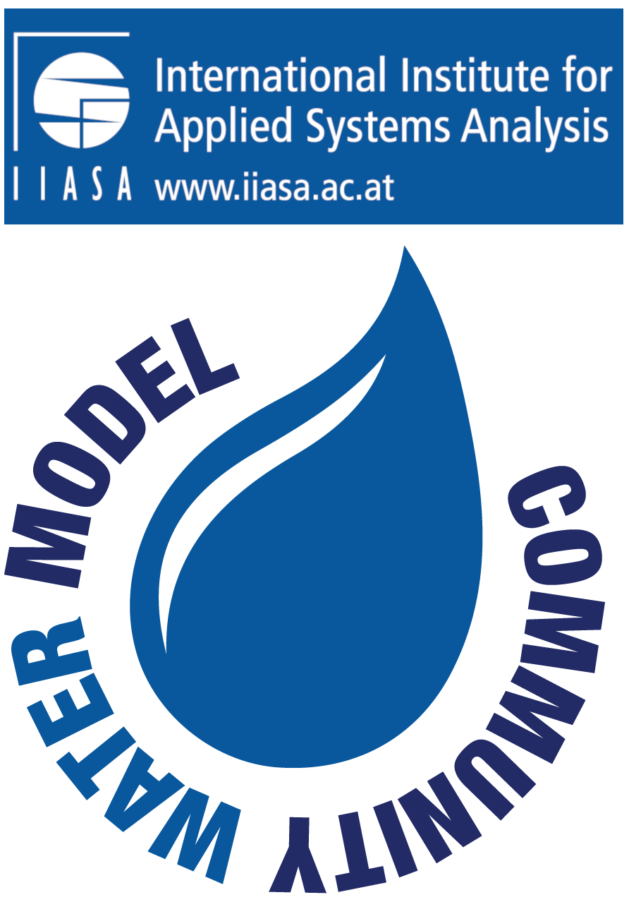
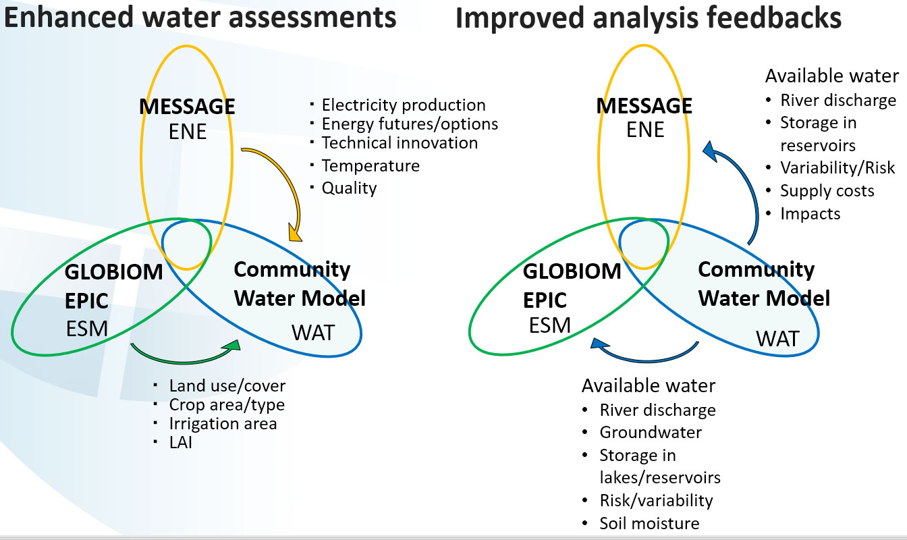

# Community Water Model (CWatM)

[]

)
)

[]

User manual and model documentation at [https://cwatm.iiasa.ac.at](https://cwatm.iiasa.ac.at).

Questions? Start a discussion on our [GitHub forum](https://github.com/iiasa/CWatM/discussions) and 
check out our [CWatM tutorials on YouTube](https://www.youtube.com/playlist?list=PLyT8dd_rWLaymQIewMyzVcjMYvPR8Rqtw).

Our repository [CWatM-Earth-30min](https://github.com/iiasa/CWatM-Earth-30min) contains input data for CWatM at 30 arcminutes and further links to climate and higher resolution input data.

# NEW 11/09/26 - Major update of Main from the last year of development of branch: develop
          
## pySnowClim model included

Abby C. Lute, Aranildo Lima, Raj Shrestha and their team coupled CWatM with a sophisticated energy-balanced snow model:

Lute, A. C., Abatzoglou, J., and Link, T.: SnowClim v1.0: high-resolution snow model and data for the western United States, Geosci. Model Dev., 15, 5045–5071, https://doi.org/10.5194/gmd-15-5045-202

## Water transfer is now possible

We include water transfer via the Excel file 
You define a two pseudo reservoirs, one as output, one as input and you define the rules of transfer

## A Windows executable is in the release

The Windows executable cwatm.exe is a way to overcome Python installation for Windows

## A draft version of a GUI is in the release

A draft version of a CWatM GUI (as bonus) for Windows to overcome the black DOS-box

## This is the version for the Danube Water Balance Project

This version is the final version for the Interreg Danube project: Danube Water Balance

# NEW 11/09/25 - Major update of Main from the last year of development of branch: develop

## FAIR model  

"The ultimate goal of FAIR is to optimise the reuse of data. To achieve this, metadata and data should be well-described so that they can be replicated and/or combined in different settings."
(from https://www.go-fair.org/fair-principles)
we included a possibility to track the source of inputdata, settingsfile, model version
- model data used (name and date) is stored in any produced discharge netcdf (global attribute: version_inputfiles)
- complete settingsfile is store in any discharge netcdf (global attribute: version_settingsfile)
- version number with github hash is loaded and stored in global attribute: git_commit

## Waterdemand 

- moved water transfer to reservoirs

## Reservoirs

- added and changed water transfer inputs in an Excel file
- added periodical wetlands

## Glaciers

- added glacier coupling from OGGM

## Frost

- changed frost index calcualtion

## Prepare to run inside a Graphical User interface

- global variabl;es are cleared when using as test or inside a GUI

## Pytest

- pytest is located in the folder pytest
- increased the number of test (currently 101)
- test cannot run in github itself, because of the big size of meteodata needed
- a test report and a codecov report is build
- codecov xml is send to codecov webside https://app.codecov.io/gh/iiasa/CWatM/

## Checks input

- run cwatm as run_cwatm.py settings.ini -c will check the inputfiles
- run_cwatm.py settings.ini -c results.csv -> stores results in a file
- run_cwatm.py settings.ini -c discharge_daily.nc results.csv -> compares inputfiles to the inputfiles used for running discharge_daily.nc

## Misc

- updated many self.var variable in metaNetcdf.xml
- path to metaNetcdf.xml is now fixed to be in subfolder cwatm
- variable description is improved
- code is checked to be PEP8 consistent 
- Function and classes have a numpydoc description
- Deleted preprocessing tools for Modflow -> will go to another repro

# Overview and scope

Community Water Model (CWatM) is a hydrological model simulating the water cycle daily at global and local levels, historically and into the future, maintained by IIASA’s Water Security group. CWatM assesses water supply, demand, and environmental needs, including water management and human influence within the water cycle. CWatM includes an accounting of how future water demands will evolve in response to socioeconomic change and how water availability will change in response to climate and management.

CWatM is open source, and its modular structure facilitates integration with other models. CWatM will be a basis to develop next-generation global hydro-economic modelling coupled with existing IIASA models like MESSAGE and GLOBIOM.

  

# Model design and processes included

Modules for hydrological processes, e.g. snow, soil, groundwater, lakes & reservoirs, evaporation, etc., are in the folder hydrological_modules. The kinematic routing and the C++ routines (for speeding up the computational time) are in the folder hydrological_modules/routing_reservoirs.

  

Figure 1: Schematic view of CWatM processes

## Next-generation global hydro-economic modelling framework

CWatM will help to develop a next-generation hydro-economic modelling tool that represents the economic trade-offs among water supply technologies and demands.  The tool will track water use from all sectors and identify the least-cost solutions for meeting future water demands under policy constraints.  In addition, the tool will track the energy requirements associated with the water supply system (e.g., desalination and water conveyance) to facilitate linking with the energy-economic tool. The tool will also incorporate environmental flow requirements to ensure sufficient water for environmental needs.

## The Nexus framework of IIASA

In the nexus framework of water, energy, food, and ecosystem, CWatM will be coupled to the existing IIASA models, including the Integrated Assessment Model MESSAGE and the global land and ecosystem model GLOBIOM to realize improved assessments of water-energy-food-ecosystem nexus and associated feedback.

  

Figure 2: IIASA model nexus

## Short to medium-term vision

Our vision for short to medium-term work is to refine the human influence within the water cycle, integrate biodiversity, introduce water quality (e.g., salinization in deltas and eutrophication associated with megacities), and consider qualitative and quantitative measures of transboundary river and groundwater governance into an integrated modelling framework.
