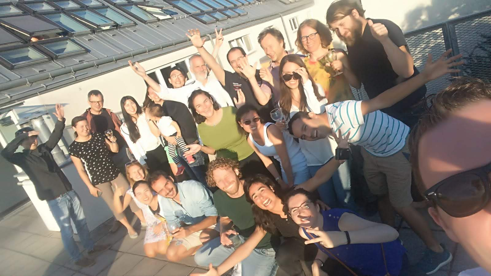

.. raw:: html

   <pre style="font-size: 0.7em;">
   Per correr miglior acque alza le vel
   omai la navicella del mio ingegno
   Dante Alighieri, Purgatorio, 1-2 
   </pre>

###################
**1. Introduction**
###################

.. raw:: html 

   <video autoplay loop controls src="_static/CWatM_intro.mp4" width="700"> </video>

Community Water Model - CWatM
=============================

With a growing population and economic development, water demands are expected to increase significantly in the future, especially in developing regions. At the same time, climate change is expected to alter the spatial patterns of precipitation and temperature, with regional to localized impacts on water availability. Thus, it is important to assess water demand, water supply and environmental needs over time to identify the populations and locations most affected by changes linked to water scarcity, droughts and floods. The Community Water Model will be designed for this purpose, including an accounting of how future water demands will evolve in response to socioeconomic change and how water availability will change in response to climate change. 

Community Water Model (CWatM) is a hydrological model that simulates the water cycle daily at global and local scales, historically and into the future, maintained by the IIASA BNR Water Security group. CWatM assesses water supply, demand, and environmental needs, including water management and human influence within the water cycle. CWatM includes an accounting of how future water demands will evolve in response to socioeconomic change and how water availability will change in response to climate and management.

CWatM is open-source and community-driven, and its modular structure facilitates integration with other models. It is flexible enough to introduce further planned developments, such as water quality and hydro-economy. CWatM will serve as a basis for developing next-generation global hydro-economic modelling, coupled with existing IIASA models such as MESSAGE and GLOBIOM.

Our vision for the short to medium-term work of the group is to introduce water quality (i.e., salinization in deltas and eutrophication associated with megacities) into the community model and to consider how to include a qualitative/quantitative measure of transboundary river and groundwater governance into a scenario and modelling framework.

.. image:: _static/Hydrological-model2.jpg
    :width: 700px

Figure: CWatM - Water-related processes included in the model design

Acknowledgement of Funding
==========================

The development of  CWatM is supported by financial support from the Austrian Research Promotion Agency (FFG) under the FUSE project funded by the Belmont Forum Urbanisation Global Initiative (SUGI)/Food–Water–Energy Nexus theme for which coordination was supported by the US National Science Foundation under grant ICER/EAR-1829999 to Stanford University (Grant Agreement: 730254), EUCP (European Climate Prediction System) project funded by the European Union under Horizon 2020 (Grant Agreement: 776613), SOS-Water (Safe Operating Space for the water resources) project funded by European Union’s Horizon EUROPE Research and Innovation Programme (Agreement N° 101059264), CO-MICC project (Project No: 863633) which is part of ERA4CS, an ERA-NET initiated by JPI Climate with co-funding by the European Union and the Austrian Federal Ministry of Science, Research and Economy (BMWFW). Interreg Danube Region: Development of a harmonized water balance modelling system for the Danube River Basin.

.. _rst_developer:

Developer
=========

Research Scholars, Water Program, IIASA

CWatM started in April 2016

| **Leading WAT Program and group:**
| David Wiberg (2014-2015), Bill Cosgrove and Peter Burek (2016), Simon Langan (2016-2019), Yoshihide Wada (2019-2020), Taher Kahil (2021-)
| **Hydrology and Programming:** 
| Peter Burek (2016-), Yoshihide Wada(2016-), Yusuke Satoh(2016-), Peter Greve(2017-2022), Mikhail Smilovic(2018-), Luca Guillaumot(2018-), Jens de Bruijn(2019-), Sarah Hanus (2022-), Dor Fridman (2022-), Emilio Politti (2023-), Jessica Ferrel (2023-), Silvia Artuso (2023-), Carla Catania (2024-)
| **Interface to Water Quality and Hydro-economic modeling:**
| Taher Kahil (2016-), Ting Tang (2018-)
| **GIS:** 
| Alejandra Virgen-Urcelay (2018)
| **Design of CWatM schematic view:**
| Adam Islaam (2019)
| **Intro video:** 
| Junko Mochizuki (2019)

| **Contribution from:**
| Fang Zhao,  East China Normal University, China 
| Mengu Wang, Wageningen University, The Netherlands
| Wenting Yang, Tsinghua University, China
| Xiaogang He, national University of Singapore
| Anjuli Figueroa, Stanford University, USA
| Congrui Yi, Shanghai University, China

