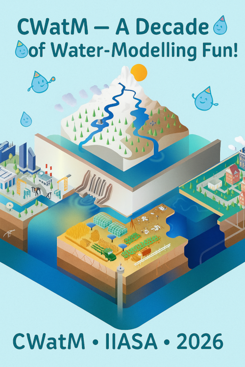

.. raw:: html

   <pre style="font-size: 0.7em;">
   La mar es el origen de todas lasaguas,
   y el corazon del hombre, el origen de
   todas los males
   Miguel de Cervantes, Don Quijote
   </pre>

###########
**2. NEWS**
###########

.. contents:: 
    :depth: 2

10 Year Anniversary
===================

We started CWatM in April 2016. Next year we have our 10 Year Anniversary.
We are planning a conference at IIASA, Laxenburg, Austria in June 2026.

**We postponed this to next year!**

Stay tuned for the next announcements!

Major Updates
=============

May 2026
------------
- We replaced gdal library with rasterio library (in develop branch)
- update to netCDF4 cf1.13 (from 1.6) with a crs variable to store projection

October 2025
------------

- added a sophisticated way of calculating snow with SnowClim: https://gmd.copernicus.org/articles/15/5045/2022/gmd-15-5045-2022.html

September 2025
---------------

- we update the Main repro of Github (just to go then straight to development again)

- we update the testing suite, source code documentation, checked for PEP8
- fixed the -c (check data option)

July 2025
------------

- we added wetland processs to cope with yearly variabible flooding of wetlands

June 2025
------------

- we added another alternative way to calculate potential evaporation with Thornthwaite

June 2024
------------

- we added waste water processes

June 2024
------------

- we added water transfer

Publication using CWatM
=======================

    **2026**

#. Huo, F., Li, Y., and Li, Z. (2026) Emerging global freshwater challenges unveiled through observation-constrained projections, Earth Syst. Dynam., 17, 291–302, https://doi.org/10.5194/esd-17-291-2026, 2026. 
#. Shrestha, R.R., Cannon, A.J. (2026).Storylines of summer streamflow droughts in western Canadian watersheds: historical attribution and future projections. npj Nat. Hazards 3, 41 (2026). https://doi.org/10.1038/s44304-026-00204-9
#. Sun, M., Tangdamrongsub, N., Sun, Y., Dong, J., Sutanudjaja, E., & Smilovic, M. (2026). Assessing and optimizing high-resolution global river streamflow estimates with triple collocation analysis. Journal of Hydrology 669 e135122. 10.1016/j.jhydrol.2026.135122.
#. Cai, K., Li, J., Jiang, Q., Hu, L., Fu, J., Zhang, M., Li, Y., Qin, Y., & Liu, Y. (2026). Enhancing hydrological modeling in large basin with intensive human water use through hierarchical parameterization and bias-integrated calibration. Water Cycle 7 219-233. 10.1016/j.watcyc.2025.10.003.

    **2025**

#. Hinton, R., Fridman, D. , Smilovic, M. , Willaarts, B.A. , Chunga, B., Banda, L., Macleod, K., Troldborg, M., & Kalin, R. (2025). Stakeholder-informed approach improves national modelling of water resources for a Sub-Saharan African basin. Journal of Hydrology: Regional Studies 60 e102574. 10.1016/j.ejrh.2025.102574.
#. Kahil, T., Baccour, S., Joseph, J., Sahu, R., Burek, P., Ng, J. Y., Asad, S., Fridman, D., Albiac, J., Ward, F. A., and Wada, Y. (2025) Development of the global hydro-economic model (ECHO-Global version 1.0) for assessing the performance of water management options, Geosci. Model Dev., 18, 7987–8015, https://doi.org/10.5194/gmd-18-7987-2025, 2025
#. Hanus, S., Burek, P., Smilovic, M., Seibert, J., Wada, Y., & Viviroli, D. (2025). Dependence of lowland water use on mountain runoff globally: Interannual variability and future changes at seasonal scale. Earth's Future, 13, e2025EF006407. https://doi.org/10.1029/2025EF006407
#. Fridman, D. , Smilovic, M. , Burek, P. , Tramberend, S. , & Kahil, T. (2025). Wastewater matters: incorporating wastewater treatment and reuse into a process-based hydrological model (CWatM v1.08). Geoscientific Model Development 18 (12) 3735-3754. 10.5194/gmd-18-3735-2025.
#. Song, Hao & Li, Bo & Li, Zhijun & Zhang, Guangxin & Lu, Xixi & Qi, Peng, (2025). Modelling water and land resources synergy and trade-off in a major grain-producing area, China, Agricultural Water Management, Elsevier, vol. 320(C). 
#. Kim, J., & Ahn, K.-H. (2025). Understanding the influence of hydrologic parameter uncertainty on Community Water Model predictions: a diagnostic assessment through extensive ensemble simulations. Environmental Research Letters, 20(6), 064001. doi:10.1088/1748-9326/add27e
#. Hinton, R., Fridman, D. , Smilovic, M. , Willaarts, B.A. , Chunga, B., Banda, L., Macleod, K., Troldborg, M., & Kalin, R. (2025). Stakeholder-informed approach improves national modelling of water resources for a Sub-Saharan African basin. Journal of Hydrology: Regional Studies 60 e102574. 10.1016/j.ejrh.2025.102574.
#. Müller Schmied, H., Gosling, S.N., Garnsworthy, M., Müller, L., Telteu, C.-E., Ahmed, A.K., Andersen, L.S., Boulange, J., Burek, P. , Chang, J., Chen, H., Gudmundsson, L., Grillakis, M., Guillaumot, L., Hanasaki, N., Koutroulis, A., Kumar, R., Leng, G., Liu, J., Liu, X., et al. (2025). Graphical representation of global water models. Geoscientific Model Development 18 (8) 2409-2425. 10.5194/gmd-18-2409-2025.
#. Zhao, F., Nie, N., Liu, Y., Yi, C., Guillaumot, L. , Wada, Y., Burek, P. , Smilovic, M. , Frieler, K., Buechner, M., Schewe, J., & Gosling, S.N. (2025). Benefits of Calibrating a Global Hydrological Model for Regional Analyses of Flood and Drought Projections: A Case Study of the Yangtze River Basin. Water Resources Research 61 (3) e2024WR037153. 10.1029/2024WR037153.
#. Kalthof, M.W.M.L., de Bruijn, J. , de Moel, H., Kreibich, H., & Aerts, J.C.J.H. (2025). Adaptive behavior of farmers under consecutive droughts results in more vulnerable farmers: a large-scale agent-based modeling analysis in the Bhima basin, India. Natural Hazards and Earth System Sciences 25 (3) 1013-1035. 10.5194/nhess-25-1013-2025.

    **2024**

#. Hanus, S. , Burek, P. , Smilovic, M. , Seibert, J., & Viviroli, D. (2024). Seasonal variability in the global relevance of mountains to satisfy lowland water demand. Environmental Research Letters 19 (11) e114078. 10.1088/1748-9326/ad8507
#. Palazzo, A. , Kahil, T. , Willaarts, B. , Burek, P. , van Dijk, M. , Tang, T. , Magnuszewski, P., Havlík, P. , Langan, S. , & Wada, Y. (2024). Assessing sustainable development pathways for water, food, and energy security in a transboundary river basin. Environmental Development 51 e101030
#. Dione, P.M., Faye, C., Mohamed, A., Alarifi, S., Mohammed, M.A.A. (2024). Assessment of the impact of climate change on current and future flows of the ungauged Aga-Foua-Djilas watershed: a comparative study of hydrological models CWatM under ISIMIP and HMF-WA. Appl Water Sci 14, 163 (2024). https://doi.org/10.1007/s13201-024-02219-x
#. Heinicke, S., Volkholz, J., Schewe, J., Gosling, S.N, Müller Schmied, H., Zimmermann, S., Mengel, M., Sauer, I.J, Burek, P. , Chang, J., Kou-Giesbrecht, S., Grillakis, M., Guillaumot, L., Hanasaki, N., Koutroulis, A., Otta, K., Qi, W., Satoh, Y., Stacke, T., Yokohata, T., et al. (2024). Global hydrological models continue to overestimate river discharge. Environmental Research Letters 19 (7) e074005. 10.1088/1748-9326/ad52b0
#. Becher, O., Smilovic, M. , Verschuur, J., Pant, R., Tramberend, S. , & Hall, J. (2024). The challenge of closing the climate adaptation gap for water supply utilities. Communications Earth & Environment 5 (1) e356. 10.1038/s43247-024-01272-3
#. Awais, M. , Vinca, A. , Byers, E. , Frank, S. , Fricko, O. , Boere, E., Burek, P. , Poblete Cazenave, M., Kishimoto, P.N. , Mastrucci, A. , Satoh, Y., Palazzo, A. , McPherson, M., Riahi, K. , & Krey, V. (2024). MESSAGEix-GLOBIOM nexus module: integrating water sector and climate impacts. Geoscientific Model Development 17 (6) 2447-2469. 10.5194/gmd-17-2447-2024
#. Fridman, D., Smilovic, M., Burek, P., Tramberend, S., and Kahil, T.: Wastewater matters: Incorporating wastewater reclamation into a process-based hydrological model (CWatM v1.08), Geosci. Model Dev. Discuss. [preprint], https://doi.org/10.5194/gmd-2024-143  in review
#. Wolkeba, F.T., Mekonnen, M.M., Brauman, K.A. et al. (2024). Indicator metrics and temporal aggregations introduce ambiguities in water scarcity estimates. Sci Rep 14, 15182 (2024). https://doi.org/10.1038/s41598-024-65155-5
#. Smilovic, M. , Burek, P. , Fridman, D. , Guillaumot, L., de Bruijn, J. , Greve, P., Wada, Y. , Tang, T. , Kronfuss, M., Hanus, S., Tramberend, S. , & Kahil, T. (2024). Water circles—a tool to assess and communicate the water cycle. Environmental Research Letters 19 (2) e021003. 10.1088/1748-9326/ad18de
#. Cheng, W., Feng, Q., Xi, H., Yin, X., Cheng, L., Sindikubwabo, C., . . . Zhao, X. (2024). Modeling and assessing the impacts of climate change on groundwater recharge in endorheic basins of Northwest China. Science of the Total Environment, 918, 170829. doi:https://doi.org/10.1016/j.scitotenv.2024.170829
#. Wolkeba, F. T., & Mekonnen, M. M. (2024). Evaluation of gridded precipitation data in water availability modeling in CONUS. Journal of Hydrology, 628, 130575. doi:https://doi.org/10.1016/j.jhydrol.2023.130575
#. Palazzo, A. , Kahil, T. , Willaarts, B. , Burek, P. , van Dijk, M. , Tang, T. , Magnuszewski, P., Havlík, P. , Langan, S. , & Wada, Y. (2024). Assessing sustainable development pathways for water, food, and energy security in a transboundary river basin. Environmental Development e101030. 10.1016/j.envdev.2024.101030
#. Becher, O., Smilovic, M. , Verschuur, J., Pant, R., Tramberend, S. , & Hall, J. (2024). The challenge of closing the climate adaptation gap for water supply utilities. Communications Earth & Environment 5 (1) e356. 10.1038/s43247-024-01272-3
#. Heinicke, S., Volkholz, J., Schewe, J., Gosling, S.N, Müller Schmied, H., Zimmermann, S., Mengel, M., Sauer, I.J, Burek, P. , Chang, J., Kou-Giesbrecht, S., Grillakis, M., Guillaumot, L., Hanasaki, N., Koutroulis, A., Otta, K., Qi, W., Satoh, Y., Stacke, T., Yokohata, T., et al. (2024). Global hydrological models continue to overestimate river discharge. Environmental Research Letters 19 (7) e074005. 10.1088/1748-9326/ad52b0
#. Matevž Vremec, Peter Burek, Luca Guillaumot, Jesse Radolinski, Veronika Forstner, Markus Herndl, Christine Stumpp, Michael Bahn, Steffen Birk, Sensitivity of montane grassland water fluxes to warming and elevated CO2 from local to catchment scale: A case study from the Austrian Alps, Journal of Hydrology: Regional Studies,Volume 56,2024,101970,ISSN 2214-5818,https://doi.org/10.1016/j.ejrh.2024.101970.(https://www.sciencedirect.com/science/article/pii/S2214581824003197)
#. Hanus, S., Schuster, L., Burek, P., Maussion, F., Wada, Y., and Viviroli, D. (2024). Coupling a large-scale glacier and hydrological model (OGGM v1.5.3 and CWatM V1.08) – towards an improved representation of mountain water resources in global assessments, Geosci. Model Dev., 17, 5123–5144, https://doi.org/10.5194/gmd-17-5123-2024
#. Dione, P.M., Faye, C., Mohamed, A. et al. (2024). Assessment of the impact of climate change on current and future flows of the ungauged Aga-Foua-Djilas watershed: a comparative study of hydrological models CWatM under ISIMIP and HMF-WA. Appl Water Sci 14, 163 (2024). https://doi.org/10.1007/s13201-024-02219-

    **2023**

#. Gnann, S., Reinecke, R., Stein, L., Wada, Y. , Thiery, W., Müller Schmied, H., Satoh, Y., Pokhrel, Y., Ostberg, S., Koutroulis, A., Hanasaki, N., Grillakis, M., Gosling, S. N., Burek, P. , Bierkens, M.F.P., & Wagener, T. (2023). Functional relationships reveal differences in the water cycle representation of global water models. Nature Water 1 1079-1090. 10.1038/s44221-023-00160-y
#. Greve, P., Burek, P. , Guillaumot, L. , van Meijgaard, E., Aalbers, E., Smilovic, M. , Sperna-Weiland, F., Kahil, T. , & Wada, Y. (2023). Low flow sensitivity to water withdrawals in Central and Southwestern Europe under 2 K global warming. Environmental Research Letters 18 (9) e094020. 10.1088/1748-9326/acec60
#. de Bruijn, J. , Smilovic, M. , Burek, P. , Guillaumot, L. , Wada, Y. , & Aerts, J.C.J.H. (2023). GEB v0.1: a large-scale agent-based socio-hydrological model – simulating 10 million individual farming households in a fully distributed hydrological model. Geoscientific Model Development 16 (9) 2437-2454. 10.5194/gmd-16-2437-2023.
#. Valencia, R., Guillaumot, L. , Sahu, R.K. , Nam, C., Lierhammer, L., & Máñez Costa, M. (2023). An assessment of water management measures for climate change adaptation of agriculture in Seewinkel. Science of the Total Environment 885 e163906. 10.1016/j.scitotenv.2023.163906.

    **2022**

#. Kallio, M., Guillaume, J.H.A., Burek, P. , Tramberend, S. , Smilovic, M. , Horton, A.J., & Virrantaus, K. (2022). Unpacking dasymetric modelling to correct spatial bias in environmental model outputs. Environmental Modelling & Software 157 e105511. 10.1016/j.envsoft.2022.105511.
#. Guillaumot, L. , Smilovic, M. , Burek, P. , de Bruijn, J. , Greve, P., Kahil, T. , & Wada, Y. (2022). Coupling a large-scale hydrological model (CWatM v1.1) with a high-resolution groundwater flow model (MODFLOW 6) to assess the impact of irrigation at regional scale. Geoscientific Model Development 15 (18) 7099-7120. 10.5194/gmd-15-7099-2022.
#. Satoh, Y., Yoshimura, K., Pokhrel, Y., Kim, H., Shiogama, H., Yokohata, T., Hanasaki, N., Wada, Y. , Burek, P. , Byers, E. , Müller Schmied, H., Gerten, D., Ostberg, S., Gosling, S.N., Boulange, J.E.S., & Oki, T. (2022). The timing of unprecedented hydrological drought under climate change. Nature Communications 13 (1) e3287. 10.1038/s41467-022-30729-2.

    **<=2021**

#. Okaali, D.A., Kroeze, C., Medema, G., Burek, P. , Murphy, H., Tumwebaze, I.K., Rose, J.B., Verbyla, M.E., Sewagudde, S., & Hofstra, N. (2021). Modelling rotavirus concentrations in rivers: Assessing Uganda's present and future microbial water quality. Water Research 204 e117615. 10.1016/j.watres.2021.117615.
#. Telteu, C.-E., Müller Schmied, H., Thiery, W., Leng, G., Burek, P. , Liu, D., Boulange, J., Andersen, L., Grillakis, M., Gosling, S., Satoh, Y., Rakovec, O., Stacke, T., Chang, J., Wanders, N., Shah, H., Trautmann, T., Mao, G., Hanasaki, N., Koutroulis, A., Pokhrel, Y., Samaniego, L., Wada, Y. , Mishra, V., Liu, J., Döll, P., Zhao, F., Gädeke, A., Rabin, S., & Herz, F. (2021). Understanding each other's models: an introduction and a standard representation of 16 global water models to support intercomparison, improvement, and communication. Geoscientific Model Development 14 (6) 3843-3878. 10.5194/gmd-14-3843-2021.
#. Vinca, A. , Parkinson, S. , Byers, E. , Burek, P. , Khan, Z., Krey, V. , Diuana, F., Wang, Y., Ilyas, A., Köberle, A.C., Staffel, I., Pfenninger, S., Muhammad, A., Rowe, A., Schaeffer, R., Rao, N. , Wada, Y. , Dhilali, N., & Riahi, K. (2019). The Nexus Solutions Tool (NEST): An open platform for optimizing multi-scale energy-water-land system transformations. Geoscientific Model Development Discussions 13 (3) 1095-1121. 10.5194/gmd-2019-134
#. Pokhrel, Y., Felfelani, F., Satoh, Y., Boulange, J., Burek, P. , Gädeke, A., Gerten, D., Gosling, S.N., Grillakis, M., Gudmundsson, L., Hanasaki, N., Kim, H., Koutroulis, A., Liu, J., Papadimitriou, L., Schewe, J., Müller Schmied, H., Stacke, T., Telteu, C.-E., Thiery, W., Veldkamp, T., Zhao, F., & Wada, Y. (2021). Global terrestrial water storage and drought severity under climate change. Nature Climate Change 11 226-233. 10.1038/s41558-020-00972-w.
#. Boulange, J., Hanasaki, N., Satoh, Y., Yokohata, T., Shiogama, H., Burek, P. , Thiery, W., Gerten, D., Müller Schmied, H., Wada, Y. , Gosling, S.N., Pokhrel, Y., & Wanders, N. (2021). Validity of estimating flood and drought characteristics under equilibrium climates from transient simulations. Environmental Research Letters 16 (10) e104028. 10.1088/1748-9326/ac27cc.
#. Reinecke, R., Müller Schmied, H., Trautmann, T., Andersen, L.S., Burek, P. , Flörke, M., Gosling, S.N., Grillakis, M., Hanasaki, N., Koutroulis, A., Pokhrel, Y., Thiery, W., Wada, Y. , Satoh, Y., & Döll, P. (2021). Uncertainty of simulated groundwater recharge at different global warming levels: a global-scale multi-model ensemble study. Hydrology and Earth System Sciences 25 (2) 787-810. 10.5194/hess-25-787-2021.
#. Satoh, Y., Shiogama, H., Hanasaki, N., Pokhrel, Y., Boulange, J.E.S., Burek, P. , Gosling, S.N., Grillakis, M., Koutroulis, A., Müller Schmied, H., Thiery, W., & Yokohata, T. (2021). A quantitative evaluation of the issue of drought definition: a source of disagreement in future drought assessments. Environmental Research Letters 16 (10) e104001. 10.1088/1748-9326/ac2348.
#. Tramberend, S. , Burtscher, R. , Burek, P. , Kahil, T. , Fischer, G., Mochizuki, J. , Greve, P., Kimwaga, R., Nyenje, P., Ondiek, R., Nakawuka, P., Hyandye, C., Sibomana, C., Luoga, H.P., Matano, A.S., Langan, S. , & Wada, Y. (2021). Co-development of East African regional water scenarios for 2050. One Earth 4 (3) 434-447. 10.1016/j.oneear.2021.02.012.
#. Long, D., Yang, W., Scanlon, B.R., Zhao, J., Liu, D., Burek, P. , Pan, Y., You, L., & Wada, Y. (2020). South-to-North Water Diversion stabilizing Beijing’s groundwater levels. Nature Communications 11 (1) 10.1038/s41467-020-17428-6.
#. Greve, P., Burek, P. , & Wada, Y. (2020). Using the Budyko Framework for Calibrating a Global Hydrological Model. Water Resources Research 56 (6) 10.1029/2019WR026280.
#. Wang, M., M. Strokal, P. Burek, C. Kroeze, L. Ma and A. B. G. Janssen (2019). "Excess nutrient loads to Lake Taihu: Opportunities for nutrient reduction." Science of the Total Environment 664: 865-873.
#. Wang, M., T. Tang, P. Burek, P. Havlík, T. Krisztin, C. Kroeze, D. Leclère, M. Strokal, Y. Wada, Y. Wang and S. Langan (2019). "Increasing nitrogen export to sea: A scenario analysis for the Indus River." Science of The Total Environment: 133629.
#. He, X., Feng, K., Li, X., Craft, A., Wada, Y. , Burek, P. , Wood, E., & Sheffield, J. (2019). Solar and wind energy enhances drought resilience and groundwater sustainability. Nature Communications 10 e4893. 10.1038/s41467-019-12810-5.

Additional selected publications
================================

#. Burek, P., Y. Satoh, G. Fischer, M. T. Kahil, A. Scherzer, S. Tramberend, L. F. Nava, Y. Wada, S. Eisner, M. Flörke, N. Hanasaki, P. Magnuszewski, B. Cosgrove, D. Wiberg and A. P. D. W. Bill Cosgrove (2016). Water Futures and Solution - Fast Track Initiative (Final Report). IIASA, Laxenburg, Austria.
#. Greve, P., L. Gudmundsson, B. Orlowsky and S. I. Seneviratne (2016). "A two-parameter Budyko function to represent conditions under which evapotranspiration exceeds precipitation." Hydrology and Earth System Sciences 20(6): 2195-2205.
#. Kahil, M. T., S. Parkinson, Y. Satoh, P. Greve, P. Burek, T. I. E. Veldkamp, R. Burtscher, E. Byers, N. Djilali, G. Fischer, V. Krey, S. Langan, K. Riahi, S. Tramberend and Y. Wada (2018). "A Continental-Scale Hydroeconomic Model for Integrating Water-Energy-Land Nexus Solutions." Water Resources Research 54(10): 7511-7533.
#. Satoh, Y., T. Kahil, E. Byers, P. Burek, G. Fischer, S. Tramberend, P. Greve, M. Flörke, S. Eisner, N. Hanasaki, P. Magnuszewski, L. F. Nava, W. Cosgrove, S. Langan and Y. Wada (2017). "Multi-model and multi-scenario assessments of Asian water futures: The Water Futures and Solutions (WFaS) initiative." Earth's Future 5(7): 823-852.
#. Tang, T., M. Strokal, M. T. H. van Vliet, P. Seuntjens, P. Burek, C. Kroeze, S. Langan and Y. Wada (2019). "Bridging global, basin and local-scale water quality modeling towards enhancing water quality management worldwide." Current Opinion in Environmental Sustainability 36: 39-48.
#. Tramberend, S., R. Burtscher, P. Burek, T. Kahil, G. Fischer, J. Mochizuki, Y. Wada, R. Kimwaga, P. Nyenje, R. Ondiek, N. Prossie, C. Hyandye, C. Sibomana and S. Langan (2019). East Africa Future Water Scenarios to 2050. IIASA Research Report. Laxenburg, Austria, IIASA.
#. Vinca, A., S. Parkinson, E. Byers, P. Burek, Z. Khan, V. Krey, F. A. Diuana, Y. Wang, A. Köberle, I. Staffel, S. Pfenninger, A. Muhammad, A. Rowe, R. Schaeffer, N. Rao, Y. Wada, N. Djilali and K. Riahi (2019). The Nexus Solutions Tool (NEST): An open platform for optimizing multi-scale energy-water-land system transformations.
#. Wada, Y., M. Flörke, N. Hanasaki, S. Eisner, G. Fischer, S. Tramberend, Y. Satoh, M. T. H. van Vliet, P. Yillia, C. Ringler, P. Burek and D. Wiberg (2016). "Modeling global water use for the 21st century: the Water Futures and Solutions (WFaS) initiative and its approaches." Geoscientific Model Development 9(1): 175-222.
#. Wada, Y., T. Gleeson and L. Esnault (2014). "Wedge approach to water stress." Nature Geosci 7(9): 615-617.

Github Version History
======================

.. note::
    | Update history can be taken from github log (2 minus in front of pretty,date, graph)
    | git log - -pretty=format:"%ad - %an : %s" - -date=short - -graph > github.log 

| **Commit:  0d9aa19**
| Date:    2025-10-21
| Message: fix: last commit monthly and annual are not set to 0 after a month/year.Thats fixed

| **Commit:  555285c**
| Date:    2025-10-17
| Message: fixed reading Thermalindex

| **Commit:  a047109**
| Date:    2025-10-07
| Message: changing the Tdew calculation back to Magnus equation

| **Commit:  32b2a9c**
| Date:    2025-10-07
| Message: added FrostDay: 1 if the soil is frozenPut the same equation into FrostIndex calcualtion as 2 updates before:
Kfrost = np.where(self.var.Tavg < 0, 0.08, self.var.Kfrost)
fixed the way Thornthwaith ET is calculated and ThermalIndex is readmeteo
fixed calculation of snow evaporation , not doing it twice

| **Commit:  98052bb**
| Date:    2025-09-25
| Message: 
- fixed output for monthly, yearly when precipitation unit is "second since" in timestep.py
- move read thermalindex for Thornwaith evaporation to readmeteo insted evapoPot
- added output for soil moisture fraction theta in landcover.py

| **Commit:  c7020a9**
| Date:    2025-09-19
| Message: change in evaporation: if pysnowclim isused there is a double counting of sublimation.

| **Commit:  0e6c616**
| Date:    2025-09-16
| Message: added pySnowClim
- added in [options]
    - usepySnowClim -> if pySnowClim should be used
    - stopaftersnow -> only runs till snow (no discharge)
- added section [pySnowclim]
- changed self.var.Qair to either huss or rhs (instead qair for both)
- in read_meteo
    - read Tdew if SnowClim is used and Tdew is available
    - if snowClim then cacluate always evapoPot (meteo files are read anyway)
- calculate missing meteo variables in evapoPot.py if pySnowClim is used
- in Snow-frost.py
   - added SnowClim change from https://github.com/aranhax/CWatM/tree/pySnowclim_coupling
   - replace metpy lib with own calculation
   - put additional libraries from SnowClim only if SnowClim is used (with importlib)

| **Commit:  0e85431**
| Date:    2025-09-11
| Message: Merge branch 'develop' of https://github.com/iiasa/CWatM into Main

| **Commit:  86066b1**
| Date:    2025-09-11
| Message: Changed calculation of frostindex
added documentation of function as numpydoc to all modules
checked for pep8
waterdemand is shortened

| **Commit:  cd56f1e**
| Date:    2025-09-04
| Message: pytest_ebro5minuntes
Wastewater, command areas, and source-sector abstraction fractions

| **Commit:  aef4571**
| Date:    2025-09-04
| Message: Correct negative storage in res type 4

| **Commit:  da94e91**
| Date:    2025-09-04
| Message: - adapted CWatm to beuse with a GUI
- changed the ouput of checks (for run_cwatm.py settings.ini -c)

| **Commit:  21f3399**
| Date:    2025-09-04
| Message: adapted CWatM to be used in a GUI
changed the output of checks if you run_cwatm.py settings.ini -c

| **Commit:  c5e6dc5**
| Date:    2025-09-03
| Message: added a few more tests
added some more functionality to checks

| **Commit:  62c916c**
| Date:    2025-09-02
| Message: added: check of local version with git version.py
added: put settings.fuile and list of inputfiles in metadata of discharge netcdf
changed: made output of checks .csv compatible and put dates of inputs in

| **Commit:  6948088**
| Date:    2025-09-01
| Message: added github hash number to output maps and .csv

| **Commit:  79056af**
| Date:    2025-09-01
| Message: Update lakes_reservoirs.py
Fix error in load_reservoirs_from_excel when trying to update an existing reservoir without specifiying the reservoir type.

| **Commit:  5e11e9d**
| Date:    2025-09-01
| Message: deleted calculation of waterbalance.py -> will be done with water circles alter
deleted all variable info in hydro files -> will be added later again
added a yaml in github/workflow to create an actual version file with github hash
added some more pytests

| **Commit:  b2e5aff**
| Date:    2025-08-30
| Message: - move preprocessing (eg modflow) out of repro
- some fix to run test one after the other in data_handling.py
- move /toolkit/pytesting to /pytest

| **Commit:  88be87d**
| Date:    2025-08-29
| Message: working on new release:
- checked soildepth calculation
- bugfix for ldd.nc (model was sometimes not working when using a ldd.nc instead of ldd.map)
- new wetlands routine in reaservoirs
- metaxml now always read in from model folder cwatm
- pytest checked and added some tests

| **Commit:  354dd3c**
| Date:    2025-08-26
| Message: Preparation to use CWatM in a graphical user interface

| **Commit:  f53fe9e**
| Date:    2025-07-08
| Message: bugfix: if thetares = 0 it can happen that soil water content <0, which cause NaN
check that soil water content is >=0

| **Commit:  cea63eb**
| Date:    2025-07-08
| Message: bugfix: soil.py: if thetares = 0 it can happen that soil water content gets < 0 which leads to NaN. Checked that soil water conten is always >=0

| **Commit:  c21fa82**
| Date:    2025-06-17
| Message: PET_modus corrections
evaporationPot
pet_modus=4 no longer needs PSurf, and loads dem
pet_modus=5 loads latitude
readmeteo
allows for PET_modus not to be in the settings file (backwards compatible)
soil
corrects multiply to divide for ET_crop_Irr_paddy_fraccrop

| **Commit:  2eef0df**
| Date:    2025-05-27
| Message: bugfix: readmeteo: if snowmelt_radiation is used then the potET modus has to be read

| **Commit:  1954852**
| Date:    2025-05-16
| Message: bugfix: error if option reservoir_add_info_in_Excel is not used

| **Commit:  b764a2f**
| Date:    2025-05-12
| Message: added new ETpot approach: modified Thornthwaite method
fixed: ETpot approach Priestly
added: precipitation_sn as variable: = precipitation + snow correction with snow factor

| **Commit:  f4debe8**
| Date:    2025-04-24
| Message: change in lakes_reservoir
- if a reservoir from Excel is not in the mask map extent, skip this reservoir-> import if you only want to run a subbasin

| **Commit:  66a39fd**
| Date:    2025-04-16
| Message: reservoirs:
- added messages if lake/res in excel is not in map extent
- added values for added lakes (from excel) for initial values

| **Commit:  8edb2cb**
| Date:    2025-04-10
| Message: added test if reservoir for reservoir transfer is valid

| **Commit:  55570fb**
| Date:    2025-04-09
| Message: fixed: reservoir_transfers_out/in/net in daily values not as accumulated sum
new reservoir coordinates are checked before

| **Commit:  d5f1c29**
| Date:    2025-04-09
| Message: adding reservoir_transfers_net_M3, and ..in, ..out to lakes_reservoirs.py

| **Commit:  dd2d1d7**
| Date:    2025-04-07
| Message: Changed reservoir transfer
- moved from waterdemand to reservoir
- added reservoirs to Excel
- changed water transfer with different rulesets

| **Commit:  5e98739**
| Date:    2025-03-27
| Message: bug fix in irrigation.py - equation was wrong for satAreaFrac using arnoBeta Line 150

| **Commit:  c3282dd**
| Date:    2025-03-27
| Message: Fixed bug in irrigation.py with arnobeta wrongly used

2024
----

| **Commit:  cbf5a9d**
| Date:    2024-12-03
| Message: 
-Crop-specific transpiration and the a/p ratio have been updated.
-new output variables to allow for monthtot and annualtot outputs and comparison with other products
-ET_crop_Irr_#
-ET_crop_nonIrr_#
-ET_crop_Irr_fraccrop_#
-ET_crop_nonIrr_fraccrop_#
-irr_crop_#

| **Commit:  e60644e**
| Date:    2024-10-04
| Message: Updated .rst pages publication.rts and setup.rts with changed documentation

| **Commit:  4f3f490**
| Date:    2024-10-04
| Message: - Checked to work with numpy 2.1 and Python 3.12.7
- Added a few more authors

| **Commit:  b01acae**
| Date:    2024-08-04
| Message: Crop transpiration disaggregation
Update options for crop transpiration disaggregation

| **Commit:  cf6b5d7**
| Date:    2024-07-11
| Message: Update to wastewater.py (#146)
* update_modflowpreprocess
* Update wastewater extensive threshold
* Revert "update_modflowpreprocess"
This reverts commit b4670111fcf83a839b6962eb7963ee131cdf3470.
Revert "update_modflowpreprocess"
This reverts commit b4670111fcf83a839b6962eb7963ee131cdf3470.
Revert "Update wastewater extensive threshold"
This reverts commit 9d476fc9ef8351009af1f58a6bc95eecedaee33a.
update extensive treatment thershold

| **Commit:  0d4cdc3**
| Date:    2024-07-11
| Message: Calibration fixes
Fixes that clarify reading the observations file
dates should be dd/mm/yyyy

| **Commit:  20731c1**
| Date:    2024-07-09
| Message: np.nan replacing deprecated np.NaN
For numpy2, np.nan replaces np.NaN

| **Commit:  4f08c05**
| Date:    2024-07-09
| Message:  fixes: runpy.sh slashes and lakeResStorage_buffer
-runpy.sh changed from backwards to forward slashes
-waterBodyBuffer defined even without water demand to allow for lakeResStorage_buffer variable output

| **Commit:  246b521**
| Date:    2024-07-06
| Message: Watercycles update
-Resolved syntax messages
-Corrected fossil water component in Water circles
-Commented settings_calibration.txt

| **Commit:  8e7162f**
| Date:    2024-07-05
| Message: np.nan replacing deprecated np.NaN

| **Commit:  2c2296b**
| Date:    2024-07-04
| Message: ecoding bug
fix found while running the Tisza 1 min model
Co-Authored-By: mategyorgy <165912677+mategyorgy@users.noreply.github.com>

| **Commit:  2609c38**
| Date:    2024-07-03
| Message: Update to allow execute permissions for .sh files for calibration on Linux: https://github.com/iiasa/CWatM/discussions/79

| **Commit:  888dc34**
| Date:    2024-07-03
| Message:  calibration updates
- included the necessary option reportOldTss = True
- removed necessary "lobith" heading title in the second column for observations: any headers for the observation file will do, as the first row is no longer read.
- updated dates in lobith2006

| **Commit:  cd8318f**
| Date:    2024-06-17
| Message: EvapChannel updated to unit M in Watercycle
EvapoChannel in CWatM has bee changed to unit Metres from unit M3. This is the associated Watercycle update.

| **Commit:  ae0c032**
| Date:    2024-06-07
| Message: lakeResStorage_buffer holds lakeResStorage in all buffer cells

| **Commit:  bf72d37**
| Date:    2024-05-27
| Message: LakeResStorage output filling in waterbody area
Puts the value of lakeResStorage into all cells covered by the waterbody

| **Commit:  9332cdd**
| Date:    2024-05-22
| Message: Merge pull request #129 from mikhailsmilovic/develop
Crop and reservoir updates

| **Commit:  2e7f6b2**
| Date:    2024-05-22
| Message: Reservoir transfer 366-day
Reservoir transfers are now input with 366-day schedules. The previous version of a static daily transfer has been deprecated.
Reservoir transfers, inwards or outwards, are activated when reservoir_transfers = True in the text settings file. Choose the waterbody ID of the giving and receiving reservoirs and the amount, either as a fraction of live storage (values  ≤ 1)  or in cubic metres (values > 1). Waterbody ID 0 represents the infinite outside source/sink. Outward transfers are added to industrial demand/use.
Reservoir transfers occur daily, with Giving reservoirs transferring water to associated Receiving reservoirs. The amount of water transferred is determined by the associated fraction of live storage of the Giving reservoir, and the available space in the Receiving reservoir. If the Giving reservoir ID is 0 (Representing an outside source/sink), the water amount refers to the Receiving reservoir. Reservoirs can both receive and give to several reservoirs, and transfers are executed in the order they appear in the Excel sheet.

| **Commit:  d8e26c3**
| Date:    2024-05-14
| Message: bugfix: some input netcdf start mid-day and causes problem when jumping from a decade to the next. -> fixed this

| **Commit:  4022f91**
| Date:    2024-05-13
| Message: bugfix: in lakes_reservoirs.py changed a term where we use inflowC in m3, but it should be m3/s
readmeteo/datahandling: cleaned the reading of meteomaps -> put a lot of information gathering in the initial instead of dynamic
Put it a way of asynchr loading of meteo data (but outcommented) because it is not working

| **Commit:  2b7c176**
| Date:    2024-05-02
| Message: change output date of netcdf files for monthly and annuala dataset. Using now first date of a period e.g. 1/2/2023 instead of 28/2/23
Bugfix: EvapWaterBodyM had some missing values. If for some reason the water fraction is 0 but the cell is assigned to a lake/res then a missing values can happen

| **Commit:  cedf81b**
| Date:    2024-05-02
| Message: Change output time for monthly and annual netcdf data.
Instead of the last day of a period, the first day of a period is taken e.g. 1/2/2023 instead of 28/2/2023
Bugfix for EvapWaterBodyM and totalET_WB. EvapWaterBodyM had some missing values, because in same cases the fraction of water = 0 but it the cell is classified as a lake.

| **Commit:  89143df**
| Date:    2024-05-02
| Message: Change output time for monthly and annual netcdf data.
Instead of the last day of a period, the first day of a period is taken e.g. 1/2/2023 instead of 28/2/2023
Bugfix for EvapWaterBodyM and totalET_WB. EvapWaterBodyM had some missing values, because in same cases the fraction of water = 0 but it the cell is classified as a lake.

| **Commit:  328313c**
| Date:    2024-04-29
| Message: - Changed output tss

-Instead of the pcraster tss default out put for timeseries is now a .csv format with real date
-If you want to use th old output OPTION: reportOldTss = False
- Changed unit for netcdf for month and year. Pandas does not recognize "Month since ...".  So instead of month it is ""Day since ..." with the first day of a month (or year)
- Removed from OPTION: (now default)

- writeNetcdfStack = True, reportMap = True, reportTss = True
- save netcdf only the valid cells in Option (faster save and load for split global run) netcdfasindex = True
- If GitPython is installed as a library - the git version is recorded in .nc and .csv
- Snow: Snowcover fraction of each cell can be output: SnowFraction

- Bugfix: totalET_WB (total act evapotrans + evapo from rivers and lakes/res) was wrongly computed) , now fixed (hopefully)
- EvapoChannel  was in unit [m3] before-> now changed to [m] (as all the other evaporation terms)
- EvapWaterBodyM is now the evaporation of a lake/reservoir for each gridcell (before it was the summed up evaporation of a lake at the outlet point)

| **Commit:  fca7581**
| Date:    2024-04-26
| Message: Update data_handling.py
add option maps_cut_individually

| **Commit:  ecaa5a7**
| Date:    2024-04-23
| Message: Update cutmap for each nc input (in readnetcdf2)
Although using a convolute of different spatial extent and then correcting this in CWatM is prone to errors, I hope this additional line could help prevent unnoticed errors when using NC inputs that have different spatial extents.

| **Commit:  2312fda**
| Date:    2024-04-11
| Message: bug fix in evaporation, irrigation.py
to use self.var.cropKC also in irrigation.py

| **Commit:  25a3131**
| Date:    2024-04-11
| Message: Some change in snow and evaporation calculation
cwatm_initial.py: a evaporation initial is included: loads 12 maps of kc factors and 12 maps for interception for each vegetation
Interception+ evaporation: major change: instead of reading maps every 10 days - 12 maps are loaded in the initial part for evaporation kc-crops in terception and daily kc and interception is interpolated from monthly values
soil: remove reading dz_rel (relative elevation) and put it into snow_frost.py
readmeteo: possibility to use radiation for snow with EMO1 maps
snow_frost: instead normal distribution for elevation it is using now 5 layers of dz_rel. Possibility to use lasperate maps, to use radiation also with EMO1 meteo maps
capillarrise.py: changed coding of capillar rise to make it shorter (old code is still in but outcommented)
Groundwater: put self.var.nonFossilGroundwaterAbs = globals.inZero in last line in initial
Timestep.ini: added a 30 day counter
datahandling: added reading12monthnetcdf. Changed init file reading - no smaller parts of a init file could be read in i.e only the Danube from global init file

| **Commit:  cd682a7**
| Date:    2024-04-03
| Message: Merge pull request #117 from mikhailsmilovic/develop
Start including daily crop coefficients

| **Commit:  a481e49**
| Date:    2024-03-13
| Message: Fix for command area update

| **Commit:  f34a6da**
| Date:    2024-02-27
| Message: Correct Kc curve

| **Commit:  ce35bed**
| Date:    2024-02-26
| Message: 📆 Daily crop coefficient
If the crop inputs are given in days, we pre-calculate the annual cycle of crop coefficients following the standard FAO/AEZ crop coefficient timeseries of flat - linear increase - flat - linear decrease

| **Commit:  8b6fd38**
| Date:    2024-02-19
| Message: Water body buffer not command area
Waterbody buffers are no longer also used as command areas -- if no command area is given, command areas are set to zero. Abstractions from within waterbody buffers happen before abstractions from within command areas.

| **Commit:  f692c35**
| Date:    2024-02-16
| Message: Merge pull request #113 from iiasa/Jessica
Glaciers with static land cover

| **Commit:  7c898d4**
| Date:    2024-02-16
| Message: Glaciers with static land cover
reading land cover year in case static land is used for other land classes

| **Commit:  c72a39a**
| Date:    2024-02-16
| Message: Merge pull request #112 from iiasa/Zonal_and_Lift_updates
Zonal and lift updates

| **Commit:  b699aea**
| Date:    2024-02-07
| Message: Moving initialisation variables from irrigation to water_demand

| **Commit:  2805d94**
| Date:    2024-02-05
| Message:  planting in remaining available space
Crops are planted in the remaining available space, even if the space demand exceeds the available land. Previously, if the demand was greater than availability, the demand was discarded. Now, the demand is not discarded but plants up to the remaining available land.

| **Commit:  229b0ef**
| Date:    2024-02-03
| Message: bugfix: data_handling could not use multiply meteo files anymore eg pr_1979.nc pr_1980.nc. A "else" in line 909 somehow got lost.

| **Commit:  fe71c43**
| Date:    2024-02-02
| Message: Update functions_Watercycles.ipynb
Watercycle updates related to zonal and lift corrections

| **Commit:  2e4ae90**
| Date:    2024-02-01
| Message: Zonal sw and Lift improvements
Update zonal abstractions to restrict channel zonal to potential surface water abstractions.
Lift abstractions and allocations corrected similar to the zonal abstractions.

| **Commit:  c2a1255**
| Date:    2024-01-30
| Message: Merge pull request #109 from iiasa/main

| **Commit:  9f393a2**
| Date:    2024-01-30
| Message: Merge pull request #107 from sarah-hanus/fix-zonal-abstraction
fixing bugs in zonal_abstraction water demand

| **Commit:  4552e36**
| Date:    2024-01-25
| Message: Land Notebook included
Notebook to explore land and crop areas through time and related water variables

| **Commit:  91e6671**
| Date:    2024-01-25
| Message: fixing bugs in zonal_abstraction water demand
- conversion of all zone values from m to m3 and back to m for calculations
- fix calculation of cell_abstractions

| **Commit:  434500c**
| Date:    2024-01-18
| Message: Lift abstractions activated for Watercycles
Lift abstractions are activated in the Abstractions circle if Lift_Irrigation (or Lift_Domestic) is included in the outputs.

| **Commit:  400899c**
| Date:    2024-01-14
| Message: crop_correct_landCover[No]
Four land cover-specific crop correction factors (initialised with 1) are multiplied with the original crop_correct factor. BareSoilEvap, applicable to all land classes, is factored only by the original crop_correct. New settings include
crop_correct_forest = #.#
crop_correct_grassland = #.#
crop_correct_irrpaddy = #.#
crop_correct_irrnonpaddy = #.#

| **Commit:  e11a114**
| Date:    2024-01-04
| Message: changed:
timestep.py to use meteo maps with seconds as unit (SMHI datasets)
landcover.py: checked that glacier area never bigger than 1
datahandling.py: SHMI meteo data comes with lat/lon X/Y -> using X/Y coordinates and not lat/lon
snow-frost.py: using glacier settings from [glaciers] in settingsfile

| **Commit:  592aa61**
| Date:    2024-01-04
| Message: changed:
timestep.py to use meteo maps with seconds as unit (SMHI datasets)
landcover.py: checked that glacier area never bigger than 1
datahandling.py: SHMI meteo data comes with lat/lon X/Y -> using X/Y coordinates and not lat/lon
snow-frost.py: using glacier settings from [glaciers] in settingsfile

2023
----

| **Commit:  0708cc1**
| Date:    2023-12-01
| Message: Scale domestic demand
New settings variable: scale_domestic_demand
Multiplies domestic demand and potential consumption
Similar to the previously introduced settings variable, scale_industrial_demand

| **Commit:  018b82e**
| Date:    2023-11-30
| Message: Update prec variable description
Update unit of prec to kg m-2 s-1 = mm/s in the variable documentation.

| **Commit:  6bef92f**
| Date:    2023-11-14
| Message: Example new variable
Creating new variables
- Rain_times_fracPaddy
- Rain_times_fracNonPaddy

| **Commit:  a19f8f1**
| Date:    2023-11-14
| Message: fossil water use is an initialisation variable
If fossil water abstractions are allowed, the running sum of variable unmetDemand ("fossil water") is removed from total water storage (tws).
This running sum of satisfied unmetDemand is now an intialisation variable, allowing for separate runs to maintain a tws change analysis with fossil water.

| **Commit:  80054d0**
| Date:    2023-11-07
| Message: No percolation under frozen soils
Percolation is prevented under frozen soils.

| **Commit:  c75b2c4**
| Date:    2023-11-07
| Message: Open water evap updated
- Open water evap. no longer includes modflow capillary rise
- documentation included
- .idea folder deleted and added to gitignore

| **Commit:  2281a2d**
| Date:    2023-11-07
| Message: Open water evap updated
- Open water evap. no longer includes modflow capillary rise
- documentation included
- .idea folder deleted and added to gitignore

| **Commit:  1690696**
| Date:    2023-10-23
| Message: tws subtracts fossil water, corrected
- tws (total water storage) subtracts the running sum of fossil water withdrawals throughout the simulation
- cleaning up notebook copies

| **Commit:  ae78067**
| Date:    2023-10-21
| Message: Removed .bak files accidentally uploaded from my computer

| **Commit:  d9d3daa**
| Date:    2023-10-21
| Message: Reservoir_release overwriting problem solved
Revised definition of reservoir_release and reservoir_supply variables to circunvent overwriting problem

| **Commit:  3da144e**
| Date:    2023-10-20
| Message: Bugfix: remove assert in line 642 in landcoverType, because small rounding errors crashes the simulation
Change: If you run simulations before glaciermelt netcdf maps starts, the day of the year (doy)of first year is used
   # added an option extendback to readmeteodata in datahandling.py - if True doy is used (only for glacier maps at the moment)

| **Commit:  db8d064**
| Date:    2023-10-20
| Message: Bugfix: remove assert in line 642 in landcoverType, because small rounding errors crashes the simulation
Change: If you run simulations before glaciermelt netcdf maps starts, the day of the year (doy)of first year is used
# added an option extendback to def readmeteodata in datahandling.py and readmeteo.py - if True doy is used (only for glacier maps at the moment)

| **Commit:  c2369b5**
| Date:    2023-10-10
| Message: Reservoir supply & release as separate inputs
Option to include an Excel sheet "Reservoirs_supply" that holds the maximum daily fraction of live storage to satisfy command area demands. If this sheet is not supplied, the sheet "Reservoirs_downstream" will be copied.

| **Commit:  6a35768**
| Date:    2023-10-09
| Message: bugfix: get basin from coordinates
-> changes in data_handling - function loadsetclone mixed up x and y coordinate
Changed glacier handling in settingsfile
- only glacier on/off in option. Other glacier control in [Glacier]
->changes in snow_frost, runoff_concentration, landcover, readmeteo

| **Commit:  b67a88f**
| Date:    2023-10-09
| Message: bugfix: readmeteo, snow_frost, evapoPot -> only_radiation
- correction writing error: self.var.only_radiation  instead self.var.only_radition
- corrected only_radiation in readmeteo

| **Commit:  e42a92a**
| Date:    2023-10-09
| Message: added option for snowmelt with radiation
snowmelt_radiation = True   in [SNOW]
default is False (if not mentioned in the settingsfile)
Changed: readmeteo and snow_frost

| **Commit:  b175807**
| Date:    2023-10-09
| Message: added option for snowmelt with radiation
snowmelt_radiation = True   in [SNOW]
default is False (if not mentioned in the settingsfile)
Changed: readmeteo and snow_frost

| **Commit:  1d86b08**
| Date:    2023-10-06
| Message: Initialise SnowMeltRad

| **Commit:  c9b252e**
| Date:    2023-10-06
| Message: Read RSDL and RSDS more selectively
If not
only_radiation
calc_evaporation = False and includeGlaciers = False

| **Commit:  044ae05**
| Date:    2023-10-02
| Message: Add new snowmelt calculation - half temperature half radiation Erlandsen et al. 2021
- change snow_frost.py - using rsds and rsdl meteorological input data to calculate snow melt from radiation
- change readmeteo.py - loading always rsds and rsdl data, not only if ETpot has to be calculated
- changed t5.cpp and globals.py to be used with MacOs (t5.cpp has to be compiled first)

| **Commit:  1f7170b**
| Date:    2023-10-02
| Message: Add new snowmelt calculation - half temperature half radiation Erlandsen et al. 2021
- change snow_frost.py - using rsds and rsdl meteorological input data to calculate snow melt from radiation
- change readmeteo.py - loading always rsds and rsdl data, not only if ETpot has to be calculated
- changed t5.cpp and globals.py to be used with MacOs (t5.cpp has to be compiled fist)

| **Commit:  e28306b**
| Date:    2023-09-21
| Message: bug fix related to environmental_need
self.var.includeIndusDomesDemand = True only if checkOption('includeWaterDemand') and 'includeIndusDomesDemand' not in Options nor set to True in Options.
This was creating a scenario where CWatM was calling self.environmental_need.dynamic() but not self.environmental_need.initial()

| **Commit:  05853b1**
| Date:    2023-09-14
| Message: setting initial groundwater storage, non-modflow
Allows one to set the initial groundwater storage as a value/map [metres] by adding storGroundwater = *value* or *path to map* in the settings file within the [GROUNDWATER] section.
Note that this is only used when load_initial = False, and relevant for the linear reservoir representation of groundwater (non-modflow).

| **Commit:  dc561e5**
| Date:    2023-09-13
| Message: Calibration fix
Allows Header and Column to be removed from the calibration settings file

| **Commit:  98e1c25**
| Date:    2023-08-24
| Message: tws subtracts fossil water
total water storage (tws) now subtracts unmetDemand (fossil water), only relevant when limitAbstraction = False.
This streamlines looking at changes in tws, such as comparisons with GRACE.

| **Commit:  e85bd54**
| Date:    2023-08-22
| Message: Reservoir operations Excel bug fix

| **Commit:  60650e1**
| Date:    2023-08-10
| Message: Update functions_Maps.ipynb
/ instead of \\ in the folder structure accommodates Mac

| **Commit:  d14ba96**
| Date:    2023-08-10
| Message: Run CWatM on Mac (Intel) 🍎
If the system is Darwin, t5_mac.so (a compiled t5.cpp) is used.

On a mac, this was created with the following two commands
g++ -c -fPIC  t5.cpp -o t5.o
g++ -shared -o t5.so t5.o

| **Commit:  1f31512**
| Date:    2023-08-09
| Message: Bugfix: lake_reservoirs with reservoir management
If a excel sheet for reservoir is used with ID of lakes but this id are not in the basin it crashed
it is now checking if the id can be found in the excel

| **Commit:  537b09d**
| Date:    2023-08-09
| Message: Bugfix: waterdemand
2 fixes for runtime warning : irrigation and waterdemand: fixed division by zero

| **Commit:  e6437b4**
| Date:    2023-08-08
| Message: Bugfix for initcondition during calibration
initcondition: initmaps are stored in self.var.initmap for all runs during calibration
line 293 was outcommented: self.var.initmap = {}

| **Commit:  a3f6ba8**
| Date:    2023-08-08
| Message: Bugfixes

- Change run_cwatm.py in the mainfolder: added import mainwarm to be used by calibration
- Waterdemand.py: line 1908ff
- self.var.reservoir_releases[dateVar['doy']-1]  -> put in dateVar['doy']-1 -> it runs from 0-365 and works in leap year
- np.put(resStorage_maxFracForIrrigation, self.var.decompress_LR, resStorage_maxFracForIrrigationC) -> to have decompressed data
- lakes_reservoirs.py: line 600
-  self.var.reservoir_releases[dateVar['doy']-1]  -> dateVar['doy']-1  -> from 0 to 365

| **Commit:  47bb8de**
| Date:    2023-08-04
| Message: Scaling industrial demand

Scaling industrial demand through the settings file
Updates to the selfvar Excel

| **Commit:  f7a6869**
| Date:    2023-07-28
| Message: Merge pull request #81 from sarah-hanus/glacier_changes
change readnetcdf2 function for glaciers

| **Commit:  235e698**
| Date:    2023-07-28
| Message: change readnetcdf2 function for glaciers
glacier input data for a basin simulation can either be given as global data which has to be cut to basin extent or glacier map that equals basin extent and does not need to be cut

| **Commit:  f9375c2**
| Date:    2023-07-26
| Message: Reservoir operations flood correction
Reservoir operations are overridden if reservoir levels are above the flood limit

| **Commit:  fcb5703**
| Date:    2023-07-26
| Message: 🔻Reservoir operations update
Reservoir operations are overridden if reservoir levels are above the flood limit

| **Commit:  2c0ac0f**
| Date:    2023-07-26
| Message: alibration updates
-Calibration settings simplified
-Prepared to read all columns of observations csv

| **Commit:  ec8e759**
| Date:    2023-07-25
| Message: Calibration and watercycle exercise
-Calibration (single) included in Toolkit
-Watercycle exercise updated

| **Commit:  df2ff39**
| Date:    2023-07-17
| Message: Removing load from settings not used
Removing ElevationMin and ElevationMean from snow_frost, currently not used

| **Commit:  93e6cf9**
| Date:    2023-07-17
| Message: small changes to data_handling
snow-frost: corrected method for snow in higher altitude

| **Commit:  f71e4db**
| Date:    2023-07-11
| Message: Changes in documentation - add Dor and Emilio as developer and SOS-Water project in acknowledgement

| **Commit:  9956994**
| Date:    2023-07-06
| Message: Reservoir corrections
-Command areas and buffer area developments have been merged
-If buffer areas overlap, ensures that the reservoir is inside its own command area

| **Commit:  8b0220d**
| Date:    2023-07-05
| Message: Res operations corrected
Correct to make reservoirs satisfy demand up to 3% of live storage if not included in the Excel sheet.

| **Commit:  bb7632c**
| Date:    2023-07-05
| Message: Res operations with Excel (beta)
With reservoir_releases_in_Excel_settings = True, inside Excel_settings_file, the sheet
Reservoirs_downstream, dictates the daily fractional release of live storage for reservoirs for downstream and demands (for now).

| **Commit:  ec04cca**
| Date:    2023-07-04
| Message: Changes documention in https://github.com/iiasa/CWatM/tree/develop/Toolkit/documentation
mainly publication.rst

| **Commit:  0996655**
| Date:    2023-06-29
| Message: Reservoir updates
-Update to allow for negative command areas (set to 0)
-Removed deprecated 'basin_transfers_daily_operations' option
-Updated variable units Excel
-Updated Reservoir notebook for abstraction

| **Commit:  0435278**
| Date:    2023-06-19
| Message: Notebook updates and lost fossil water option
-Updates to Notebooks, including new variables
-Lost fossil water development can now be removed with the option fossil_water_treated_normally = True in OPTIONS

| **Commit:  8e0112a**
| Date:    2023-06-15
| Message: Merge pull request #73 from dof1985/develop
Add an initial pit latrines version & fix bugs with reservoir type 4 in wastewater module

| **Commit:  29bcb3c**
| Date:    2023-06-15
| Message: includeWastewaterPits moved
Moving includeWastewaterPits out of includeWaterDemand, as used in landcoverType, potentially without water demand

| **Commit:  3d7745c**
| Date:    2023-06-15
| Message: Include reservoir operations notebook

| **Commit:  623abc5**
| Date:    2023-06-15
| Message: Merge branch 'iiasa:develop' into develop

| **Commit:  b2407e5**
| Date:    2023-06-15
| Message: Fix wastewater bugs and test pit latrines
* Always create self.var.lakeResInflowM_2 and self.var.lakeResOutflowM_2
* introduce pit latrines

| **Commit:  4c385f3**
| Date:    2023-04-07
| Message: 🧊 Snow and ice updates
-SnowMelt, IceMelt, & iceEvap are new variables
-Small documentation changes

| **Commit:  37e78af**
| Date:    2023-04-04
| Message: Merge pull request #61 from dof1985/develop
Introducing new wastewater features and a seawater desalination feature

| **Commit:  bb810ba**
| Date:    2023-04-03
| Message:  Updating Toolkit and water_demand
-Toolkit includes new and updated notebooks
-sector-, source- GW abstractions included for settings limitabstraction = False, Modflow = False

| **Commit:  2c7668e**
| Date:    2023-03-14
| Message: Soil calibration maps and ice outputs
-thetar/thetas/ksat_fact
-Ice and snow melt separated for outputs

| **Commit:  801580e**
| Date:    2023-03-09
| Message: win fix
Fixed minor bugs emerged in win testing, added more feedback to the user. Updated the readme.txt

| **Commit:  1dfbfbf**
| Date:    2023-03-09
| Message: added new excel and xml file formats

| **Commit:  43de59d**
| Date:    2023-03-09
| Message: completed new features of variables documentation script

| **Commit:  3058fa9**
| Date:    2023-03-08
| Message: made reading and writing of excel file

| **Commit:  bd66516**
| Date:    2023-03-08
| Message: Notebooks and initialising
-Watercycles and NetCDF Notebooks in Toolkit
-Initialising variables
---------------------------------------------

| **Commit:  6f41464**
| Date:    2023-03-02
| Message: Updated initialization variables
Including initialization variables to allow for such outputs in case water demand is not activated

| **Commit:  bdffc6a**
| Date:    2023-03-01
| Message: Bug fix Irr agents, transfer deprec., & vars
- Bug fix in irrigation agents
- Initialize variables
- Remove deprecated basin transfers through NetCDF

| **Commit:  a539c8d**
| Date:    2023-02-21
| Message: Fixing issues by pyTesting
* Allow usability with Reservoir and lakes turned off

| **Commit:  f44cce9**
| Date:    2023-02-16
| Message: Update lakes_reservoirs.py
Change default behaviour of restricted reservoirs and lakes

| **Commit:  78f496a**
| Date:    2023-02-16
| Message: Updates wastewater and desalination feature
Updates wastewater
* fix bug in wastewater to reservoirs.
* shift to an excel settings for wastewater.
* allow many-to-many relationship between WWTP and reservoirs
* add capacity to reclaim wastewater using command areas and sector-source abstraction fraction.
* introduce seawater desalination features - coupled with sector-source abstraction fraction.

| **Commit:  49a7dae**
| Date:    2023-02-08
| Message: Package imports and tutorials
-Updates to tutorials
-Import flopy and xmipy only with modflow
-Removed xlrd and openpyxl

| **Commit:  30166f8**
| Date:    2023-02-03
| Message: Updates to 6_watercycle

| **Commit:  bb30b5e**
| Date:    2023-02-02
| Message: Merge pull request #5 from iiasa/develop
Crop disaggregation updates and organising

| **Commit:  98f3181**
| Date:    2023-02-01
| Message: Crop disaggregation updates and organising
- irr_crop[c] and Yield_(non)Irr[c] updated
- growth stage length used instead of end month of growth stage
- another complex solver included
- updates to list_all_variables.py to catch variables in evaporation.py

Old commits
-----------

| **Commit:  d5ec4f1**
| Date:    2022-10-24
| Message: Merge pull request #37 from iiasa/sarah-changes

Changes Glaciers & Downscaling Interpolation Method

| **Commit:  42e0950**
| Date:    2022-10-24
| Message: 🔧Update string syntax and 🌱 evaporation

Deprecation warnings for string syntax have been relaxed
Crop-specific evaporation's bare soil evaporation contribution has been corrected

| **Commit:  6a91c48**
| Date:    2022-10-24
| Message: ✔️ pytesting and kron option

kron option replacing peter for interpolation
pytesting

| **Commit:  dff782e**
| Date:    2022-10-19
| Message: Change bilinear Interpolation method to work at boundaries of meteo input map

the bilinear interpolation method always needs to set a buffer around the maskmap to get consistent interpolation results. This works fine as long as the MaskMap (the modelled extent) is smaller than the meteo input. If the MaskMap includes the boundary of the meteo input, no data for the buffer exists. In this case, an artifical buffer needs to be constructed by repeating the same row/column. This is a rare occasion if you use global input data sets, but can occur.
To know if the model extent (MaskMap) reaches the boundary of the meteo input set, the readmeteodata() function needs to output this information, which is then used in the downscaling2() function.
The disadvantage is that you have an additional parameter that readmeteodata() needs to output

| **Commit:  06fc690**
| Date:    2022-10-19
| Message: Interpolation Method - add method

Add peter's interpolation method to the downscaling2 function, so that the user can choose between 'spline' (currently used for CWatM public repo), 'bilinear' downscaling implemented by Sarah which does not depend on extent of model domain or 'peter' which is Peter's new interpolation function.
Probably we should rename 'peter' but I thought Peter might have a name idea for it.

| **Commit:  14bbf4e**
| Date:    2022-10-18
| Message: changes for glacier runoff in readmeteo.py
include an option to include only melt on glaciers and not rain on glaciers for runs with glaciers, to assess the fraction of glacier melt vs rain on glacier in runoff using two different simulations. Another use case for this option is if you only have a single input data set for glacier runoff that does not differentiate between melt and rain or does only contain glacier melt.

| **Commit:  1b5b432**
| Date:    2022-10-18
| Message: changes for glacier runoff
include an option to include only melt on glaciers and not rain on glaciers for runs with glaciers, to assess the fraction of glacier melt vs rain on glacier in runoff using two different simulations. Another use case for this option is if you only have a single input data set for glacier runoff that does not differentiate between melt and rain or does only contain glacier melt.

| **Commit:  c8f9451**
| Date:    2022-10-17
| Message: Merge pull request #34 from iiasa/peter

Some bug fixes, smaller changes in

| **Commit:  a94ee71**
| Date:    2022-10-17
| Message: Merge branch 'develop' into peter

| **Commit:  8f4187a**
| Date:    2022-10-17
| Message: Merge pull request #36 from iiasa/FUSE

Fuse

| **Commit:  043d538**
| Date:    2022-10-17
| Message: Crop and lift updates

Improvements to the crop-specific distribution of transpiration and irrigation

Including lifts into abstraction fractions

| **Commit:  5b8cadd**
| Date:    2022-08-17
| Message: Reservoir transfer updated

Allows reservoir transfers to be in m3 or fraction of live storage

| **Commit:  d130b84**
| Date:    2022-07-15
| Message: 🔨 Correction to lakes and reservoirs

| **Commit:  ebcbdc8**
| Date:    2022-07-08
| Message: 🤎 Groundwater init condition and verbose

| **Commit:  ff468a7**
| Date:    2022-07-08
| Message: Some bug fixes, smaller changes in:
run_cwatm.py
cwatm_dynamic.py
cwatm_initial.py

routing_kinematic.py
water_demand.py
water_quality1.py

evaporationPot.py: introduced a new calculation with less variables to you new dataset EMO (JRC)
readmeteo.py: introduced a new calculation with less variables to you new dataset EMO (JRC)

some bug fixes in
output.py
timestep.py
data_handling.py

| **Commit:  d6eca52**
| Date:    2022-07-06
| Message: 📕 Variable documentation

-Updated List_all_variables.py
-readme included in variable_documentation
-Updated variable names, descriptions, and units
-General organising

| **Commit:  ce08dd6**
| Date:    2022-07-05
| Message: 🤎 Groundwater modules and limitAbstraction

- Separation of groundwater modules with/out MODFLOW
- Zonal abstractions option for limitAbstraction=False
- General organising

| **Commit:  e0c4af8**
| Date:    2022-07-02
| Message: âž• pytesting

| **Commit:  09a1e65**
| Date:    2022-07-02
| Message: Merge pull request #33 from iiasa/Reservoir-transfers

Reservoir transfers

| **Commit:  bc228d3**
| Date:    2022-07-02
| Message: Merge pull request #32 from iiasa/wastewater

Wastewater into reservoir-transfers

| **Commit:  c5caae3**
| Date:    2022-07-02
| Message: âž• include pytesting from both branches

| **Commit:  7d62e14**
| Date:    2022-07-01
| Message: 🧹 Minor changes and organising

| **Commit:  ef7876a**
| Date:    2022-07-01
| Message: fix interpolation method option

fix two mistakes in implementation of interpolation method option

| **Commit:  54cd893**
| Date:    2022-07-01
| Message: add interpolation method option

the default interpolation option is the old one in CWatM using spline interpolation. Instead a bilinear interpolation can now be used. The advantage is that values of gridcells will be the same even if mask map has a different extent.

| **Commit:  dfcbe26**
| Date:    2022-07-01
| Message: 🧹 organising lakes_reservoirs and water_demand

-self.var.waterBodyTyp and self.var.resYear are created always, not only for modflow or includeType4
-organising, commenting, and including  PEP spacing and line length coding conventions

| **Commit:  8aef859**
| Date:    2022-06-30
| Message: wastewater_lakesRes

Make self.var.resYear available for cases where res type 4 is used.

| **Commit:  847b853**
| Date:    2022-06-30
| Message: 🧹 enabling wastewater and type 4 waterbodies

CWatM now plays
-without includeWastewater in the settings file, and
-without type 4 waterbodies

| **Commit:  4cc9505**
| Date:    2022-06-30
| Message: Merge branch 'sarah' into Reservoir-transfers

| **Commit:  617ca8f**
| Date:    2022-06-30
| Message: 🔧fix readmeteo

Fix readmeteo and include pytesting

| **Commit:  d8b1a35**
| Date:    2022-06-30
| Message: wastewater_v01

Wastewater no irrigation restriction

| **Commit:  fc0ae72**
| Date:    2022-06-27
| Message: 📤 minor update

| **Commit:  ccef0f1**
| Date:    2022-06-27
| Message: 📤 minor update

Allows for settings file not to include options basin_transfers_daily_operations and reservoir_transfers

| **Commit:  bdfee52**
| Date:    2022-06-27
| Message: 📤 Reservoir transfers

Basin transfers, inwards or outwards, can be performed using the reservoir transfers development, choosing waterbody ID 0 for the outside source/sink. Outwards transfers are added to industrial demand/use.

Giving reservoirs transfer water to associated Receiving reservoirs, daily as the associated fraction of live storage of the Giving reservoir, depending on available space in the Receiving reservoir. If the giving reservoir ID is 0 (Ocean), the fraction of live storage of the Receiving reservoir is used instead. Reservoirs can receive or give to several reservoirs.

reservoir transfers = True activates the Excel reservoir transfers.
Transfers are performed in the order they are in the Excel sheet.

Basin transfers are first applied with the daily rule through the netCDF if basin_transfers_daily_operations = True.

| **Commit:  c323643**
| Date:    2022-06-23
| Message: Update metaNetcdf.xml

| **Commit:  9e28d2b**
| Date:    2022-06-23
| Message: Revert "Rounding errors mask as .map file"

This reverts commit 9f7149506edac29eb29a4976aff5bd91c30ed0c9.

| **Commit:  0f2b4cd**
| Date:    2022-06-23
| Message: Update snow_frost.py

fix mistake in updated snow_frost.py

| **Commit:  664d119**
| Date:    2022-06-23
| Message: save git commit hash in output files

add option to save git commit in output files

| **Commit:  9f71495**
| Date:    2022-06-22
| Message: Rounding errors mask as .map file

Rounding errors occurred when mask is given as a .map, then the x and y coordinates should not be rounded, otherwise ldd.nc might be interpreted wrong (this happened for the Fraser river.
I am not sure whether this works on all basins

| **Commit:  952d2f5**
| Date:    2022-06-22
| Message: Update readmeteo.py

update readmeteo.py to initialize glacier melt and precipitation

| **Commit:  c5a5d5a**
| Date:    2022-06-22
| Message: Update landcoverType.py

change, so that glacier area can be excluded from modelling in CWatM, glacier area is first subtracted from grassland fraction

| **Commit:  1b11a0d**
| Date:    2022-06-22
| Message: Update runoff_concentration.py

add option to include glacier runoff. Glacier runoff is added to runoff in each grid cell and if runoff concentration is enabled runoff of glaciers is concentrated.

| **Commit:  787c32b**
| Date:    2022-06-22
| Message: Update snow_frost.py

this include changes to
- snow redistribution procedure in CWatM
- option to partition precipitation between two thresholds relatively between snow and rain
- option to make seasonalsnowmelt coefficient work for southern hemisphere
- options to exclude area of glaciers from modelling

| **Commit:  5f5b46e**
| Date:    2022-06-17
| Message: Modflow thickness map and organising

-Modflow thickness can now be a map
-Organising of water_demand module

| **Commit:  9431a6a**
| Date:    2022-06-16
| Message: Reservoir transfers

-Transfer water between reservoirs using the Excel sheet reservoir_transfers in cwatm_settings.xlsx.
-Designate the giver and receiver waterBodyIDs, and designate a maximum daily fraction of live storage (giver) to be sent. This is sent as long as there is space in the receiver reservoir.
-Activate with option reservoir_transfers in the settings.

| **Commit:  aa60ad2**
| Date:    2022-06-10
| Message: Merge pull request #31 from iiasa/Mikhail

Mikhail

| **Commit:  292553c**
| Date:    2022-06-10
| Message: Updates for pytesting

| **Commit:  5dc4c95**
| Date:    2022-05-31
| Message: Modflow preprocessing updates

| **Commit:  f25bed7**
| Date:    2022-04-26
| Message: Updates for pytesting

| **Commit:  e0d1cc4**
| Date:    2022-04-07
| Message: Fix init for relax and update settings name

-relaxSWagent and relaxGWagent are created in the init file when a source-specific agent request is present and relax is activated
-irrigation_agent_GW_request_month_m3 replaces irrigation_agent_GW_withdrawal_request_month_m3
-irrigation_agent_SW_request_month_m3 replaces irrigation_agent_SW_withdrawal_request_month_m3
-domestic_agent_SW_request_month_m3 replaces domestic_agent_GW_withdrawal_request_month_m3
-domestic_agent_GW_request_month_m3 replaces domestic_agent_GW_withdrawal_request_month_m3

| **Commit:  ea11171**
| Date:    2022-04-05
| Message: Updated options, clearer names, modflow, command areas, leakage

-Option relax_abstraction_fraction_initial
-Fixes allowing sectorSourceAbstractionFractions=False
-Option use_complex_solver_for_modflow
-Safety threshold limiting pumping at 2% storage.
-Bugfix allows only active reservoirs to satisfy command area demands.
-Leakage can occur without canals -- command areas without canals experience leakage throughout the command area.
-Option activate_domestic_agents
-Option activate_irrigation_agents
-Option relax_irrigation_agents
-Settings domestic_agent_GW_withdrawal_request_month_m3 REPLACES gw_agentsUrban_month_m3
-Settings domestic_agent_SW_withdrawal_request_month_m3 REPLACES sw_agentsUrban_month_m3
-Settings irrigation_agent_GW_withdrawal_request_month_m3 REPLACES gw_agents_month_m3
-Settings irrigation_agent_SW_withdrawal_request_month_m3 REPLACES sw_agents_month_m3
-self.var.swAbstractionFraction_domestic REPLACES
self.var.swAbstractionFraction_nonIrr

| **Commit:  73e684c**
| Date:    2022-03-23
| Message: Updates

| **Commit:  11b371a**
| Date:    2022-02-18
| Message: Updates

| **Commit:  a3423d0**
| Date:    2022-02-08
| Message: Include relax feature in init

| **Commit:  7b2e7fa**
| Date:    2022-01-24
| Message: Update

Create maps with crop names in the title
Bug fix: Initialize irr_Paddy_month=0 for any day of the month

| **Commit:  8bb307c**
| Date:    2022-01-17
| Message: Irrigation per crop and agent

| **Commit:  0f436a1**
| Date:    2022-01-12
| Message: Update and backup

| **Commit:  941dc01**
| Date:    2022-01-09
| Message: Update and backup

| **Commit:  b943c90**
| Date:    2022-01-09
| Message: Update and backup

| **Commit:  5fbb875**
| Date:    2021-12-03
| Message: Update

-Groundwater: Conductivity and specific yield as maps
-Irrigation: Increase by a fraction
-Relax automatic groundwater abstractions over command areas

| **Commit:  134df4d**
| Date:    2021-11-30
| Message: Updates

| **Commit:  3fa80d3**
| Date:    2021-11-29
| Message: Minor updates

| **Commit:  dc58ff6**
| Date:    2021-11-09
| Message: Updates

Updates related to reservoirs, crops,  source- and sector-specific abstraction fractions, and agents

| **Commit:  6927e86**
| Date:    2021-10-15
| Message: Exercise 6 updates

| **Commit:  7c33414**
| Date:    2021-10-14
| Message: Exercise 6 update

| **Commit:  fd15fb0**
| Date:    2021-10-14
| Message: Exercise 6 updates

| **Commit:  343cd6e**
| Date:    2021-10-11
| Message: Change: Merge branch Luca-CWatM_ModFlow6-varsteps
Add: Modflow6.2.2 for Linux and Win 64
Add: preprocessing_forModFlow

| **Commit:  42cc81c**
| Date:    2021-10-08
| Message: change: CwatM can be used as a library in calibration.doctreeFix; Still some fix: trying to fix rounding error in some catchment setup

| **Commit:  6a08edf**
| Date:    2021-10-08
| Message: Merge branch 'develop' of https://github.com/iiasa/CWATM_priv into develop

| **Commit:  6d84db7**
| Date:    2021-10-08
| Message: Change: internal changes, so CWatM can be used as a library inside the calibration routine

| **Commit:  de9c21f**
| Date:    2021-10-05
| Message: Including Exercise 6 for Tutorial

| **Commit:  1c88258**
| Date:    2021-06-18
| Message: new: new OPTION: savebasinmap = True
create a basin.tif (and a ups.tif) to be used as maskmap.
Because some users struggle to do their own maskmap

| **Commit:  9f9c2c2**
| Date:    2021-06-16
| Message: fix: small fixed for more testing of data management

| **Commit:  38d218e**
| Date:    2021-06-16
| Message: Fix: GW modflow - in cwatm_dynamic to close all modflow temporary files
Fix: some of the issues from Jens

| **Commit:  d3684bc**
| Date:    2021-06-14
| Message: Fix: self.var.availableGWStorageFraction = 0.85 is set before pumping in transient to allow Groundwater_pumping = False

| **Commit:  5dfe40a**
| Date:    2021-06-12
| Message: add: groundwater watertable can be read in as .npy or .nc

| **Commit:  e26b4b3**
| Date:    2021-06-11
| Message: fix: Modflow6 and runoff concentration works together
fix: remove steady state modflow in readmeteo, dynamics, data handling
add: check if modflow6 directory is valid (does not check for files)

| **Commit:  c0fe2b6**
| Date:    2021-06-08
| Message: Fix: inflow from other basins into a lake

| **Commit:  19ec1e2**
| Date:    2021-06-07
| Message: some changes for improved calibration

| **Commit:  774dbc7**
| Date:    2021-06-02
| Message: fix:
includeIndusDomesDemand True as Standard
Deleted: includeIndusDomesDemand, ModFlow_modelV5.py

| **Commit:  f89bcc2**
| Date:    2021-06-02
| Message: Crop specific
- library panda,xlrd, openpyxl loaded with importlib only if includeCrops = True

Groundwater

- library flopy, xmipy loaded with importlib only if modflow_coupling = True
- modflow_coupling = True  back to OPTIONs
- include verbose in Groundwater_Modflow to make run not so noisy

General

- new layout for documentation
- output during run goes in same line

| **Commit:  9d28c8a**
| Date:    2021-06-01
| Message: change in modflow; remove merge conflict

| **Commit:  f203283**
| Date:    2021-06-01
| Message: groundwater, calibration

| **Commit:  4599eb3**
| Date:    2021-06-01
| Message: Groundwater:
- include libraries flopy, xmipy via importlib (only use if modflow is used)
- not tested with pytest but runburgenland

Crops
- include libraries panndas,xlrd, openpyxl via importlib (only use if crop specific version is used)

General
- less talkaktive (less lines of text in the beginning)
- included new methods for new calibration (meteo data in memory)

| **Commit:  3ec98f4**
| Date:    2021-05-31
| Message: Merge pull request #27 from iiasa/luca_cwatmModflow6

Luca cwatm modflow6

| **Commit:  acd4e53**
| Date:    2021-05-19
| Message: Improving recharge on ModFlow saturated cells

Modifications on soil.py (prefFlow and subperc3toGW) and on transient.py (now on compute capillar_index from gw_outflow, and recharge is applied only on unsaturated ModFlow cells.

| **Commit:  0d055fb**
| Date:    2021-05-06
| Message: Merge branch 'luca_cwatmModflow6' of https://github.com/iiasa/CWATM_priv into luca_cwatmModflow6

| **Commit:  af88508**
| Date:    2021-05-06
| Message: Improving preprocess

Keep modflow cells if more than 50% of the area is inside the cwatm mask

| **Commit:  f823b77**
| Date:    2021-05-06
| Message: Update transient.py

Updates to Modflow-CWatM conversion

| **Commit:  f192153**
| Date:    2021-04-20
| Message: Flopy version in requirements and Burgenland option in landcover

| **Commit:  e2b616d**
| Date:    2021-04-12
| Message: No need QGIS now, more friendly

| **Commit:  8a988a9**
| Date:    2021-03-29
| Message: Updated dll file from ModFlow6 repository

| **Commit:  edcf9ba**
| Date:    2021-03-19
| Message: Update README.md

| **Commit:  872e580**
| Date:    2021-03-19
| Message: Create README.md

| **Commit:  31c781e**
| Date:    2021-03-19
| Message: Add codes to preprocess ModFlow inputs

| **Commit:  dfbf07d**
| Date:    2021-03-19
| Message: Merge branch 'luca_cwatmModflow6' of https://github.com/iiasa/CWATM_priv into luca_cwatmModflow6

| **Commit:  5309543**
| Date:    2021-03-19
| Message: Update CWaTm-ModFlow6

Cleaning the code
Making the code more general in case settings file are different
Some documentation

| **Commit:  e969437**
| Date:    2021-03-17
| Message: Burgenland option and remove prints

| **Commit:  33d335b**
| Date:    2021-03-17
| Message: Update CWATM-Modflow6

Including leakage and pumping

| **Commit:  5f1f4d8**
| Date:    2021-01-19
| Message: add: changed data_handling , readmeteo, and miscInitial to be used with 1km LAEA projection

| **Commit:  24915ad**
| Date:    2021-01-12
| Message: chk: changed pytest settingsfile for rhine30min

| **Commit:  744b601**
| Date:    2021-01-11
| Message: add: added additional testing settings (modflow,error, add checkmap)

| **Commit:  a8c460e**
| Date:    2020-12-31
| Message: fix: modflow groundwater working with newest version
add: pytest groundwater modflow test for Rhine

| **Commit:  f897e04**
| Date:    2020-12-31
| Message: fix: modflow groundwater working with newest version
add: pytest groundwater modflow test for Rhine

| **Commit:  1a10b13**
| Date:    2020-12-16
| Message: Update .travis.yml

try 8

| **Commit:  2b00b8d**
| Date:    2020-12-16
| Message: Update .travis.yml

try 7

| **Commit:  7d6d295**
| Date:    2020-12-16
| Message: Update .travis.yml

try 5

| **Commit:  fffc131**
| Date:    2020-12-16
| Message: Update .travis.yml

try 4

| **Commit:  638b186**
| Date:    2020-12-16
| Message: Update .travis.yml

try 3

| **Commit:  5ed6eb2**
| Date:    2020-12-16
| Message: Update .travis.yml

try 2

| **Commit:  569ee16**
| Date:    2020-12-16
| Message: Update .travis.yml

| **Commit:  c6dd371**
| Date:    2020-12-16
| Message: chg: turial 7, travis

| **Commit:  13fdde5**
| Date:    2020-12-15
| Message: add: tutorial 7 and 8

| **Commit:  eeb14ba**
| Date:    2020-12-15
| Message: add: tutorial 8

| **Commit:  5d15f1a**
| Date:    2020-12-12
| Message: chg: test travis

| **Commit:  57c9ecd**
| Date:    2020-12-12
| Message: chg: coverage.xml pytest

| **Commit:  1f4a6f9**
| Date:    2020-12-11
| Message: chg: change readme,
add: .travis.yml, codecov and pytest xml docu

| **Commit:  7bcf5c5**
| Date:    2020-12-11
| Message: Merge branch 'develop' of https://github.com/iiasa/CWATM_priv into develop

| **Commit:  9026c28**
| Date:    2020-12-11
| Message: chg: setup travis, codecov and uploaded a pytest coverage.xml

| **Commit:  b2b90b5**
| Date:    2020-12-11
| Message: Update README.md

| **Commit:  a9f9667**
| Date:    2020-12-11
| Message: Update README.md

| **Commit:  c237b57**
| Date:    2020-12-10
| Message: chg: set docu to new github: https://github.com/iiasa/CWatM

| **Commit:  780d24c**
| Date:    2020-12-10
| Message: add: description how to use the tutorial and ppt of the tutorial

| **Commit:  19a81cb**
| Date:    2020-12-10
| Message: add:  tutorial 1-5, data and model

| **Commit:  a6f8a29**
| Date:    2020-12-10
| Message: add data for global 30min

| **Commit:  b5d1c4f**
| Date:    2020-12-10
| Message: add climate for basin Rhine

| **Commit:  cd4c31d**
| Date:    2020-12-10
| Message: add CWatMexe as LFS

| **Commit:  ea8dea0**
| Date:    2020-12-10
| Message: fix; sorting out error with large files

| **Commit:  6999d44**
| Date:    2020-12-10
| Message: removed big file

| **Commit:  66fc8b3**
| Date:    2020-12-10
| Message: chg: delete cwatmexe and rhine
chg: uplad tutorial exercise 1

| **Commit:  083ed05**
| Date:    2020-12-10
| Message: Merge branch 'develop' of https://github.com/iiasa/CWATM_priv into develop

| **Commit:  0f749f0**
| Date:    2020-12-10
| Message: chg: delete cwatm.exe and rhine to prepare for tutorial

| **Commit:  b18cdbb**
| Date:    2020-12-03
| Message: Update water_demand.py

Including missing '.var' for irrPaddyDemand and irrNonpaddyDemand.
Allows for limitAbstraction = True.

| **Commit:  fef81b4**
| Date:    2020-12-01
| Message: fix: fixed date error when writing init file using 365 day calender

| **Commit:  d4e4112**
| Date:    2020-10-08
| Message: chg: Error handling improved, included numbering of error handling
add: pytest checks error handling

| **Commit:  a7d25b2**
| Date:    2020-10-02
| Message: add: Co2 data, check if climate data are upside down

| **Commit:  0e6a1aa**
| Date:    2020-08-17
| Message: chk: added water withdrawal from neigbor cells

| **Commit:  62bddd8**
| Date:    2020-07-02
| Message: Fix: some minor fixes to adjust the waterbalance, mainly water demand e.g. calculation of return flow, lost to evaporation, dealing with fossil gw and return flow of fossil gw

Fix: some waterbalance routines in each module

| **Commit:  5a2d5cf**
| Date:    2020-06-15
| Message: Add: added self.var.tws total water storage, dis_outlet, sum_soil, lakeReservoirStorage as variable
Add: dis_outlet as discharge only at the outlet points

| **Commit:  a7c76ad**
| Date:    2020-06-15
| Message: Merge branch 'develop' of https://github.com/iiasa/CWATM_priv into develop

| **Commit:  a22dca5**
| Date:    2020-06-15
| Message: Add: added self.var.tws total water storage, dis_outlet, sum_soil, lakeReservoirStorage as variable
Add: dis_outlet as discharge only at the outlet points

| **Commit:  eda70ca**
| Date:    2020-06-09
| Message: remove print hello

| **Commit:  1e10c8a**
| Date:    2020-06-09
| Message: Merge pull request #18 from iiasa/test

add print hello world

| **Commit:  74a2d83**
| Date:    2020-06-09
| Message: add print hello world

| **Commit:  41b404a**
| Date:    2020-06-03
| Message: chg: renamed water_demand/environmental_flow to water_demand/environmental_need
chg: docu/sourcecode.rst changed the graphic to display the modules

| **Commit:  f66c2cb**
| Date:    2020-06-03
| Message: CHG: improved description for each class with defined global Variables
Add: water_demand.py in water_demand (moved from __init__)
CHG: change file encoding to uft-8 again

| **Commit:  a106564**
| Date:    2020-06-02
| Message: CHG: added Luca's description of variables in each class comment

| **Commit:  a8c9d33**
| Date:    2020-05-28
| Message: Merge pull request #17 from iiasa/improve-cwatmfileerror

improve error handling when file does exist but another error was raised

| **Commit:  60f5c6e**
| Date:    2020-05-28
| Message: Chg: removed import numba from irrigation
Add: import GNU to run_cwatm

| **Commit:  9416f1e**
| Date:    2020-05-28
| Message: Merge branch 'develop' of https://github.com/iiasa/CWATM_priv into develop

| **Commit:  cf20cad**
| Date:    2020-05-28
| Message: Chg: removed import numba from irrigation
Add: import GNU to run_cwatm

| **Commit:  abb3aae**
| Date:    2020-05-28
| Message: Fix spelling error

| **Commit:  f4b1084**
| Date:    2020-05-28
| Message: Merge pull request #16 from iiasa/split-water-demand2

Split water demand

| **Commit:  3f1ca82**
| Date:    2020-05-28
| Message: improve error handling when file does exist but an error was raised

| **Commit:  825ff39**
| Date:    2020-05-28
| Message: Fix decoding error

| **Commit:  5fccb54**
| Date:    2020-05-28
| Message: split water demand module

| **Commit:  05aef18**
| Date:    2020-05-28
| Message: some small pep8 changes

| **Commit:  3e0bf9f**
| Date:    2020-05-28
| Message: requirement pytest-report to pytest-html

| **Commit:  220ec61**
| Date:    2020-05-28
| Message: fix error with usage function

| **Commit:  1931781**
| Date:    2020-05-28
| Message: Merge pull request #8 from iiasa/Mikhail

Updates for channel abstraction and groundwater module

| **Commit:  d81c5ef**
| Date:    2020-05-28
| Message: Merge branch 'develop' into Mikhail

| **Commit:  7f699da**
| Date:    2020-05-28
| Message: CHG: cleaning cwatm_initial.py - put parts in data-handling loadsetclone

| **Commit:  394ef66**
| Date:    2020-05-28
| Message: Chg: put the part of checking meteorological forcing data to fit with mask map in readmeteo.py

| **Commit:  2f46cdd**
| Date:    2020-05-28
| Message: CHG: Merge Jens changed self.var structure

| **Commit:  8cce25b**
| Date:    2020-05-28
| Message: Chk: preparation to merge with Jens change self.var structure

| **Commit:  ce579ad**
| Date:    2020-05-28
| Message: Merge pull request #13 from iiasa/var-restructure

self.var restructure

| **Commit:  d757e1d**
| Date:    2020-05-28
| Message: Merge branch 'develop' into var-restructure

| **Commit:  554438e**
| Date:    2020-05-28
| Message: Merge pull request #11 from iiasa/simplify-run_cwatm.py

Simplify run_cwatm.py

| **Commit:  f743b65**
| Date:    2020-05-25
| Message: add: test self.var description in soil

| **Commit:  87fff9d**
| Date:    2020-05-25
| Message: Merge branch 'develop' of https://github.com/iiasa/CWATM_priv into develop

| **Commit:  dcd1ce7**
| Date:    2020-05-25
| Message: add: addition self.var description to soil as test

| **Commit:  6bf3d0c**
| Date:    2020-05-19
| Message: small bugfix

| **Commit:  1792920**
| Date:    2020-05-19
| Message: revert some unnecessary changes

| **Commit:  cff3532**
| Date:    2020-05-19
| Message: return firstout from var

| **Commit:  b0852e1**
| Date:    2020-05-18
| Message: Merge pull request #12 from iiasa/var-variable-restructuring

all variables to model.var

| **Commit:  d44ada5**
| Date:    2020-05-18
| Message: include automatically generated settingsfiles and wordfiles temp files

| **Commit:  c64766e**
| Date:    2020-05-15
| Message: add: added different option for ETP
2: Milly and Dunne method
3: Yang et al. Penman Montheith correction method

| **Commit:  a1bd9c4**
| Date:    2020-04-27
| Message: Updates

-Updated decomress to decompress2
-ammendments to allow for water demand=False, Moflow=True.

| **Commit:  4a4dd5f**
| Date:    2020-04-27
| Message: Initial values and new pumping variable

Changing initial values from 0 to globals.inZero
Changing variable Pumping_daily to pumping

| **Commit:  7437989**
| Date:    2020-04-27
| Message: Fixed usingAllocSegments

usingAllocSegments will eventually be removed. For now, allowing it to be removed from settings file.

| **Commit:  2b47375**
| Date:    2020-04-27
| Message: Initialize variables and fix rootFrac

| **Commit:  23b86d1**
| Date:    2020-04-27
| Message: Merge branch 'develop' into Mikhail

| **Commit:  dc2f57e**
| Date:    2020-04-20
| Message: Merge branch 'develop' of https://github.com/iiasa/CWATM_priv into develop

| **Commit:  eaefa0b**
| Date:    2020-04-20
| Message: new: put documentation for pytesting in pytesting
new: put documentation for docu in docu
chg: changed pytesting
fix: fixed find closest option if option is misspelled

| **Commit:  2d0edaa**
| Date:    2020-04-20
| Message: Corrected self.var.sumlakeResOutflow and removed "somtimes_closed" feature

self.var.sumlakeResOutflow was previously not including outflow from reservoirs

'sometimes_closed' feature has been removed.

| **Commit:  7ac8aab**
| Date:    2020-04-17
| Message: removed unneccesary import

| **Commit:  c5be94e**
| Date:    2020-04-17
| Message: simplify run_cwatm

| **Commit:  d4cbff8**
| Date:    2020-04-16
| Message: chg: added some lines on docu/setup.rst

| **Commit:  0bb468f**
| Date:    2020-04-16
| Message: Making a new cwat version which can be installed by pip and manual

| **Commit:  666e863**
| Date:    2020-04-16
| Message: cwamt which runs under pip install and manual install

| **Commit:  610ea8d**
| Date:    2020-04-16
| Message: Upadating cwatm to work from pip install and manual install

| **Commit:  72c8fa2**
| Date:    2020-04-16
| Message: Delete .travis.yml

| **Commit:  2d80899**
| Date:    2020-04-16
| Message: make run_cwatm.py work both directly and as 'cwatm' from command line.

| **Commit:  7b331e4**
| Date:    2020-04-16
| Message: Merge pull request #10 from iiasa/jens

make cwatm installable from pip and then runnable as a command-line utility

| **Commit:  fa4857f**
| Date:    2020-04-16
| Message: remove .vscode folder

| **Commit:  b91c48e**
| Date:    2020-04-15
| Message: all variables to model.var

| **Commit:  74c5527**
| Date:    2020-04-15
| Message: Merge branch 'jens' of https://github.com/iiasa/CWATM_priv into jens

| **Commit:  2319b00**
| Date:    2020-04-15
| Message: include license (was already present in master branch and docs) + include readme as long_description

| **Commit:  8869ff3**
| Date:    2020-04-15
| Message: include license (was already present in docs) + include readme as long_description

| **Commit:  1854053**
| Date:    2020-04-15
| Message: Merge branch 'jens' of https://github.com/iiasa/CWATM_priv into jens

| **Commit:  7b37b46**
| Date:    2020-04-15
| Message: moved to cwatm folder

| **Commit:  9051275**
| Date:    2020-04-15
| Message: remove nonexisting page

| **Commit:  1efe4aa**
| Date:    2020-04-15
| Message: update documentation to reflect running from command line

| **Commit:  ae1b3c0**
| Date:    2020-04-15
| Message: make cwatm runnable from the command line

| **Commit:  1010cf6**
| Date:    2020-04-15
| Message: fix circular reference

| **Commit:  ad557bc**
| Date:    2020-04-15
| Message: fix circular reference

| **Commit:  c952bf2**
| Date:    2020-04-15
| Message: fix pip installation + restructure document

| **Commit:  64a6b0f**
| Date:    2020-04-15
| Message: create requirements.txt for documentation

| **Commit:  b592d92**
| Date:    2020-04-15
| Message: change \over to \frac

| **Commit:  897ffb7**
| Date:    2020-04-15
| Message: fix logo path

| **Commit:  bda74fe**
| Date:    2020-04-15
| Message: included packages for testing in setup.py

| **Commit:  9d8bfb4**
| Date:    2020-04-14
| Message: chk: trying to use Travis with pytest
fix: some date problems using 360 days

| **Commit:  3c8359c**
| Date:    2020-04-14
| Message: Merge branch 'develop' of https://github.com/iiasa/CWATM_priv into develop

| **Commit:  e61c880**
| Date:    2020-04-14
| Message: chk: small changes to run with Travis

| **Commit:  b4d4db0**
| Date:    2020-04-14
| Message: Merge branch 'develop' of github.com:iiasa/CWATM_priv into develop

| **Commit:  d7a2703**
| Date:    2020-04-14
| Message: removed some unneccesary code + some renaming

| **Commit:  74e0654**
| Date:    2020-04-14
| Message: fix: 2nd fix for monthly netcdf file base on different netcdf calendars
fix: included metanetcdf.xml in cwatm folder
chk: in case there is not metanetcdf at the location defined in settingsfile -> look into cwatm folder
fix; include metaxml into setu

| **Commit:  d90a656**
| Date:    2020-04-14
| Message: Removed file related to leakage

| **Commit:  797d997**
| Date:    2020-04-14
| Message: Increase MODFLOW soil layer by soildepth[0]

 soildepth[0] = 0.05m

| **Commit:  f5b413f**
| Date:    2020-04-14
| Message: Reset summed up groundwater pumping

Once MODFLOW has run, reset the summed up self.var.modflowPumpingM

| **Commit:  cafbad6**
| Date:    2020-04-14
| Message: Improved demand2pumping option

Groundwater demand is now distributed to all underlying MODFLOW cells, and the package pyproj is no longer necessary.

| **Commit:  184c40e**
| Date:    2020-04-14
| Message: Allocation segments and cleaning

Allocation segments has been turned into using_reservoir_command_areas and significantly changed, and is now included in the settings file in [OPTIONS].
Some updates to use MODFLOW for groundwater demand.

| **Commit:  cc97b34**
| Date:    2020-04-14
| Message: fix: fixed a bug in the new meteo data use with 360 days

| **Commit:  dcc1f2f**
| Date:    2020-04-14
| Message: Remove FUSE landcover commands and clean up rootFrac

Previously, the code included landcover commands as an experiment related to the FUSE project that have been removed.

The alternative option for setting root fractions has been cleaned up. If rootFrac in [OPTIONS] is set to False, then the root distribution in a soil layer is equal to its relative contribution to the soil column. For example, if soil layer 1 is 10% of the soil column, then 10% of the roots are in soil layer 1. In the settings file, rootFrac has been moved into the [OPTIONS] section.

| **Commit:  339e4a1**
| Date:    2020-04-10
| Message: act_gw bug fix

act_gw was previously double counting

| **Commit:  709acb0**
| Date:    2020-04-10
| Message: Soil depth fix and Aquifer begins below soil layer

soildepth_modflow is no longer factored by the weight used for recharge.

Groundwater now begins at the bottom of the soil layers, instead of at the surface.

| **Commit:  17ced28**
| Date:    2020-04-10
| Message: Channel abstractions fix

Channel abstractions were previously potentially too large as the lake and reservoir abstractions were also being removed. 

self.var.act_SurfaceWaterAbstract includes channel abstractions as well as abstractions from lakes and reservoirs, and we must, therefore, remove these lake and reservoir abstractions before subtracting from the channel. 

In waterdemand.py: self.var.act_SurfaceWaterAbstract = self.var.act_SurfaceWaterAbstract + self.var.act_bigLakeResAbst + self.var.act_smallLakeResAbst

The abstractions from lakes and reservoirs have already been dealt with by removing these amounts from their storages in the waterdemand module. The water abstractions from the channel are thus the surface water abstractions subtract the lake and reservoir abstractions.

| **Commit:  01be3a4**
| Date:    2020-04-10
| Message: chg: reads meteo data with different netcdf calendar and unit (days, minutes)

| **Commit:  25c78e4**
| Date:    2020-04-10
| Message: Chg: tested last version for global 30, 5, rhine 5.30, Upper Bhima
Add: CWatM can use different calendar as meteo input e.g 360 days
Chg: improved setting mask in global dataset and meteoset
Todo: meteo datasets should have days from , make this flexible to minutes, ...

| **Commit:  19db22b**
| Date:    2020-04-09
| Message: Merge branch 'develop' of https://github.com/iiasa/CWATM_priv into develop

| **Commit:  3c123a0**
| Date:    2020-04-09
| Message: Chg: Using meteo datasets with 360 days, no_leap etc. automatically
chg: calculting the position of the area map inside meteomaps, global data sets

| **Commit:  ac75cdc**
| Date:    2020-02-20
| Message: removed unused function parameter

| **Commit:  7851215**
| Date:    2020-02-19
| Message: improve setup authors + include myself as an author

| **Commit:  1c92f1d**
| Date:    2020-02-19
| Message: Making CWatM installable as a pip package

| **Commit:  531a0fd**
| Date:    2020-02-19
| Message: removed source for python 2

| **Commit:  62cca31**
| Date:    2020-02-19
| Message: fixes to documentation

| **Commit:  0e0ba52**
| Date:    2020-02-19
| Message: fix docstring

| **Commit:  935286b**
| Date:    2020-02-18
| Message: Making CWatM installable as a pip package

| **Commit:  6b0dffb**
| Date:    2020-02-12
| Message: New: pytest framwork to test features of CWATM in different environemnts (scales, basins, options)
Chg: Changed cwatm3.py and globals.py to run with pytest

| **Commit:  ad90df7**
| Date:    2020-02-12
| Message: New: pytest framwork to test features of CWATM in different environemnts (scales, basins, options)
Chg: Changed cwatm3.py and globals.py to run with pytest

| **Commit:  99d7cbb**
| Date:    2020-02-07
| Message: make gitignore more general, works for all Python versions now

| **Commit:  e26cdca**
| Date:    2020-02-07
| Message: init

| **Commit:  8d9331e**
| Date:    2020-02-07
| Message: changed time.clock() to time.perf_counter() as time.clock() ensuring Python3.8 support. time.perf_counter was added in Python3.3

| **Commit:  c60fc79**
| Date:    2020-02-06
| Message: Bugfix: corrected a bug that gave some error message when using CWatM for 5min version
Chg: Changed some internal structure to make it run with pytest.ini (cwatm3.py, output.py, globals.py, datahandling.py, etc.)
New: A version which can be tested with a pytest framework

| **Commit:  87cd521**
| Date:    2019-12-05
| Message: Merge branch 'develop' of https://github.com/iiasa/CWATM_priv into develop

# Conflicts
#	source_py3/management_modules/data_handling.py

| **Commit:  c70516e**
| Date:    2019-12-05
| Message: chg: adjusted downscaleing of meteo data. Now it checks if the wordclim data fits to the map extend of the precipitation data

| **Commit:  9245da3**
| Date:    2019-11-26
| Message: Update of module for Segments and unmet_div_ww

For the option usingAllocSegments, cells not within allocation zones are now to be input as <=0. Previously, the arbitrary number 65535 was used.

Negative values for unmet_div_ww are now avoided where unmetDemand exceeds act_totalWaterWithdrawal.

| **Commit:  401ebbb**
| Date:    2019-11-26
| Message: Fix to update act_irrConsumption for not LimitAbstraction

For the option not LimitAbstraction, act_irrConsumption[2] and [3] are now updated. 

Previously, act_irrConsumption[2] and [3] were initialized at 0 and not updated.

Further details

In the Soil module

# availWaterInfiltration = water net from precipitation (- soil - interception - snow + snowmelt) + water for irrigation

availWaterInfiltration = availWaterInfiltration + self.var.act_irrConsumption[No] 

Since act_irrConsumption[No] was maintained at 0, the irrigation water was being withdrawn, but this water was not updating the available water for infiltration. This resulted in repeated near-maximum withdrawals while the soil water was only updated with water net from precipitation.

| **Commit:  155b668**
| Date:    2019-11-04
| Message: Merge pull request #7 from mikhailsmilovic/develop

Fix: all valid ldd values included

| **Commit:  d2ac0f8**
| Date:    2019-11-04
| Message: Fix: all valid ldd values included

| **Commit:  9c0c5b1**
| Date:    2019-11-04
| Message: Revert "Fix: all valid ldd values included"

This reverts commit 76f7978d4576d2f1f52e3a90ef9b51d3664de002.

| **Commit:  76f7978**
| Date:    2019-11-04
| Message: Fix: all valid ldd values included

| **Commit:  7a24a23**
| Date:    2019-11-04
| Message: Merge pull request #7 from iiasa/develop

fix, added colon

| **Commit:  a774a0e**
| Date:    2019-11-04
| Message: fix, added colon

| **Commit:  320d0d5**
| Date:    2019-11-04
| Message: Merge pull request #6 from iiasa/develop

Update

| **Commit:  7a20807**
| Date:    2019-11-04
| Message: Clean up: remove print('hello')

| **Commit:  ff35a32**
| Date:    2019-11-04
| Message: Merge pull request #6 from mikhailsmilovic/develop

Moving features into Settings file.

| **Commit:  180128b**
| Date:    2019-11-04
| Message: Moving options into Settings file

| **Commit:  ce5b2bc**
| Date:    2019-11-04
| Message: Merge pull request #5 from iiasa/develop

update

| **Commit:  6c87eec**
| Date:    2019-11-04
| Message: True --> 'True'

| **Commit:  bf3e8fe**
| Date:    2019-11-04
| Message: clean up of "sometimes_closed" feature

| **Commit:  b052581**
| Date:    2019-10-31
| Message: Merge pull request #4 from iiasa/develop

attempt 3: update personal fork

| **Commit:  ee56535**
| Date:    2019-10-31
| Message: Merge branch 'develop' into pr/4

| **Commit:  4b0278c**
| Date:    2019-10-31
| Message: fixed negative pumping and pyc git ignore

| **Commit:  6af4186**
| Date:    2019-10-31
| Message: Activates pumping through modflow to meet gw demand

| **Commit:  77a7cad**
| Date:    2019-10-31
| Message: delete pyc files

| **Commit:  300b5ce**
| Date:    2019-10-31
| Message: Removing pyc files and including Sarati settings file

| **Commit:  d389e12**
| Date:    2019-10-30
| Message: rootFraction disabled

rootFraction was causing challenges when the third layer was made to be  the minimum of 0.05

| **Commit:  d1ce652**
| Date:    2019-10-30
| Message: Revert "Revert "Revert "Revert "Beginning demand2pumping feature""""

This reverts commit 06579a4c5f28cf5a2c55511cf39108fa93bbc71b.

| **Commit:  06579a4**
| Date:    2019-10-30
| Message: Revert "Revert "Revert "Beginning demand2pumping feature"""

This reverts commit ef22dc4eb16486242eb0d52b53ae54752108fb80.

| **Commit:  ef22dc4**
| Date:    2019-10-30
| Message: Revert "Revert "Beginning demand2pumping feature""

This reverts commit 870f805e69770fbb1a2f81a8e29f8267f65f96ab.

| **Commit:  870f805**
| Date:    2019-10-30
| Message: Revert "Beginning demand2pumping feature"

This reverts commit 178e73c005783a6332de120fbd5e1fafce27b8e0.

| **Commit:  178e73c**
| Date:    2019-10-30
| Message: Beginning demand2pumping feature

Settings file
Water demand

| **Commit:  e6745fa**
| Date:    2019-10-30
| Message: Include sometimes_closed option

Allows suppressing downstream reservoir discharge during specific months.

| **Commit:  c9f9aa8**
| Date:    2019-10-30
| Message: sometimes_closed option

This prevents reservoir water from being released downstream during specific months, here set as after October and before June. Settings files similarly edited.

| **Commit:  36f51a9**
| Date:    2019-10-30
| Message: Updated settings file

| **Commit:  ae0c3d1**
| Date:    2019-10-30
| Message: Test: small edits 

A test commit, editing the document including comments and parameter values.

| **Commit:  4480801**
| Date:    2019-10-19
| Message: Add: Point can be used as maskmap. this will generate the upstream catchment
Add: output as catchment sum or avg
Add: douc is updated

| **Commit:  800eb5d**
| Date:    2019-10-18
| Message: NEW: added additional time series output: tss as catchment sum or average
New: more checks to prevent white space in paths
Fix: try to remove all compiled code

| **Commit:  396ba69**
| Date:    2019-10-18
| Message: Merge branch 'develop' of https://github.com/iiasa/CWATM_priv into develop

| **Commit:  ff2e5b1**
| Date:    2019-10-18
| Message: NEW: added aditional time series output: tss as catchment sum or average
New: more checks to prevent whitespaces in pathes

| **Commit:  15d55d0**
| Date:    2019-09-25
| Message: Update logo and CWATM --> CWatM

| **Commit:  85f41d5**
| Date:    2019-09-25
| Message: New CWatM logo

| **Commit:  97f1018**
| Date:    2019-09-23
| Message: Updates

allocSegments updated
landcoverType TotalAvlWater updated.

| **Commit:  a847c68**
| Date:    2019-09-13
| Message: Allows for the option 'usingAllocSegments'

| **Commit:  d506e24**
| Date:    2019-09-11
| Message: fix: change reservoir size (from Mikhail)

| **Commit:  2c08268**
| Date:    2019-09-11
| Message: fix: data handling, using maskmap with col row celllenght lon lat again

| **Commit:  0b96383**
| Date:    2019-08-06
| Message: Version 1.04

| **Commit:  849dc7c**
| Date:    2019-08-06
| Message: Version 1.04

| **Commit:  634a30f**
| Date:    2019-06-27
| Message: fix: bug fix for initial value, small lakes was not stored

| **Commit:  c3336aa**
| Date:    2019-06-03
| Message: New: Groundwater

| **Commit:  0923320**
| Date:    2019-05-08
| Message: chk: changes omodflow groundwater_modflow.py
chk data handling: saving netcdf with modflow resolution

| **Commit:  ff1df87**
| Date:    2019-05-03
| Message: fix: fixed some coding in groundwater

| **Commit:  0db7e01**
| Date:    2019-04-30
| Message: chk: fixed cropcorrect load in evapopartionpot.py
chk: library for groundwater flopy only loaded when ModFlow is used

| **Commit:  b21cdf7**
| Date:    2019-04-30
| Message: Add: First version which include the ModFlow version from LG

| **Commit:  f0b9824**
| Date:    2019-04-04
| Message: add: waterquality parts,: watertemp, waterlevel, travel time

| **Commit:  feefb1d**
| Date:    2019-03-08
| Message: chk: improved some pics, intro viedo from Junko

| **Commit:  745d654**
| Date:    2019-03-07
| Message: Merge branch 'develop' of https://github.com/iiasa/CWATM_priv into develop

| **Commit:  f6d5b82**
| Date:    2019-03-07
| Message: chg: cwatm.py no predefined setting.file

| **Commit:  6c1a650**
| Date:    2019-03-05
| Message: useSmallLakes commented out

| **Commit:  8cf061e**
| Date:    2019-03-05
| Message: changes for 1km version in readmeto and initcond

| **Commit:  6c1d4f5**
| Date:    2019-01-24
| Message: Fix: removed double mult with soilddepth in waterdemand - thank you Simon Moulds
Fix: ldd with 1km reso was not working: changed kinematic, and kinematic_sub and lake_reservoirs
Fix: read_meteo was not reading meteo

| **Commit:  34cc23c**
| Date:    2019-01-17
| Message: fix; cleaned snow_frost.html
add: docu added to data.rst

| **Commit:  b75dc25**
| Date:    2019-01-16
| Message: Add: added tesxt pics to data.rst in docu

| **Commit:  62a5194**
| Date:    2019-01-16
| Message: Merge branch 'develop' of https://github.com/iiasa/CWATM_priv into develop

| **Commit:  dc35511**
| Date:    2019-01-16
| Message: Add: some addition to docu: data.rst

| **Commit:  039ef8f**
| Date:    2019-01-16
| Message: corrected under/overlines

| **Commit:  8b606e7**
| Date:    2019-01-15
| Message: Added resolution

| **Commit:  6c3dcc4**
| Date:    2019-01-14
| Message: test2 readme pic

| **Commit:  dd57d8f**
| Date:    2019-01-14
| Message: test1 pic readme

| **Commit:  610c56e**
| Date:    2019-01-14
| Message: chk: docu sourcecode and setup.doctree
chk: checks

| **Commit:  c2b9e24**
| Date:    2019-01-14
| Message: Chk: change checking of data, mainly check.py and data handling.py

| **Commit:  47dc87d**
| Date:    2019-01-12
| Message: chk: changed parts in timestep.py so it does not need python-dateutil library

| **Commit:  cb981aa**
| Date:    2019-01-11
| Message: Chk: fix: add library python-dateutil as requirement in setup and tutorial docu

| **Commit:  f78d54a**
| Date:    2019-01-11
| Message: add: added file rhine_basin.zip as test case for cwatm.doctree
add: cwatmexe.zip include rhine_basin.zip - a whole package now: executable cwatm + test case

| **Commit:  263952f**
| Date:    2019-01-11
| Message: Updated authors' list and developers photo.

| **Commit:  064ee15**
| Date:    2019-01-10
| Message: Merge pull request #2 from iiasa/mikhail

Update evaporation.py

| **Commit:  5207ebf**
| Date:    2019-01-10
| Message: Added an 'M' to CWAT

| **Commit:  1c98447**
| Date:    2019-01-10
| Message: Add: added a batch file to cwatmexe.zip

| **Commit:  5aa2e9b**
| Date:    2019-01-08
| Message: Python 2.7 version support has stopped
We maintaining from now on Python 3.7 version

| **Commit:  0cc3355**
| Date:    2019-01-08
| Message: Chg: Added header for autodocu to each function, class (all changes only Python3.7 version)
Chg: Put the downscaling functions in fron of readmeteo: no longer internal functions of readmeteo
Fix: Cleaned the code, removed not used functions
Chg: Improved the documentation, especially the autodocu of source code

| **Commit:  3828bac**
| Date:    2019-01-05
| Message: fix: corrected some warnings from PCCharm code inspector

| **Commit:  f16bf9f**
| Date:    2019-01-04
| Message: add: adding executable cwatm.exe

| **Commit:  f72f624**
| Date:    2019-01-04
| Message: Fix: new water demand changes did not use the same variable name act_surfacewater in waterdemand and routing_kinematic. changed this in both version 2.7 and 3.7
Add python: added a report command to report data as .map or .tif for debugging

| **Commit:  100a127**
| Date:    2018-12-20
| Message: Python3.7
New: replaced pcraster framework by own framework
Removed folder pcraster2
New: added save conditions for warmstart -> you can add a 10d or 6m or 2y after the first date -> the initial data will be saved every 10d (or whatever number), or 6 month or 2 year

| **Commit:  a2f8961**
| Date:    2018-12-17
| Message: New: Python 3 test code

| **Commit:  5daf4cb**
| Date:    2018-12-17
| Message: Merge branch 'develop' of https://github.com/iiasa/CWATM_priv into develop

| **Commit:  62792b7**
| Date:    2018-12-17
| Message: New: python 3 test version

| **Commit:  b4e8436**
| Date:    2018-12-17
| Message: New: Added Python source code: Further test required, but it seems to work. -> Plan in 2019 further development will use Python 3.7 coding
New: Building a executable .exe with Python 3  seems to work as well. Further testing -> 2019 an installation setup will be produced using cx_freeze and Inno setup to make an easy start on Windows (no Python background will be required for CWATM users)

Fix: fixed a bug in waterdemand - livestock was loaded every timestep

| **Commit:  2f8530d**
| Date:    2018-12-12
| Message: Merge pull request #3 from iiasa/waterdemand_update

Waterdemand update

| **Commit:  0f9d518**
| Date:    2018-12-12
| Message: Merge branch 'develop' into waterdemand_update

| **Commit:  5f8dcac**
| Date:    2018-12-12
| Message: Put Yusuke's version of waterdemand in (soil, landtypes, waterdemand)

| **Commit:  b832a30**
| Date:    2018-12-12
| Message: Fix: checkmap -c option now checks maps first (but can be improved)
new flag: usemeteodownscaling in [meteo] for using meteo downscaling
Fix: can now use rivernetwork as map or tif again (ldd.map) changes in initial and data_handling

| **Commit:  504f8ba**
| Date:    2018-12-11
| Message: in sync with version on p drive

| **Commit:  50f5b7f**
| Date:    2018-12-11
| Message: Small change in tutorial, added output variable
added calibration tutorial, to be extended

| **Commit:  f6013fa**
| Date:    2018-09-24
| Message: chk: waterdemand can use water demand netcdf with m/s or million m3 per month/year

| **Commit:  45615d7**
| Date:    2018-08-15
| Message: modify irrConsuption to act_irrConsumption in landcoverType and soil modules

| **Commit:  7d1db07**
| Date:    2018-08-15
| Message: potential and actual values are explicitly written in waterdemand module

| **Commit:  3f3b131**
| Date:    2018-08-08
| Message: modified efficiency vaiables ;)

| **Commit:  7477d7d**
| Date:    2018-08-07
| Message: fix: reading meteo map with no leap year (365 day maps)
new: using a cover map to put addition values in

| **Commit:  94dfdec**
| Date:    2018-08-07
| Message: modified read-netcdf for wateruse data

Modified reading processes of water use data because data cover specific period. If data does not cover a year, first or end year is allocate.

| **Commit:  f9e8cd4**
| Date:    2018-07-24
| Message: Added act_nonIrrConsumption conponents

| **Commit:  5725b49**
| Date:    2018-07-24
| Message: Clean up before editing

| **Commit:  92a5838**
| Date:    2018-07-09
| Message: Fix: waterbalance for soil
Chg: output of tss from 3-d variable e.g actualET[1]

| **Commit:  b47e3be**
| Date:    2018-06-27
| Message: fix: corrected storing initial values for the next warm start
chk: changed environmental flow (EF)settings file -
     loading EF is now in water demand

| **Commit:  a1bd699**
| Date:    2018-06-07
| Message: chg: outcommented a library call in data_handling
   #from netcdftime import utime
chg: added the sum of ET_actual again

| **Commit:  1a1d835**
| Date:    2018-06-05
| Message: Update evaporation.py

Comment an equivalent derivation of potential transpiration.

To develop including the effect of initiatives that reduce evaporation, such as mulching.

| **Commit:  4b82316**
| Date:    2018-05-17
| Message: Changed waterbalance
Changed waterbodies in large and small lakes and reservoirs

| **Commit:  d6f5ddf**
| Date:    2018-04-24
| Message: Fix: bugfix to read waterdemand map

| **Commit:  594510b**
| Date:    2018-04-19
| Message: Change: meteo data can be clipped before and used. CWAT detects if it is a global map or a regional one
e.g using only meteo data set for the Rhine.

| **Commit:  30c60b4**
| Date:    2018-04-16
| Message: Change; in waterdemand, landcovertyp and soil cjhange variable names
    Gross = demand = withdrawal, netto = consumptiom
     all vraibales names now are ..demand or .. consumption

| **Commit:  0c68265**
| Date:    2018-04-13
| Message: test

| **Commit:  097fd84**
| Date:    2018-04-13
| Message: Change: netcdf output as monthly or annual map has now a adequate monthly or yearly time step e.g. Months since 1901-01-01

Add: included irrigation efficiency and return flow from irrigation
  at the moment using a single map of irrigation efficiency, but
    will be replaced by a map stack

| **Commit:  a633c9d**
| Date:    2018-04-03
| Message: Change: CWATM can be used with a smaller meteo dataset e.g. to use a demo dataset for the Rine with pr, tavg, ETRef, EWref

| **Commit:  22634af**
| Date:    2018-04-03
| Message: Change: CWAT can be used with a smaller meteo dataset  e.g. to download a smaller test meteo dataset for the Rhine

| **Commit:  5b4db66**
| Date:    2018-04-03
| Message: Chg: running cwatm with a smaller meteo dataset in order to make a test catchment (e.g. Rhine) with a small meteo dataset

| **Commit:  7e6b5ea**
| Date:    2018-03-20
| Message: Added:
- small lakes
- calc environmental flow
- 5 arcmin version
- downscale 30min meteo dataset to 5min

Working on :  water deamnd , not working at the moment

| **Commit:  1bc2ffa**
| Date:    2017-11-20
| Message: fix: replace strftime with .year or .month etc
fix: looks for > 1e20 and -1e20 in each map and change these to standard zero value (default =0)

| **Commit:  54dabfa**
| Date:    2017-10-30
| Message: Fix: bug fix to save maps with a SpinUp <> None

| **Commit:  69c7b16**
| Date:    2017-10-27
| Message: Fix: reading meteo maps - every data > 1e12 is set to 0
Add: maxtopwater in prg and settings.ini
Fix: calibration routine

| **Commit:  9843c1c**
| Date:    2017-09-21
| Message: bugfix: snow with more layers than 3

| **Commit:  6d0162d**
| Date:    2017-09-20
| Message: chg: water demand, small lakes, land cover

| **Commit:  36ea84d**
| Date:    2017-08-29
| Message: chg: water demand , soil
add: error handling for output maps

| **Commit:  cd065a8**
| Date:    2017-08-17
| Message: new: water demand is working
chg: soil especially paddy and non paddy irrigation
bug: checked water balance

| **Commit:  5a519d8**
| Date:    2017-07-13
| Message: fix: small bugfix, to run precipitation maps with the suffix .nc4

| **Commit:  11948f5**
| Date:    2017-07-13
| Message: chg: soil part - using different maps -> map folder has to be updated!
chg: meteo maps do not have to be merge before -> stack of maps can be used
add: inflow to a catchment (still to work on)

| **Commit:  f3621b2**
| Date:    2017-05-23
| Message: chk: saving of netcdf with fixed number of time and with fixed chunk size -> less diskspace used
chk: a few more error handlings added

| **Commit:  44060b2**
| Date:    2017-05-19
| Message: chk: Chaznged soil calculation to Arno scheme and Mualem - van Genuchten equation
new: put in a lot of checks for the settingsfile e.g. check True and false (not mispelled like ture). Check timing, check output variables
chk: a lot more error messages are given out if something is wrong
chk: output netcdf time is calculate in advanced in order to reduce size of output netcdf -> data_handling line 789 sets it to this value
Todo: landcover.ty and soil.py has been modified a lot, some further testing and cleaning of old unnecessary lines is needed

| **Commit:  8b5568f**
| Date:    2017-05-10
| Message: chk: bugfix cropKC per land cover
new: snow evaporation included
new: Calibration routine added

| **Commit:  ec75196**
| Date:    2017-04-20
| Message: fix: output to netcdf - in output and data_handling
fix: output as a time series without header with the option -h
new: readme.md for github

| **Commit:  9c6a694**
| Date:    2017-04-18
| Message: Transfer to new IIASA domain and making it private in branch develop

| **Commit:  2c80ff3**
| Date:    2017-04-18
| Message: Transfer to new IIASA CWAT domain

| **Commit:  689c500**
| Date:    2017-04-18
| Message: ready for transfer to iiasa

| **Commit:  9439997**
| Date:    2017-04-13
| Message: data handling: faster read of meteo data

| **Commit:  1ec94aa**
| Date:    2017-04-06
| Message: soil - Copy (2).py- removed bug in calculation of soildepth. Change calc of arno beta

| **Commit:  c05ca8d**
| Date:    2017-04-06
| Message: Merge branch 'branch2' of https://github.com/CWatM/CWatM into branch2

| **Commit:  310a88b**
| Date:    2017-04-06
| Message: Updated soil, removed bug in calculating the soil depth
changed how arno beta is calculated

| **Commit:  e7f2c13**
| Date:    2017-04-06
| Message: Create LICENSE
GNU v.3 license 6/4/2017
Laxenburg, Austria

| **Commit:  8174731**
| Date:    2017-02-03
| Message: - made CWATM run under cygwin
  (for other linux version the c++ code has to be compiled)
- fixed reading maskmap from rectangle

| **Commit:  537a888**
| Date:    2017-02-02
| Message: set realtive file path to c++ routine

| **Commit:  2d7ef63**
| Date:    2017-02-02
| Message: - New kinematic routing

- c++ routine include
- TODO: make it usable for linu/Unix
- removed pcraster GIS commands
- new output routine for time series
- Budyko output.html
- corrected bug in snow modules
- corrected bug in init read/save module
- WORKING on lakes/reservoirs
- TODO: bug in reading maskmap from coordinates

| **Commit:  758ad8b**
| Date:    2017-01-17
| Message: init condition - save more than 1 date

| **Commit:  407cd9d**
| Date:    2017-01-16
| Message: Lake/reservoirs routing

| **Commit:  0a640a8**
| Date:    2016-12-22
| Message: updated soil , initconditions etc

| **Commit:  55af78e**
| Date:    2016-12-16
| Message: runoff concentration

| **Commit:  0e1692b**
| Date:    2016-12-08
| Message: With sphinx documentation making files

| **Commit:  7b55fa5**
| Date:    2016-12-07
| Message: Update

| **Commit:  475540a**
| Date:    2016-12-07
| Message: Preferential flow, frost

| **Commit:  ab78ba7**
| Date:    2016-11-10
| Message: Cacluation Evaporation from climate data

| **Commit:  e5b4855**
| Date:    2016-10-21
| Message: Changed soil + test

| **Commit:  3b7b5e1**
| Date:    2016-10-18
| Message: Waterdemand included

| **Commit:  7eba5a3**
| Date:    2016-10-03
| Message: last August update - waterbalance

| **Commit:  4499014**
| Date:    2016-08-26
| Message: water balance 7

| **Commit:  aaa257a**
| Date:    2016-08-26
| Message: water balance 6

| **Commit:  327a46f**
| Date:    2016-08-25
| Message: water Balance 5

| **Commit:  f1ec404**
| Date:    2016-08-24
| Message: water balance 4
Checks ok : soil , groundwater, routing, waterdemand
Missing: reservoirs, sum up to catchments

| **Commit:  0cc1ae1**
| Date:    2016-08-23
| Message: water balance 3

| **Commit:  8091d7a**
| Date:    2016-08-23
| Message: water balance 2

| **Commit:  be07fc1**
| Date:    2016-08-22
| Message: Water balance check 1
Output on screen

| **Commit:  137dfb0**
| Date:    2016-08-19
| Message: initial condition

| **Commit:  69d7f66**
| Date:    2016-08-17
| Message: Spin up

| **Commit:  75437d9**
| Date:    2016-08-17
| Message: output netcdf add attributes

| **Commit:  1d727c2**
| Date:    2016-08-10
| Message: output + time

| **Commit:  8830ae5**
| Date:    2016-08-09
| Message: date and time

| **Commit:  416b0a3**
| Date:    2016-08-09
| Message: output 3

| **Commit:  5d67fc0**
| Date:    2016-08-09
| Message: output 2

| **Commit:  8906961**
| Date:    2016-08-08
| Message: output timeseries

| **Commit:  c68088c**
| Date:    2016-08-03
| Message: waterbodies 1
Checked routing - working :)

| **Commit:  8553762**
| Date:    2016-08-02
| Message: routing 3

| **Commit:  b2bc063**
| Date:    2016-08-01
| Message: routing 2

| **Commit:  c3fc825**
| Date:    2016-08-01
| Message: routing 1

| **Commit:  97243f7**
| Date:    2016-07-29
| Message: some changes I do not know anymore

| **Commit:  c2a5dfa**
| Date:    2016-07-26
| Message: soil + groundwater

| **Commit:  fc70ad5**
| Date:    2016-07-26
| Message: soil check3

| **Commit:  1bc2678**
| Date:    2016-07-25
| Message: soil check2

| **Commit:  fef5f4e**
| Date:    2016-07-25
| Message: check soil module

| **Commit:  5c2b2a7**
| Date:    2016-07-24
| Message: soil update

| **Commit:  c5887aa**
| Date:    2016-07-24
| Message: Soil and groundwater

| **Commit:  03a5756**
| Date:    2016-07-22
| Message: soil

| **Commit:  d4e3555**
| Date:    2016-07-21
| Message: till waterdemand - soil

| **Commit:  5f0ec2a**
| Date:    2016-07-20
| Message: Next step interception

| **Commit:  a3b2115**
| Date:    2016-07-19
| Message: changing irrigationarea part

| **Commit:  fc8c77e**
| Date:    2016-07-15
| Message: Initial procedure for
soil, groundwater, waterdemand

| **Commit:  946f675**
| Date:    2016-07-13
| Message: include:
snow
frost

First commit!
-------------

| **Commit:  2390fe0**
| Date:    2016-04-02
| Message: Initial commit

