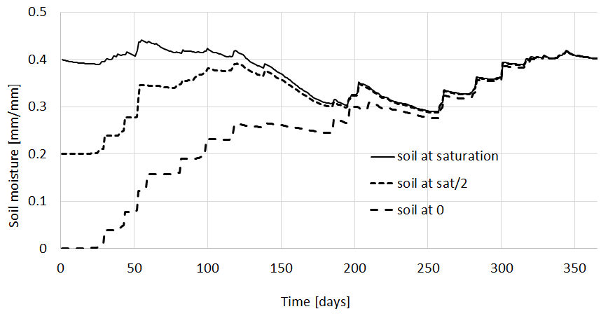
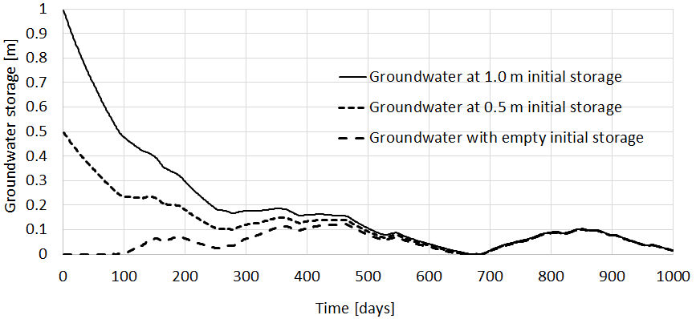

##############
Initialization
##############

.. contents:: 
    :depth: 4

Initialization
==============

CWatM needs estimates of the initial state of internal storage variables, e.g., the amount of water stored in snow, soil, groundwater, etc.

There are two possibilities:

1. The initial state of the internal storage variables is unknown and a **first** guess has to be used e.g. all storage variables are half-filled.

2. The initial state is known from a previous run, where the variables are stored at a certain time step. This is called **warm start**

The **warm start** is usful for:

* using a long pre-run to find the steady-state storage of the groundwater storage and use it as initial value

* using the stored variables to shorten the warm-up period

* using the stored variables to restart every day with the values from the previous day (forecasting mode)

Example of soil moisture
------------------------

The next figure shows the impact of different initial conditions on soil moisture in the lower soil.
In one of the simulations, the soil is initially almost completely saturated. In another simulation, the soil is completely dry and the third simulation starts with initial conditions in between the two extremes.

At first, the effects of different initial conditions are clearly visible. But after one year the three curves converge. The **memory** of the lower soil extends back about 1 year.

For all initial conditions other than groundwater, lakes, and reservoirs, the memory is about 12 months. 

Figure: Simulation of soil moisture in the lower soil with different initial conditions

For the groundwater zone, a longer warm-up period is needed due to the groundwater's slow response. Here, a rather fast-reacting groundwater storage is shown, with the three curves converging after two years.
We propose a warm-up of several decades. The longer the better.

Figure: Simulation of groundwater storage with different initial conditions

Cold start
----------

For a **cold start**, the values of the storage variables are unknown and set to a "first guess".
A list of variables and their default value for a **cold start** is given below in: :ref:`rst_initialcondition`

Set up a cold start in the settingsfile
***************************************

In the settings file the option: **load_initial** has to be set on **False**

.. literalinclude:: _static/settings1.ini
    :linenos:
    :lineno-match:
    :language: ini
    :lines: 145-152

.. note:: It is possible to exclude the warming up period of your model run for further analysis of results by setting the **SpinUp** option

::
 
    [TIME-RELATED_CONSTANTS]
    SpinUp =  01/01/1995 
	
Storing initial variables 
-------------------------

In the settings file the option **save_initial** has to be set to **True**

The name of the initial netCDF4 file has to be put in **initsave**

and one or more dates have to be specified in StepInit

.. literalinclude:: _static/settings1.ini
    :linenos:
    :lineno-match:
    :language: ini
    :lines: 154-158

	
Warm start
----------

CWatM can write internal variables to a netCDF file for chosen timesteps. These netCDF files can be used as the initial conditions for a succeeding simulation.

This is useful for establishing a steady-state after a long-term run and then using this steady-state for succeeding simulations or for an everyday run (forecasting mode)

.. warning:: If the parameters are changed after a run(especially the groundwater, lakes and reservoir parameters) the stored initial values do not reflect the conditions of the storage variables. Stored initial conditions should **not** be used as initial values for a model run with another set of parameters. If you do this during calibration, you will not be able to reproduce the calibration results!

Set up a cold start in the settingsfile
***************************************

In the settings file the option: **load_initial** has to be set on **True**
And define the name of the netcdf4 file in **initLoad**

.. note:: Use the initial values of the previous day here. E.g. if you run the model from 01/01/2006 use the inital condition from 31/12/2005

.. literalinclude:: _static/settings1.ini
    :linenos:
    :lineno-match:
    :language: ini
    :lines: 145-152

.. _rst_initialcondition:

Initial conditions
------------------

.. csv-table:: 
   :header: "No.","Variable","Description", "Default value","Number of maps"
   :widths: 20,50, 100, 50,30
   
   "1","SnowCover","Snow cover for up to 7 zones","0","7"
   "2","FrostIndex","Degree days frost threshold","0","1"
   "3","Forest state","Interception storage","0","1"
   "","","Top water layer","0","1"
   "","","Soil storage for 3 soil layers","0","3"
   "4","Grassland state","Interception storage","0","1"
   "","","Top water layer","0","1"
   "","","Soil storage for 3 soil layers","0","3"
   "5","Paddy irrigation state","Interception storage","0","1"
   "","","Top water layer","0","1"
   "","","Soil storage for 3 soil layers","0","3"
   "6","Irrigation state","Interception storage","0","1"
   "","","Top water layer","0","1"
   "","","Soil storage for 3 soil layers","0","3"
   "7","Sealed area state","Interception storage","0","1"
   "8","Groundwater","Groundwater storage","0","1"   
   "9","Runoff concentration","10 layers of runoff concentration","0","10"  
   "10","Routing","Channel storage","0.2 * total cross section","1"  
   "","Routing","Riverbed exchange","0","1" 
   "","Routing","Discharge","depending on ini channel stor.","1" 
   "11","Lakes and Reservoirs","Lake inflow","from HydroLakes database","1" 
   "","","Lake outflow","same as lake inflow","1" 
   "","","Lake&Res outflow to other lakes&res","same as lake inflow","1" 
   "","","Lake storage","based on inflow and lake area","1" 
   "","","Reservoir storage","0.5 * max. reservoir storage","1" 
   "","","Small lake storage","based on inflow and lake area","1" 
   "","","Small lake inflow","from HydroLakes database","1" 
   "","","Small lake outflow","same as small lake inflow","1" 
