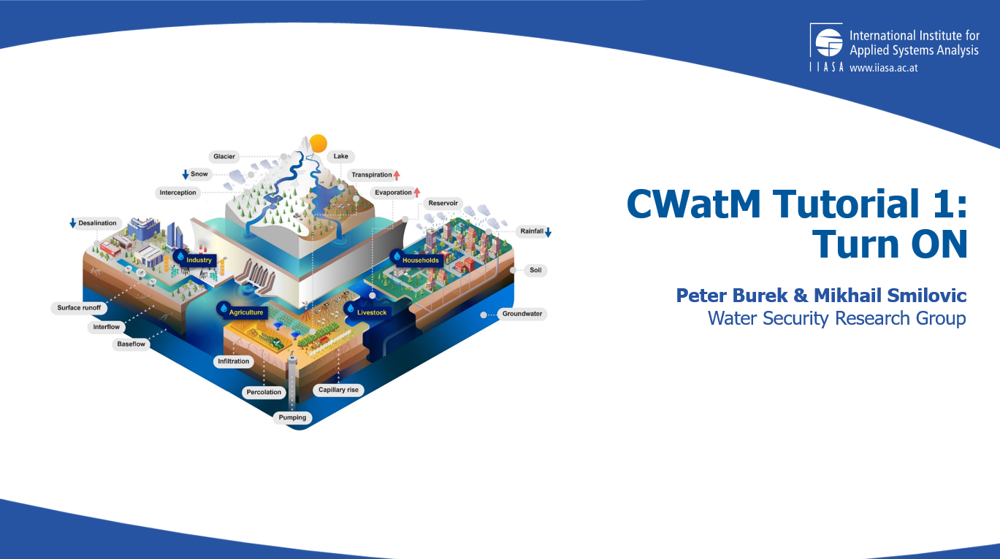
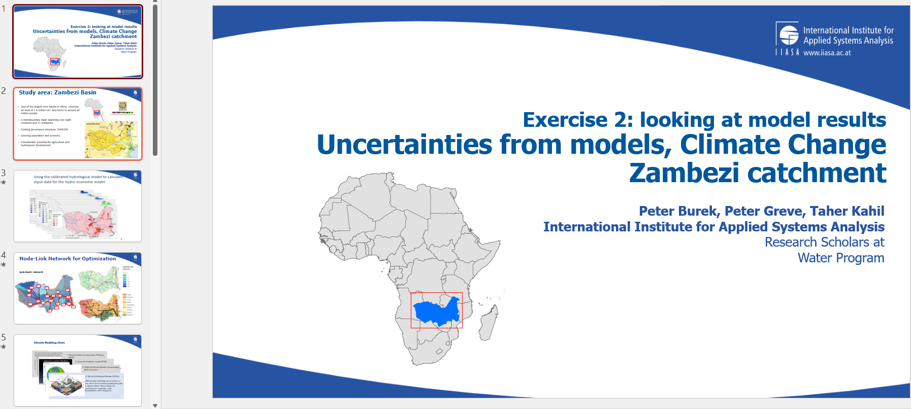
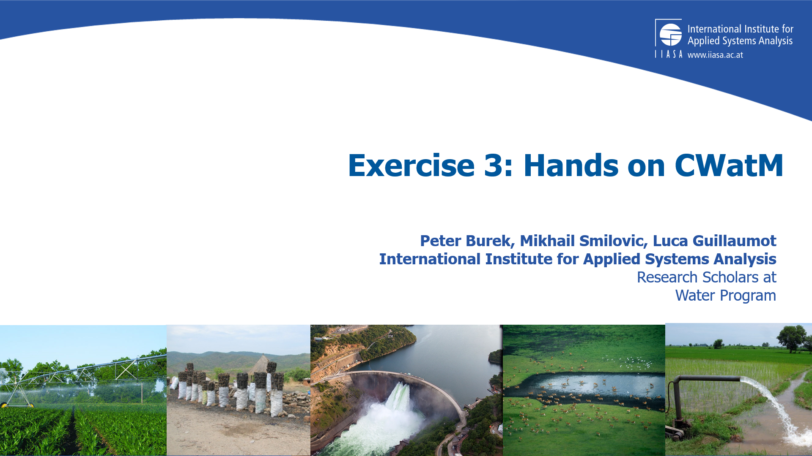
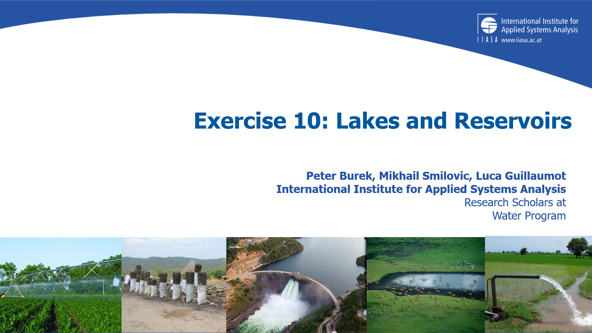
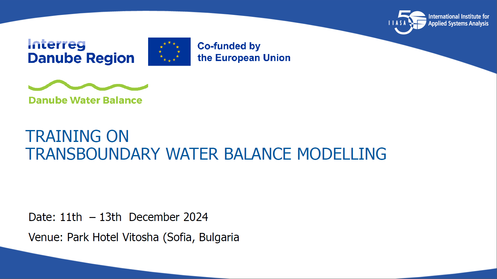
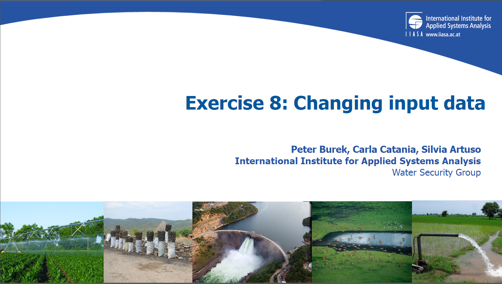

################
Offline Training
################

Tutorials 
=========

Our offline tutorial can be found here:

https://github.com/iiasa/CWatM/tree/develop/Tutorials/General

They come with a description and some exercises with settingsfiles

Please have a look at the pdf

Tutorial 1 starts with the structure of CWatM and how to turn it on

Tutorial 2 shows the example of the Zambezi River Basin - What are the uncertainties?

Tutorial 3 From here on you start to run CWatM by yourself

...
...

Tutorial 10 shows how to model lakes and reservoirs

Danube specific tutorials
-------------------------

For the Danube we have a own tutorial. It is produced in the framework of the Interreg Danube project: Danube Water Balance 2024-2026.

https://github.com/iiasa/CWatM/tree/develop/Tutorials/Danube

They come with a description and some exercises with settingsfiles

- **Exercise0** installing: Installing Python and CWatM
- **Exercise1** settings:   Working with the CWatM settingsfile.ini
- **Exercise2** mannings:    Change something and see the effect (here the routing parameter)
- **Exercise3** calibration: How to calibrate the model?
- **Exercise4** rivernetwork: How to change the river network?
- **Exercise5** crops:		  CWatM can have different crops. How to work with them?
- **Exercise6** watercycle: Postprocessing - How to make watercycle plots?
- **Exercise7** options: CWatM has a lot of options - How to select which one?
- **Exercise8** meteo:	How to work with netcdf files and how to change the input data?
- **Exercise10** output: CWatM has >500 variables, You dont want to output all of them, but maybe some?
- **Exercise11** model structure: Inside CWatM - explains the source code structure
- **Exercise12** reservoirs: How to change the behaviour of reservoirs?
- **Exercise13** GitHub: Why using GitHub?

This is the starting point:

And this is for example Exercise8

