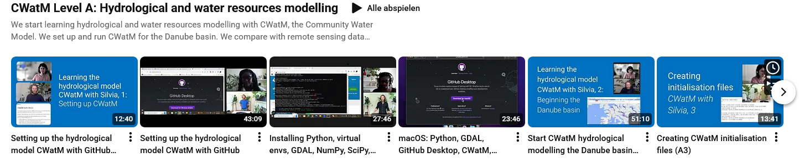
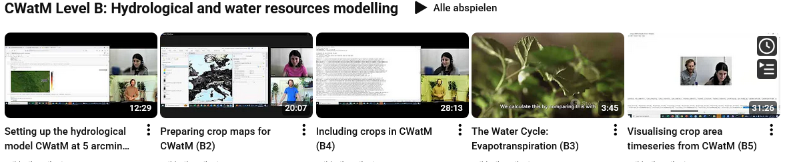
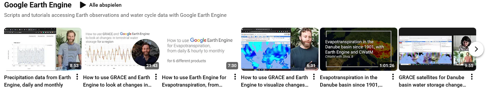
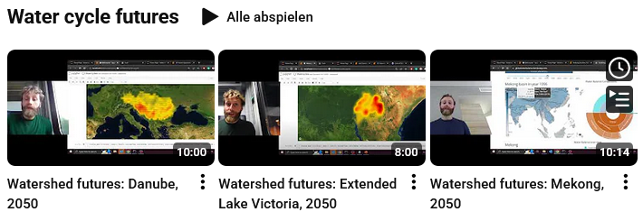
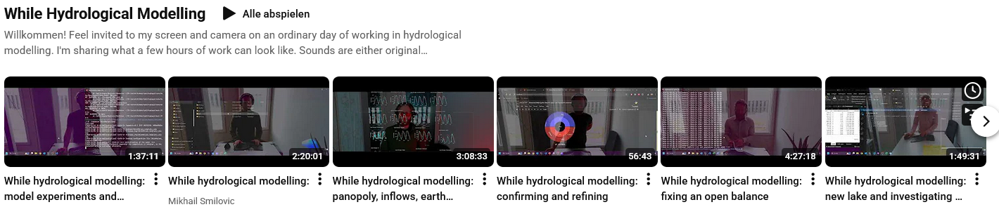

################
Online Training
################

YouTube videos 
==============

Mikhail Smilovic and Silvia Artuso explaining CWatM

please have a look at:

CWatM Level A: Hydrological and water resources modelling
---------------------------------------------------------

https://www.youtube.com/playlist?list=PLyT8dd_rWLawkTUNNXIIhoTxm_fGkI9Vf

We start learning hydrological and water resources modelling with CWatM, the Community Water Model. We set up and run CWatM for the Danube basin. 
We compare with remote sensing data hosted on Google Earth Engine, including changes in water storage from the GRACE satellites and Evapotranspiration products. We investigate patterns in the Danube basin over the last century.
Finally, we calibrate river discharge.
Level A certificates will be awarded upon successful submissions of a similar analysis for another large basin.

CWatM Level B: Hydrological and water resources modelling
---------------------------------------------------------

https://www.youtube.com/playlist?list=PLyT8dd_rWLawkU3nFlN21WKOBlscViiU4

Google Earth Engine
-------------------

https://www.youtube.com/playlist?list=PLyT8dd_rWLazhNqcxLwkV3mDhIrUjkNH-

Scripts and tutorials accessing Earth observations and water cycle data with Google Earth Engine

Water Cycle Future
------------------

https://www.youtube.com/playlist?list=PLyT8dd_rWLayzeiKKNMaV5G6csGv7tZKr

While Hydrological Modelling
----------------------------

https://www.youtube.com/playlist?list=PLyT8dd_rWLazt3SOEqW19Hy4qnIGOZXTn

Willkommen! Feel invited to my screen and camera on an ordinary day of working in hydrological modelling. I'm sharing what a few hours of work can look like. 
Sounds are either original compositions created using simulation outputs or occasionally live.
