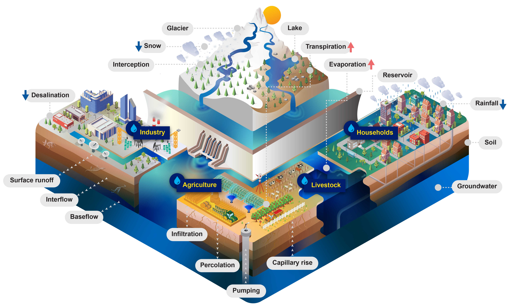
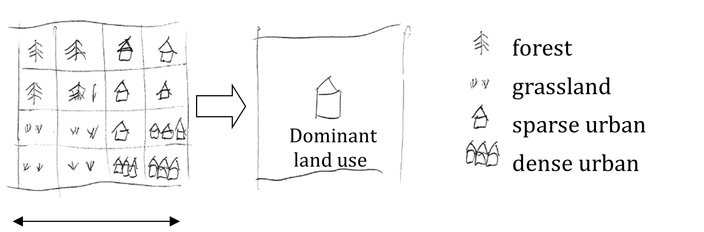
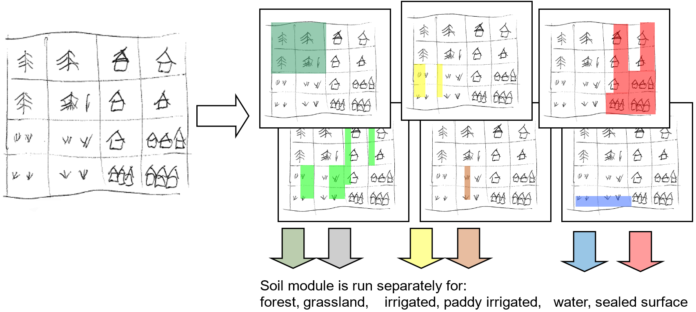
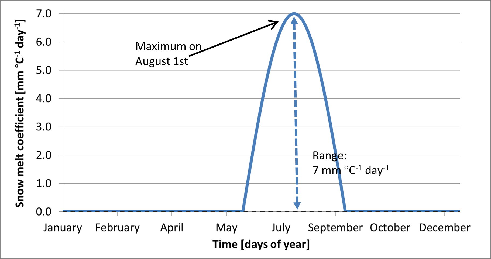
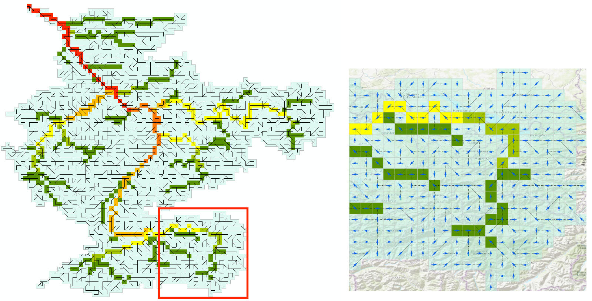

######################
Hydrological processes
######################

.. contents:: 
    :depth: 3

Overview
========

Figure 1: CWatM - Water-related processes included in the model

Processes
---------

Calculation of potential Evaporation
************************************

Using Penman-Montheith equations based on FAO 56 (and other approaches)

Calculation of rain, snow, and snowmelt
***************************************

Using day-degree approach with up to 10 vertical layers
Including snow- and glacier melt.

Land cover
**********

using fraction of 6 different land cover types

* Forest
* Grassland
* Irrigated land
* Paddy irrigated land
* Sealed areas (urban)
* Water

Water demand
************

* including water demand from industry and domestic land use via precalculated monthly spatial maps
* including agricultural water use from the calculation of plant water demand and livestock water demand
* Return flows ((water withdrawn but not consumed and returned to the water circle)

Vegetation
**********

Vegetation is taken into account in the calculation.

* Albedo
* Transpiration (including rooting depth, crop  phenology, and potential evapotranspiration)
* Interception 

Soil
****

Three soil layers for each land cover type, including processes:

* Frost interrupts soil processes
* Infiltration
* Preferential flow
* Capillary rise
* Surface runoff
* Interflow
* Percolation into groundwater

Groundwater
***********

Groundwater storage is simulated as linear groundwater reservoir

Lakes & Reservoirs
******************

* Lakes are simulated with weir function from Poleni for rectangular weir.
* Reservoirs are simulated  as outflow function between three storage limits (conservative, normal,flood) and three outflow functions (minimum, normal, non-damaging)

Routing
*******

Routing is calculated using the kinematic wave approach

Adressing sub-grid variability in land cover
--------------------------------------------

.. note::

   | Most of this and the following chapters (text and figures) are taken from 
   | Burek, P., Van Der Knijff, J., & de Roo, A. P. J. D. (2013). LISFLOOD distributed water balance and flood simulation model. Revised user manual. doi:10.2788/24719
   | https://publications.jrc.ec.europa.eu/repository/handle/JRC78917
   | and adjusted to CWatM

In hydrological model a number of parameters are linked directly to land cover classes by using lookup tables. In some models the spatially dominant value is used to assign the corresponding grid parameter values. This implies that some of the sub-grid variability in land use, and consequently in the parameter of interest, is lost (figure 2)

Figure 2: Land cover aggregation approach with dominant land cover

To account for the sub-grid variability in land use, CWatM models the within-grid variability. In the modified version of the hydrological model, the spatial distribution and frequency of each class is defined as a percentage of the whole represented area of the new pixel. Combining land cover classes and modeling aggregated classes, is known as the concept of hydrological response units (HRU). The logic behind this approach is that the non-linear nature of the rainfall runoff processes on different land cover surfaces observed in reality will be better captured. This concept is also used in models such as SWAT (Arnold and Fohrer, 2005) and PREVAH (Viviroli et al., 2009). CWatM is using a HRU approach on sub-grid level, as shown in figure 3.

Figure 3:  CWatM land cover aggregation by modelling aggregated land use classes separately: Percentages of forest (dark green); water (blue), impervious surface (red), other classes (light green)

**For forest, grassland (or others), irrigated and paddy irrigated areas:**

- The description of all soil- and groundwater-related processes below (evaporation, transpiration, infiltration, preferential flow, soil moisture redistribution and groundwater flow) are valid.
- While the modelling structure for forest, irrigated agriculture and others is the same, the difference is the use of different map sets for crop coefficient, interception, soil hydraulic properties and runoff concentration. 

.. note:: In most case we use the same soil hydraulic properties for all land cover classes, because we use dataset on soil hydraulics that does not distinguish between forests and others

**For sealed (impervious) areas:**

- A depression storage is filled by precipitation and snowmelt and emptied by evaporation
- Any water that is not filling a depression storage, reaches the surface and is added directly to surface runoff
- The storage capacity of the soil is zero (i.e. there is no soil)
- There is no groundwater storage

**For water covered areas:**

- Actual evaporation is equal to potential evaporation on open water
- The storage capacity of the soil is zero (i.e. there is no soil)
- There is no groundwater storage
- Lakes, reservoirs, wetland are calculated differently

The table below summarises the profiles of the four individually modelled categories of land cover classes.

Table 1: Summary of hydrological properties for different land cover classes

+--------------+----------------------+---------------+-------------------+
| Category     | Evapotranspiration   | Soil          | Runoff            |
+==============+======================+===============+===================+
| Forest       | High level of evapo- | Large rooting | Low concentration |
|              | transpiration        | depth         | time              |
|              | (high crop coeef.)   |               |                   |
+--------------+----------------------+---------------+-------------------+
| Other e.g.   | Evapotranspiration   | Rooting depth | Medium            |
| agricultural | lower than for       | lower than    | concentration     |
| areas,       | forest               | for forest    | time              |
| nonforested, |                      |               |                   |
| natural area |                      |               |                   |
+--------------+----------------------+---------------+-------------------+
| Sealed,      | max. evaporation     | -             | Fast              |
| impervious   | from depression      |               | concentration time|
| area         | storage              |               |                   |
+--------------+----------------------+---------------+-------------------+
| Water        | Maximum evaporation  | -             | Fast              |
|              |                      |               | concentration time|
+--------------+----------------------+---------------+-------------------+

CWatM calculates for every land cover class the soil fluxes, even if there is not such a land cover class in that cell. The model will then calculate the real fluxes based on the corresponding land cover class fraction. As result of the soil model you get six different surface fluxes weighted by the corresponding fraction (forest, other, irrigated, paddy irrigated, water and sealed), respectively four fluxes percolating to the groundwater zone (forest, other, irrigated, paddy irrigated).

CWatM can report the real fluxes and state variable by weighting the indivual fluxes and state variables with the fraction of each land cover class.

.. note::

   | CWatM can report each individual flux (e.g. directRunoff[0] for forest) or state variable (e.g. theta1[2] for soil moisture 1st layer irrigated class)
   | If you report individual variables, it is assumed that this is for 100% of this land cover class

Detailed description of processes
=================================

Potential Evaporation
---------------------

Evaporation can be calculated with different approaches:

#. Penman Monteith:
   Allen, R. G., Pereira, L. S., Raes, D., & Smith, M. (1998). Crop evapotranspiration—Guidelines for computing crop water requirements—FAO Irrigation and Drainage Paper 56. Food and Agriculture Organization of the United Nations.
#. Milly and Dunne method:
   P. C. D. Milly* and K. A. Dunne, 2016: Potential evapotranspiration and continental drying, Nature Climate Change, DOI: 10.1038/NCLIMATE3046
   Energy only PET: ET=0.8 Rn   equation 8 in the paper
#. Yang et al. Penman Montheith correction method:
   Yang, Y., Roderick, M. L., Zhang, S., McVicar, T. R., and Donohue, R. J.: Hydrologic implications of vegetation response to elevated CO2 in climate projections, Nat. Clim. Change, 9, 44-48, 10.1038/s41558-018-0361-0, 2019.
   Equation 14 in the paer: where the term 2.14 accounts for changing [CO2] on rs
#. Priestley-Taylor: 
   Buck AL. 1981. New equations for computing vapor pressure and enhancement factor
   uses only tmin, tmax, tavg, rsds, rlds (or rsd)
#. Modified Thornthwaite: 
   Pereira, A. R., & Pruitt, W. O. (2004). Adaptation of the Thornthwaite Scheme for Estimating Daily Reference Evapotranspiration. Agricultural Water Management, 66, 251-257.
   https://doi.org/10.1016/j.agwat.2003.11.003
   Adjusted by Tamas Acs, Budapest University of Technology and Economics

There are three very good guides to explain the approach of Penman Monteith, `FAO 56 Guidelines <http://www.fao.org/docrep/X0490E/x0490e08.htm#penman%20monteith%20equation>`__ , `LISVAP Documentation <https://op.europa.eu/en/publication-detail/-/publication/1aa87e8f-8aa9-45f7-9524-6a98c0f495ce/language-en>`__  and `Wetlandscapes <https://wetlandscapes.github.io/blog/blog/penman-monteith-and-priestley-taylor/>`__  . Therefore, we are here to lazy to explain this again.

Rain and Snow and Melt
----------------------

If the average temperatur is below 1°C, all precipitation is assumed to be snow. A snow correction factor is used to correct for undercatch of snow precipitation. Unlike rain, snow accumulates on the soil surface until it melts. The rate of snowmelt is estimated using a simple degree-day factor method. Degree-day factor type snow melt models usually take the following form (e.g. see WMO, 1986):

:math:`M = C_m (T_{avg} - T_m)`

where M  is the rate of snowmelt, Tavg is the average daily temperature, Tm is some critical temperature and Cm is a degree-day factor [mm °C-1 day-1]. Speers et al. (1979) developed an extension of this equation which accounts for accelerated snowmelt that takes place when it is raining (cited in Young, 1985). The equation is supposed to apply when rainfall is greater than 30 mm in 24 hours. Moreover, although the equation is reported to work sufficiently well in forested areas, it is not valid in areas that are above the tree line, where radiation is the main energy source for snowmelt).  CWatM uses a variation on the equation of Speers et al. The modified equation simply assumes that for each mm of rainfall, the rate of snowmelt increases with 1% (compared to a ‘dry’ situation). This yields the following equation:

:math:`M = C_m \cdot C_{\text{Seasonal}} \cdot (1 + 0.01 \cdot R \cdot \Delta t) \cdot (T_{\text{avg}} - T_m) \cdot \Delta t` 

where M is the snowmelt per time step [mm], R is rainfall (not snow!) intensity [mm day-1], and Δt is the time interval [days]. Tm has a value of 0 °C, and Cm is a degree-day factor [mm °C-1 day-1]. However, it should be stressed that the value of Cm can actually vary greatly both in space and time (e.g. see Martinec et al., 1998). 
Therefore, in practice this parameter is often treated as a calibration constant. A low value of Cm indicates slow snow melt. CSeasonal is a seasonal variable melt factor which is also used in several other models (e.g. Anderson 2006, Viviroli et al., 2009). There are mainly two reasons to use a seasonally variable melt factor:
-	The solar radiation has an effect on the energy balance and varies with the time of the year.
-	The albedo of the snow has a seasonal variation, because fresh snow is more common in the mid winter and aged snow in the late winter/spring. This produce an even greater seasonal variation in the amount of net solar radiation

Figure 4: shows an example where a mean value of: 3.0 mm °C-1 d-1is used. The value of Cm is reduced by 0.5 at 21st December and a 0.5 is added on the 21st June. In between a sinus function is applied

.. image:: _static/82_snowmelt.png
    :width: 600px
	
Figure 4 Sinus shaped snow melt coefficient (Cm) as a function of days of year

At high altitudes, where the temperature never exceeds 1ºC, the model accumulates snow without any reduction because of melting loss. In these altitudes runoff from glacier melt is an important part. The snow will accumulate and converted into firn. Then firn is converted to ice and transported to the lower regions. This can take decades or even hundred years. In the ablation area the ice is melted. In CWatM this process is emulated by melting the snow in higher altitudes on an annual basis over summer. A sinus function is used to start ice melting in summer, starting on the 15 June and ending on the 15 September (see fig 4) and using the temperature of elevation zone 3 (see fig 5)

Figure 5: Sinus shaped ice melt coefficient as a function of days of year

The amount of snowmelt and icemelt together can never exceed the actual snow cover that is present on the surface.

For large cell sizes, there may be considerable sub-cell heterogeneity in snow accumulation and melt, which is a particular problem if there are large elevation differences within a cell. Because of this, snow melt and accumulation are modelled separately for different elevation zones, which are defined by the percentiles of sub-cell elevation.
The division in elevation zones is done by calculating the percentiles of a high resolution DEM inside the resolution  of the CWatM cell. e.,g 3 arcsec SRTM DEM cell in a 5 arcmin grid cell. 
Depending on the elevetion zones (e.g. 0.0065 °C) per meter elevation difference. Snow, snowmelt and snow accumulation are subsequently modelled separately for each elevation zone.

Frost Index
-----------

When the soil surface is frozen, this affects the hydrological processes occurring near the soil surface. To estimate whether the soil surface is frozen or not, a frost index F is calculated. The equation is based on Molnau & Bissell (1983, cited in Maidment 1993), and adjusted for variable time steps. The rate at which the frost index changes is given by: 

:math:`\frac{dF}{dt} = -(1 - A_f)F - T_{av} \cdot e^{-0.04 \cdot K \cdot \frac{d_s}{we_s}}` 

dF/dt  is expressed in [°C day-1 day-1 ].  Af is a decay coefficient [day-1], K is a a snow depth reduction coefficient [cm-1], ds is the (pixel-average) depth of the snow cover (expressed as mm equivalent water depth), and wes is a parameter called snow water equivalent, which is the equivalent water depth water of a snow cover (Maidment, 1993). In CWatM, Af and K are set to 0.97 and 0.57 cm-1 respectively, and wes is taken as 0.1, assuming an average snow density of 100 kg/m3 (Maidment, 1993). The soil is considered frozen when the frost index rises above a critical threshold of 56.  For each time step the value of F [°C day-1] is updated as:

:math:`F(t) = F(t-1) + \frac{dF}{dt} \Delta t` 

F is not allowed to become less than 0. When the frost index rises above a threshold of 56, every soil process is frozen and transpiration, evaporation, infiltration and the outflow to the second soil layer and to upper groundwater layer is set to zero. Any rainfall is bypassing the soil and transformed into surface runoff till the frost index is equal or less than 56. To prevent that the soil is frozen for a too long period, a maximimum F can bedefined (e.g. 60) where F is not allowed to become more.

Available water for infiltration and runoff
-------------------------------------------

Water available for infiltration or surface runoff is calculated for each cell and each landcover class:

:math:`W_{av} = R + SM + D - Int`

| where:
| W\ :sub:`av`: Available water
| R:  Rainfall [m]
| SM: Snow melt [m]
| D:  Vegetation drainage [m]
| Int: Interception [mm]

The openwater evaporation for sealed and water is calculated:

:math:`E_{act\_water} = \min(mult \cdot ET_{water}, W_{av})`

| where:
| Eact\ :sub:`water`: open water evaporation for this land cover class
| mult:  multiplicator - for water 1.0, for sealed 0.2
| ET\ :sub:`water`: Potential evaporation for water

Direct runoff (surface runoff) for sealed and water land cover class is calculated:

:math:`\text{Direct runoff} = \text{fraction\_sealed\_or\_water} \times W_{\text{av}}`

For the other land cover classes (forest, other, irrigated, paddy irrigated) W\ :sup:`av` is split into surface runoff and infiltration.

Soil processes
--------------

Water uptake by plant roots and transpiration
*********************************************

Water uptake and transpiration by vegetation and direct evaporation from the soil surface are modelled as two separate processes. The approach used here is largely based on Supit et al. (1994) and Supit & Van Der Goot (2000). The maximum transpiration per time step [m] is given by:

:math:`T_{max} = \min(k_{crop} \cdot ET_{ref}, 0.01)`

Where ETref is the potential (reference) evapotranspiration rate [mm day-1], kcrop is dependend on the crop and on the day of the year.

The energy that has been ‘consumed’ already for the evaporation of intercepted water is simply subtracted here in order to respect the overall energy balance.  The actual transpiration rate is reduced when the amount of moisture in the soil is small. In the model, a reduction factor is applied to simulate this effect:

:math:`r_{WS} = \frac{w_1 - w_{wp1}}{w_{crit1} - w_{wp1}}`

where w1 is the amount of moisture in the upper soil layer [mm], wwp1 [mm] is the amount of soil moisture at wilting point (soil moisture potential pF 4.2) and  wcrit1 [mm] is the amount of moisture  below which water uptake is reduced and plants start closing their stomata. The critical amount of soil moisture is calculated as:

:math:`w_{crit1} = (1-p) \cdot (w_{fc1} - w_{wp1}) + w_{wp1}`

where wfc1 [mm] is the amount of soil moisture at field capacity and p is the soil water depletion fraction. RWS varies between 0 and 1: negative values and values greater than 1 are truncated to 0 and 1, respectively. p represents the fraction of soil moisture between wfc1 and wwp1 that can be extracted from the soil without reducing the transpiration rate.  Its value is a function of both vegetation type and the potential evapotranspiration rate. The procedure to estimate p is described in Supit and Van Der Goot (2003).

It is calculated for irrigated and paddy irrigated areas:

:math:`p = \frac{1}{0.76 + 1.5 \cdot T_{\text{max}}} - 0.4`

:math:`p = p + (T_{max} - 0.6) / 4`

From: Soil water depletion fraction (easily available soil water). Van Diepen et al., 1988: WOFOST 6.0, p.87.

And for forest and others:

:math:`p = \frac{1}{0.76 + 1.5 \cdot T_{\text{max}}} - 0.10 \cdot (5 - \text{Crop\_Groupnumber})`

:math:`p = p + \frac{T_{max} - 0.6}{Crop\_Groupnumber \cdot (Crop\_Groupnumber + 3)}`  for Crop\ :sub:`Groupnumber` <= 2.5
 
 Crop\ :sub:`Groupnumber` is a value between 1-5 and is a indicator of adaptation to dry climate, e.g. olive groves are adapted to dry climate, therefore they can extract more water from drying out soil than e.g. rice. The crop group number of olive groves is 4 and of rice fields is 1.

.. image:: _static/82_waterstress.png
    :width: 500px

Figure 6: Reduction of transpiration in case of water stress. Rws decreases linearly to zero between wcrit and wwp.

The actual transpiration Ta is now calculated as:

:math:`T_a = r_{WS} \cdot T_{max}`

Transpiration is set to zero when the soil is frozen (i.e. when frost index F exceeds its critical threshold). The amount of moisture in the upper soil layer is updated after the transpiration calculations:

:math:`w_1 = w_1 - T_a`

Actual bare soil evaporation
**************************************

The maximum amount of evaporation from the soil surface equals the maximum evaporation from a shaded soil surface, E\ :sub:`Smax` [m]:

:math:`ES_a = ET_{Ref} \cdot K_{c,min}`

| where:
| ET\ :sub:`Ref`: Potential evapotranspiration of a reference crop
| K\ :sub:`c,min`: Minimum KC factor of a land cover class

The actual soil evaporation is always the smallest value out of the result of the equation above and the available amount of moisture in the soil

:math:`ES_a = \min(ES_a, w_1 - w_{res1})`

Infiltration capacity
*********************

The infiltration capacity of the soil is estimated using the widely-used Xinanjiang (also known as VIC/ARNO) model (e.g. Zhao & Lui, 1995; Todini, 1996). This approach assumes that the fraction of a grid cell that is contributing to surface runoff (read: saturated) is related to the total amount of soil moisture, and that this relationship can be described through a non-linear distribution function. For any grid cell, if w1 is the total moisture storage in the upper soil layer and ws1 is the maximum storage, the corresponding saturated fraction As is approximated by the following distribution function: 

:math:`A_s = 1 - \left(1 - \frac{w_1}{ws_1}\right)^b`

where ws1 and w1 are the maximum and actual amounts of moisture in the upper soil layer, respectively [m], and b is an empirical shape parameter. In the CWatM implementation of the Xinanjiang model, A\ :sub:`s` is defined as a fraction of the permeable fraction of each cell. The infiltration capacity INF\ :sub:`pot` [m] is a function of ws and A\ :sub:`as`:

The shape parameter b is related to the heterogeneity within each grid cell. For a totally homogeneous grid cell b approaches zero, which reduces the above equations to a simple ‘overflowing bucket’ model. Before any water is draining from the soil to the groundwater zone the soil has to be completely filled up. See also red line in figure 2.9: e.g. a soil of 60% soil moisture has 40% potential infiltration capacity. A b value of 1.0 is comparable to a leaking bucket. See black line in figure 7: e.g. a soil of 60% soil moisture has only 10% potential infiltration capacity while 30% is draining directly to groundwater. Increasing b even further than 1 is comparable to a sieve (see figure 8). Most of the water is going directly to groundwater and the potential infiltration capacity is going toward 0.

.. image:: _static/82_xinan1.png
    :width: 400px

Figure 7: Soil moisture and potential infiltration capacity relation

.. image:: _static/82_xinan2.png
    :width: 700px

Figure 8: Analogy picture of increasing Xinanjiang empirical shape parameter b

Preferential bypass flow
************************

For the simulation of preferential bypass flow –i.e. flow that bypasses the soil matrix and drains directly to the groundwater- no generally accepted equations exist. Because ignoring preferential flow completely will lead to unrealistic model behaviour during extreme rainfall conditions, a very simple approach is used in CWatM. During each time step, a fraction of the water that is available for infiltration is added to the groundwater directly (i.e. without first entering the soil matrix).  It is assumed that this fraction is a power function of the relative saturation of the topsoil, which results in an equation that is somewhat similar to the excess soil water equation used in the HBV model (e.g. Lindström et al., 1997):

:math:`D_{pref,gw} = W_{av} \left(\frac{w_1}{w_{s1}}\right)^{c_{pref}}`

where D\ :sub:`pref,gw` is the amount of preferential flow per time step [m],  W\ :sub:`av` is the amount of water that is available for infiltration, and c\ :sub:`pref` is an empirical shape parameter. The equation results in a preferential flow component that becomes increasingly important as the soil gets wetter.  

Figure 9 shows with cpref = 0 (red line) every available water for infiltration is converted into preferential flow and bypassing the soil. cpref = 1 (black line) gives a linear relation e.g. at 60% soil saturation 60% of the available water is bypassing the soil matrix. With increasing cpref  the percentage of preferential flow is decreasing.

.. image:: _static/82_preferential.png
    :width: 400px

Figure 9: Soil moisture and preferential flow relation

Actual infiltration and surface runoff
**************************************

The actual infiltration INFact [m] is now calculated as:

:math:`INF_{act} = \min(INF_{pot}, W_{av} - D_{pref,gw})`

The surface runoff R\ :sub:`s` [m] for each land cover class is calculated as:

:math:`R_s = W_{av} - D_{pref,gw} - INF_{act}`

If the soil is frozen (F > critical threshold) no infiltration takes place. The amount of moisture in the upper soil layer is updated after the infiltration calculations:

:math:`w_1 = w_1 + INF_{act}` 

Soil moisture redistribution
****************************

The description of the moisture fluxes out of the subsoil (and also between the upper- and lower soil layer) is based on the simplifying assumption that the flow of soil moisture is entirely gravity-driven. Starting from Darcy’s law for 1-D vertical flow:

:math:`q = -K(\theta)\left[\frac{\partial h(\theta)}{\partial z} - 1\right]`

where q [m day-1] is the flow rate out of the soil (e.g. upper soil layer, lower soil layer); K(θ) [m day-1] is the hydraulic conductivity (as a function of the volumetric moisture content of the soil, θ [m3 m-3]) and   is the matric potential gradient. If we assume a matric potential gradient of zero, the equation reduces to:

:math:`q=K(\theta)`

This implies a flow that is always in downward direction, at a rate that equals the conductivity of the soil.  The relationship between hydraulic conductivity and soil moisture status is described by the Van Genuchten equation (van Genuchten, 1980), here re-written in terms of m water slice, instead of volume fractions:

:math:`K(w) = K_s \left(\frac{w-w_r}{w_s-w_r}\right)^{1/2} \left\{1-\left[1-\left(\frac{w-w_r}{w_s-w_r}\right)^{1/m}\right]^m\right\}^2`

where Ks is the saturated conductivity of the soil [mm day-1], and w, wr and ws are the actual, residual and maximum amounts of moisture in the soil respectively (all in [mm]). Parameter m is calculated from the pore-size index, λ (which is related to soil texture):

:math:`m=\lambda/(\lambda+1)`

For large values of Δt (e.g. 1 day) the above equation often results in amounts of outflow that exceed the available soil moisture storage, i.e:

:math:`K(w)\Delta t > w - w_r`

In order to solve the soil moisture equations correctly an iterative procedure is used. At the beginning of each time step, the conductivities for both soil layers [K1(w1), K2(w2)] are calculated using the Van Genuchten equation. Multiplying these values with the time step and dividing by the available moisture gives a Courant-type numerical stability indicator for each respective layer: 

:math:`C_1 = \frac{K_1(w_1) \cdot \Delta t}{w_1 - w_{r1}}`

:math:`C_2 = \frac{K_2(w_2) \cdot \Delta t}{w_2 - w_{r2}}`

A Courant number that is greater than 1 implies that the calculated outflow exceeds the available soil moisture, resulting in loss of mass balance. Since we need a stable solution for both soil layers, the ‘overall’ Courant number for the soil moisture routine is the largest value out of C1 and C2:

:math:`C_{soil} = \max(C_1, C_2)`

In CWatM the number of substeps is set to 3.

In brief, the iterative procedure now involves the following steps. First, the number of sub-steps and the corresponding sub-time-step are computed as explained above. The amounts of soil moisture in the upper and lower layer are copied to temporary variables w’1 and w’2. Two variables, D1,2 (flow from upper to lower soil layer) and D2,gw (flow from lower soil layer to groundwater) are initialized (set to zero). Then, for each sub-step, the following sequence of calculations is performed:

1.	compute hydraulic conductivity for both layers

2.	compute flux from upper to lower soil layer for this sub-step (D’1,2, can never exceed storage capacity in lower layer):

 	:math:`D'_{1,2} = \min[K_1(w'_1)\Delta t, w'_{s2} - w'_2]`

3.	compute flux from lower soil layer to groundwater for this sub-step (D’2,gw, can never exceed available water in lower layer):

    :math:`D'_{2,gw} = \min[K_2(w'_2)\Delta t, w'_2 - w'_{r2}]`

4.	update w’1 and w’2

5.	add D’1,2 to D1,2; add D’2,gw to D2,gw

If the soil is frozen (F > critical threshold), both D1,2 and D2,gw are set to zero. After the iteration loop, the amounts of soil moisture in both layers are updated as follows:

:math:`w_1 = w_1 - D_{1,2}`

:math:`w_2 = w_2 + D_{1,2} - D_{2,gw}`

Interflow and groundwater recharge
**********************************

Interflow is the lateral movement of water through the subsurface, above the groundwater table but below the surface, Interflow, together with surface runoff and baseflow from groundwater creates runoff.

PercolationImp is the fraction of area where percolation to interflow is impeded. To calculate PercolationImp a simplified approach from from Sloan and Moore (1984) as in van Beek and Bierkens (2009) is used:

:math:`p = (2 k_s \tan(\text{slope})) / (0.4 \theta_s)`

| where:
| p: PercolationImp
| ks: Saturated soil conductivity of the 2nd layer
| tanslope: Tangens of the average slope
| θ_s: Saturated soil moisture content 

Interflow is calculated for each land cover class as:

:math:`Interflow = (p \times calibration\_factor) \times (D_{2,gw} + D_{pref,gw})`

and groundwater recharge as:

:math:`GW_{recharge} = (1 - p * calibration_{factor}) * (D_{2,gw} + D_{pref,gw})`

Groundwater
-----------

Groundwater storage and transport are modelled using a linear reservoirs, the outflow of the storage represent baseflow. 

:math:`GW_{Storage} = GW_{Storage} + GW_{recharge,sum} - GW_{Abstraction}`

:math:`baseflow = recession\_Coeff \times GW\_Storage`

where recession_Coeff is a reservoir constant [1/days] and can be calculated like in Beck et al. 2013 as  base flow recession constant.

:math:`GW_{Storage} = GW_{Storage} - baseflow`

Runoff concentration
--------------------

Runoff concentration is the intermediate process between runoff generation and channel routing. It is concentrating runoff from different land cover classes within each grid cell by using lag-time and diffusion processes based on topographic and land cover characteristics. Calculation is based on triangular weighting function concepts for temporal concentration.
	
The concentration process accounts for:
   - Variable lag times based on slope, length, and land cover
   - Temporal diffusion using triangular weighting functions
   - Different peak times for surface runoff, interflow, and baseflow
   - Land cover-specific concentration parameters
    
Mathematical formulation:

:math:`Q_t = \sum_{i=0}^{\text{max}} c_i \cdot Q_{\text{source},t-i+1}`

where c(i) represents the triangular weighting coefficients:

:math:`c_i = \int_{min}^{\text{i}} \left(\frac{2}{\text{max}} - (u - \frac{\text{max}}{2}) \cdot \frac{4}{\text{max}^2}\right) du`
    

River routing
-------------

The river drainage map or local drain direction (LDD) defines the flow direction of each grid cell and forming a river channel network. See :ref:`rst_ldd`

Figure 10: River network for the Rhine basin

Flow through the river channel network is calculated using the kinematic wave equations. The basic equations and the numerical solution are identical to those used for the surface runoff routing:

:math:`q = \frac{\partial Q}{\partial x} + \frac{\partial A}{\partial t}`

where Q is the channel discharge [m3 s-1], A is the cross-sectional area of the flow [m2] and q is the amount of lateral inflow per unit flow length [m2 s-1]. The momentum equation then becomes:

:math:`\rho g A (S_0 - S_f) = 0`

where ρ is the density of the flow [kg m-3], g is the gravity acceleration [m s-2], S0 is the topographical gradient and Sf is the friction gradient. From the momentum equation it follows that S0= Sf, which means that for the kinematic wave equations it is assumed that the water surface is parallel to the topographical surface. The continuity equation can also be written in the following finite-difference form:

:math:`\frac{Q_{i+1}^{j+1}-Q_i^{j+1}}{\Delta x}+\frac{A_{i+1}^{j+1}-A_{i+1}^j}{\Delta t}=\frac{q_{i+1}^{j+1}-q_{i+1}^j}{2}`

where j is a time index and i a space index. The momentum equation can also be expressed as (Chow et al., 1988)

:math:`A = \alpha_k \cdot Q^{\beta_k}`

If αk,sr and βk are known, this non-linear equation can be solved for each cell and during each time step (here we us sub-daily timesteps) using an iterative procedure. This numerical solution scheme is programmed in CWatM as C++ function to decrease computational time. The coefficients αk and βk are calculated by substituting Manning's equation:

:math:`A = \left(\frac{n \cdot P^{2/3}}{\sqrt{S_0}}\right)^{3/5} \cdot Q^{3/5}`

where n is Manning's roughness coefficient and Psr is the wetted perimeter of a cross-section of the surface flow. Substituting the right-hand side of this equation for A gives:

:math:`\alpha_k = \left(\frac{n \cdot P^{2/3}}{\sqrt{S_0}}\right)^{0.6}` ; :math:`\beta_k = 0.6`

CWatM uses values for αk,ch which are based on a static channel flow depth (half bankfull) and measured channel dimensions. The term q_ch (sideflow) represents the runoff that enters the channel per unit channel length:

:math:`q_{ch} = (runoff_{surface} + interflow + baseflow + Q_{lake,res} + Q_{in}) / L_c`

where runoff is the results from runoff concentration of surface, interflow and baseflow, Q_lake,res is water thats flows in from lakes and reservoirs and Q_in is the inflow from an external inflow hydrograph.

Missing processes
-----------------

Not missing in the model, but in this description

- Lake, reservoirs, wetlands
- Water transfer
- Crop specific evaporation
- Water demand, consumption, withdrawal
- Waste water

**References**
==============

#. Anderson, E., 2006. Snow Accumulation and Ablation Model – SNOW-17. Technical report.
#. Aston, A.R., 1979. Rainfall interception by eight small trees. Journal of Hydrology 42, 383-396.
#. Beck, H. E., A. I. J. M. van Dijk, D. G. Miralles, R. A. M. de Jeu, L. A. Bruijnzeel, T. R. McVicar, and J. Schellekens (2013), Global patterns in base flow index and recession based on streamflow observations from 3394 catchments, Water Resour. Res., 49, 7843–7863, doi:10.1002/2013WR013918
#. Bódis, K., 2009. Development of a data set for continental hydrologic modelling. Technical Report EUR 24087 EN JRC Catalogue number: LB-NA-24087-EN-C, Institute for Environment and Sustainability, Joint Research Centre of the European Commission Land Management and Natural Hazards Unit Action FLOOD. Input layers related to topography, channel geometry, land cover and soil characteristics of European and African river basins.
#. Buck AL. 1981. New equations for computing vapor pressure and enhancement factor. Journal of Applied Meteorology 20 (12): 1527-1532 DOI: 10.1175/1520-0450(1981)020<1527:NEFCVP>2.0.CO;2
#. Chow, V.T., Maidment, D.R., Mays, L.M., 1988. Applied Hydrology, McGraw-Hill, Singapore, 572 pp.
#. De Roo, A., Thielen, J., Gouweleeuw, B., 2003. LISFLOOD, a Distributed Water-Balance, Flood Simulation, and Flood Inundation Model, User Manual version 1.2. Internal report, Joint Research Center of the European Communities, Ispra, Italy, 74 pp.
#. Fröhlich, W., 1996. Wasserstandsvorhersage mit dem Prgramm ELBA. Wasserwirtschaft Wassertechnik, ISSN: 0043-0986, Nr. 7, 1996, 34-37.
#. Goudriaan, J., 1977. Crop micrometeorology: a simulation study. Simulation Monographs. Pudoc, Wageningen.
#. Hock, R., 2003. Temperature index melt modelling in mountain areas. Journal of Hydrology, 282(1-4), 104–115.
#. Lindström, G., Johansson, B., Persson, M., Gardelin, M., Bergström, S., 1997. Development and test of the distributed HBV-96 hydrological model. Journal of Hydrology 201, 272-288.
#. Maidment, D.R. (ed.), 1993. Handbook of Hydrology, McGraw-Hill.
#. Maniak, U., 1997. Hydrologie und Wasserwirtschaft. Vierte, überarbeitete und erweiterte Auflage, Springer.
#. Martinec, J., Rango, A., Roberts, R.T., 1998. Snowmelt Runoff Model (SRM) User's Manual (Updated Edition 1998, Version 4.0). Geographica Bernensia, Department of Geography - University of Bern, 1999.  84pp.
#. Merriam, R.A., 1960. A note on the interception loss equation. Journal of Geophysical Research 65, 3850-3851.
#. Molnau, M., Bissell, V.C., 1983. A continuous frozen ground index for flood forecasting. In: Proceedings 51st Annual Meeting Western Snow Conference, 109-119.
#. Rao, C.X. and Maurer, E.P., 1996. A simplified model for predicting daily transmission losses in a stream channel. Water Resources Bulletin, Vol. 31, No. 6., 1139-1146.
#. Sloan, P.G. and I.D. Moore (1984), Modeling subsurface stormflow on steeply sloping forested watersheds, Water Resources Research 20, 1815–1822.
#. Speers, D.D. , Versteeg, J.D., 1979. Runoff forecasting for reservoir operations – the past and the future. In: Proceedings 52nd Western Snow Conference, 149-156.
#. Stroosnijder, L., 1982. Simulation of the soil water balance. In: Penning de Vries, F.W.T., Van Laar, H.H. (eds), Simulation of Plant Growth and Crop Production, Simulation Monographs, Pudoc, Wageningen, pp. 175-193.
#. Stroosnijder, L., 1987. Soil evaporation: test of a practical approach under semi-arid conditions. Netherlands Journal of Agricultural Science 35, 417-426.
#. Supit I., A.A. Hooijer, C.A. van Diepen (eds.), 1994. System Description of the WOFOST 6.0 Crop Simulation Model Implemented in CGMS. Volume 1: Theory and Algorithms. EUR 15956, Office for Official Publications of the European Communities, Luxembourg.
#. Supit, I. , van der Goot, E. (eds.), 2003. Updated System Description of the WOFOST Crop Growth Simulation Model as Implemented in the Crop Growth Monitoring System Applied by the European Commission, Treemail, Heelsum, The Netherlands, 120 pp.
#. Todini, E., 1996. The ARNO rainfall––runoff model. Journal of Hydrology 175,  339-382.
#. van Beek, L. P. H., and Bierkens, M. F. P.: The global hydrological model PCR-GLOBWB: Conceptualization, parameterization and verification [Available at http://vanbeek.geo.uu.nl/suppinfo/vanbeekbierkens2009.pdf], Dep. of Phys. Geogr., Utrecht University, Utrecht, Netherlands, 2009.
#. Van Der Knijff, J., De Roo, A., 2006. LISFLOOD – Distributed Water Balance and Flood Simulation Model, User Manual. EUR 22166 EN, Office for Official Publications of the European Communities, Luxembourg, 88 pp.
#. Van Genuchten, M.Th., 1980. A closed-form equation for predicting the hydraulic conductivity of unsaturated soils. Soil Science Society of America Journal 44, 892-898.
#. Viviroli, D., Zappa, M., Gurtz, J., & Weingartner, R., 2009. An introduction to the hydrological modelling system PREVAH and its pre- and post-processing-tools. Environmental Modelling & Software, 24(10), 1209–1222.
#. Vogt, J., Soille, P., de Jager, A., Rimaviciute, E., Mehl, W., Foisneau, S., Bodis, K., Dusart, M., Parachini, M., Hasstrup, P.,2007.  A pan-European River and Catchment Database. JRC Reference Report EUR 22920 EN, Institute for Environment and Sustainability, Joint Research Centre of the European Commission.
#. Von Hoyningen-Huene, J., 1981. Die Interzeption des Niederschlags in landwirtschaftlichen Pflanzenbeständen (Rainfall interception in agricultural plant stands). In: Arbeitsbericht Deutscher Verband für Wasserwirtschaft und Kulturbau, DVWK, Braunschweig, p.63.
#. Wesseling, C.G., Karssenberg, D., Burrough, P.A. , Van Deursen, W.P.A., 1996. Integrating dynamic environmental models in GIS: The development of a Dynamic Modelling language. Transactions in GIS 1, 40-48.
#. World Meteorological Organization, 1986. Intercomparison of models of snowmelt runoff. Operational Hydrology Report No. 23. 
#. Young, G.J. (ed), 1985. Techniques for prediction of runoff from glacierized areas. IAHS Publication 149, Institute of Hydrology, Wallingford.
#. Zhao, R.J., Liu, X.R., 1995. The Xinanjiang model. In: Singh, V.P. (ed.), Computer Models of Watershed Hydrology, pp. 215-232. 
