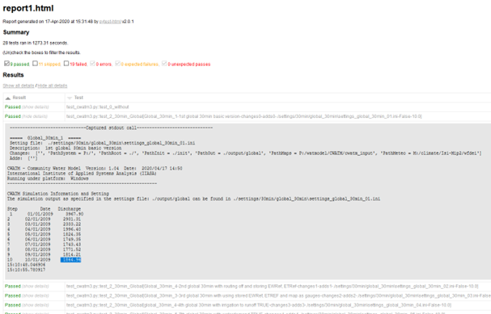

#################
Testing Framework 
#################

.. contents:: 
    :depth: 3

.. _rst_testing:

CWatM has a pyTest suite, but it is different from others.
We have some bigger dataset to run especially meteorological dataset and we want to be sure that CWatM is running with
different resolutions, with diffrent projections, for diffrent regions, with diffrent sub-modules.

.. note:: Please have a look at the folder: pytest on our github: https://github.com/iiasa/CWatM

Purpose
-------

A comprehensive pytest-based testing framework for the CWatM (Community Water Model) hydrological modeling system. This module provides automated testing capabilities for multiple model configurations, scenarios, and validation workflows including testing different settings files for different resolutions, different basins and different input and output options in order to make sure that CWatM is properly running after each change.
| Folder: pytest
| Program: test_cwatm3.py
| Requirement: libraries pytest and pytest-html
| Optional: pip install pytest-codecov

.. note:: 

    | Execute:
    | pytest test_cwatm3.py --html=C:/work/CWATM/report1.html
    | --settingsfile=test_py_cwatm2.txt  --cwatm=C:/work/CWATM/run_cwatm.py
    | Where:
    | --html=C:/work/CWATM/report1.html: results of test are written into this HTML file
    | --settingsfile=test_py_cwatm2.txt: settings file to tell which tests are executed
    | --cwatm=C:/work/CWATM/run_cwatm.py: executable of CWatM

Test Types and Execution Modes
------------------------------

The framework supports different test execution modes based on keywords in the settings file path:

- "error": Tests expected failure scenarios with quiet mode execution
- "calibration": Runs calibration workflow with meteorological data loading and warm-start functionality
- "checkmap": Validates model configuration without full execution - configuration validation only
- Default mode: Performs standard model run with full execution and result validation

Configuration File Structure
----------------------------

The test configuration file uses a structured format to define test scenarios:

- base_setting: Path to the base configuration template
- name: Test scenario identifier and description
- runtest: Enable/disable specific test groups (TRUE/FALSE)
- test_value: Enable discharge value validation
- path_*: System paths for different components (system, root, init, output, maps, meteo)
- header: Test title for reporting
- description: Detailed test description
- set_save: Output filename for the generated settings file
- changes: Parameter modifications in "parameter = value" format
- adds: Additional configuration lines to append
- last_value: Expected discharge value for validation

Testing Workflow
----------------

CWatM can be run with different resolutions, different basins, and different options. Each testing scenario uses a settings template and varies different options during the test. The framework follows this workflow:
#. Parse command line arguments for settings file and CWatM executable paths
#. Read and parse the test configuration file to extract test scenarios
#. For each enabled test scenario:

    #. Generate modified settings files with parameter changes
    #. Execute CWatM with the appropriate test mode
    #. Validate results based on test type
    #. Record success/failure status
	
#. Generate comprehensive HTML test report with pytest

Code Quality and Standards
--------------------------

The test_cwatm3.py module has been enhanced with:

- PEP 8 Compliance: Code formatted according to Python PEP 8 standards with 120-character line limit
- Comprehensive Documentation: All functions documented using numpydoc format with detailed parameter descriptions
- Preserved Functionality: All original variable names, function names, and comments maintained
- Enhanced Readability: Improved code structure and formatting for better maintainability

Usage Examples
--------------
Basic execution with HTML reporting:

.. note:: pytest test_cwatm3.py --html=pytest_report_cwatm.html --settingsfile=__cwatm_pytests_settings.ini --cwatm=../run_cwatm.py

Extended execution with code coverage:

.. note:: pytest test_cwatm3.py --html=pytest_report_cwatm.html --cov=cwatm --cov-report=xml --settingsfile=__cwatm_pytests_settings.ini --cwatm=../run_cwatm.py

The framework provides robust validation for CWatM hydrological model testing across multiple scenarios, ensuring model reliability and consistency across different configurations and use cases.

Files and folders
-----------------

- output:		Folder for CWatM testing results e.g. output/rhine
- init:		Folder for CWatM warm-start files
- settings:	Folder with settings templates and created settings files e.g. Settings/30min/global_30min/settings_global_30min.ini
- metaNetcdf.xml: xml file with metadata for NetCDF files
- test_cwatm3.py, conftest.py, pytest.ini:		Program files
- test_py_cwatm1.txt,..				Settings files

Testing CWatM
-------------

CWatM can be run with different resolutions, different basins, and different options. Each testing e.g. for the Rhine basin 30 arcmin is using a settings template and varies different options during the test. Examples for tests are given below, but other tests can be included. Tests are executed using the template settings file as a start and then tests are repeated using different options.

Results
-------

Results of the testing are written into the report.html (--html=C:/work/CWATM/report1.html)
This report shows an overview of passed, failed and skipped test and the details of each test.

	
Figure 1: Screenshot of a test report page

Example of a pytesat settings file:

.. literalinclude:: _static/cwatm_pytests_settings2.ini
    :linenos: