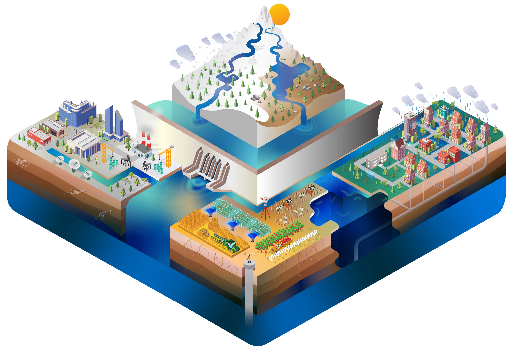

.. source documentation master file, created by
   sphinx-quickstart on Sat Sep 03 09:08:12 2016.
   You can adapt this file completely to your liking, but it should at least
   contain the root `toctree` directive.

------------

######################
Community Water Model
######################

:Copyright: IIASA WAT Program
:Authors: :ref:`rst_developer`
:Version: 1.10  
:Version Date: |today|

**Content:**
		
.. toctree::
   :maxdepth: 2
   
   1_introduction.rst
   2_news.rst
   3_modeldesign.rst
   4_UsingCwatM.rst
   5_howto.rst
   51_installCwatM.rst
   52_settingsfile.rst
   53_output.rst
   54_testingdata.rst
   55_initialization.rst
   56_calibration.rst
   57_reproduce.rst
   58_tricks.rst
   6_references.rst
   61_errors.rst
   61_variables.rst
   7_tutorials.rst
   71_offline.rst
   72_online.rst
   8_explanation.rst
   81_data.rst
   82_processes.rst
   9_technical.rst
   91_sourcecode.rst
   92_testing.rst   
   10_zambezi.rst
   11_forum.rst
   12_faq.rst
   13_glossary.rst
