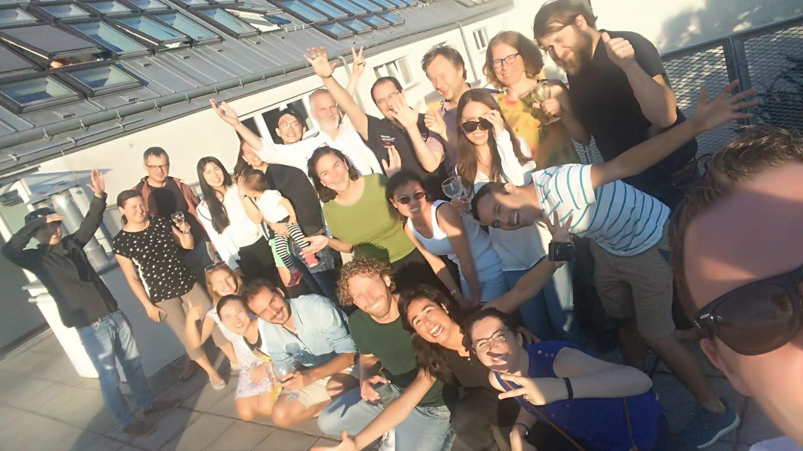

####################################
Publication 
####################################

.. contents:: 
    :depth: 3

Please cite when using CWatM
============================

Burek, P., Satoh, Y., Kahil, T., Tang, T., Greve, P., Smilovic, M., Guillaumot, L., Zhao, F., and Wada, Y.: Development of the Community Water Model (CWatM v1.04) - a high-resolution hydrological model for global and regional assessment of integrated water resources management, Geosci. Model Dev., 13, 3267–3298, https://doi.org/10.5194/gmd-13-3267-2020, 2020.
 
`Link to paper in Geoscientific Model Development <https://gmd.copernicus.org/articles/13/3267/2020>`_

Manual of CWatM (version 1.05, October 2020)

Burek, P., Smilovic, M., Guillaumot, L., de Bruijn, J., Greve, P., Satoh, Y., Islaam, A., Virgen-Urcelay, A., Tang, T., Kahil, T., and Wada, Y.: Community Water Model CWatM Manual, Laxenburg, Austria, IIASA Report, 2020.

`Link to manual <http://pure.iiasa.ac.at/id/eprint/16802/>`_

Publication using CWatM
=======================
#. de Bruijn, J. , Smilovic, M. , Burek, P. , Guillaumot, L. , Wada, Y. , & Aerts, J.C.J.H. (2023). GEB v0.1: a large-scale agent-based socio-hydrological model – simulating 10 million individual farming households in a fully distributed hydrological model. Geoscientific Model Development 16 (9) 2437-2454. 10.5194/gmd-16-2437-2023.
#. Valencia, R., Guillaumot, L. , Sahu, R.K. , Nam, C., Lierhammer, L., & Máñez Costa, M. (2023). An assessment of water management measures for climate change adaptation of agriculture in Seewinkel. Science of the Total Environment 885 e163906. 10.1016/j.scitotenv.2023.163906.
#. Kallio, M., Guillaume, J.H.A., Burek, P. , Tramberend, S. , Smilovic, M. , Horton, A.J., & Virrantaus, K. (2022). Unpacking dasymetric modelling to correct spatial bias in environmental model outputs. Environmental Modelling & Software 157 e105511. 10.1016/j.envsoft.2022.105511.
#. Guillaumot, L. , Smilovic, M. , Burek, P. , de Bruijn, J. , Greve, P., Kahil, T. , & Wada, Y. (2022). Coupling a large-scale hydrological model (CWatM v1.1) with a high-resolution groundwater flow model (MODFLOW 6) to assess the impact of irrigation at regional scale. Geoscientific Model Development 15 (18) 7099-7120. 10.5194/gmd-15-7099-2022.
#. Satoh, Y., Yoshimura, K., Pokhrel, Y., Kim, H., Shiogama, H., Yokohata, T., Hanasaki, N., Wada, Y. , Burek, P. , Byers, E. , Müller Schmied, H., Gerten, D., Ostberg, S., Gosling, S.N., Boulange, J.E.S., & Oki, T. (2022). The timing of unprecedented hydrological drought under climate change. Nature Communications 13 (1) e3287. 10.1038/s41467-022-30729-2.
#. Okaali, D.A., Kroeze, C., Medema, G., Burek, P. , Murphy, H., Tumwebaze, I.K., Rose, J.B., Verbyla, M.E., Sewagudde, S., & Hofstra, N. (2021). Modelling rotavirus concentrations in rivers: Assessing Uganda's present and future microbial water quality. Water Research 204 e117615. 10.1016/j.watres.2021.117615.
#. Telteu, C.-E., Müller Schmied, H., Thiery, W., Leng, G., Burek, P. , Liu, D., Boulange, J., Andersen, L., Grillakis, M., Gosling, S., Satoh, Y., Rakovec, O., Stacke, T., Chang, J., Wanders, N., Shah, H., Trautmann, T., Mao, G., Hanasaki, N., Koutroulis, A., Pokhrel, Y., Samaniego, L., Wada, Y. , Mishra, V., Liu, J., Döll, P., Zhao, F., Gädeke, A., Rabin, S., & Herz, F. (2021). Understanding each other's models: an introduction and a standard representation of 16 global water models to support intercomparison, improvement, and communication. Geoscientific Model Development 14 (6) 3843-3878. 10.5194/gmd-14-3843-2021.
#. Vinca, A. , Parkinson, S. , Byers, E. , Burek, P. , Khan, Z., Krey, V. , Diuana, F., Wang, Y., Ilyas, A., Köberle, A.C., Staffel, I., Pfenninger, S., Muhammad, A., Rowe, A., Schaeffer, R., Rao, N. , Wada, Y. , Dhilali, N., & Riahi, K. (2019). The Nexus Solutions Tool (NEST): An open platform for optimizing multi-scale energy-water-land system transformations. Geoscientific Model Development Discussions 13 (3) 1095-1121. 10.5194/gmd-2019-134
#. Pokhrel, Y., Felfelani, F., Satoh, Y., Boulange, J., Burek, P. , Gädeke, A., Gerten, D., Gosling, S.N., Grillakis, M., Gudmundsson, L., Hanasaki, N., Kim, H., Koutroulis, A., Liu, J., Papadimitriou, L., Schewe, J., Müller Schmied, H., Stacke, T., Telteu, C.-E., Thiery, W., Veldkamp, T., Zhao, F., & Wada, Y. (2021). Global terrestrial water storage and drought severity under climate change. Nature Climate Change 11 226-233. 10.1038/s41558-020-00972-w.
#. Boulange, J., Hanasaki, N., Satoh, Y., Yokohata, T., Shiogama, H., Burek, P. , Thiery, W., Gerten, D., Müller Schmied, H., Wada, Y. , Gosling, S.N., Pokhrel, Y., & Wanders, N. (2021). Validity of estimating flood and drought characteristics under equilibrium climates from transient simulations. Environmental Research Letters 16 (10) e104028. 10.1088/1748-9326/ac27cc.
#. Reinecke, R., Müller Schmied, H., Trautmann, T., Andersen, L.S., Burek, P. , Flörke, M., Gosling, S.N., Grillakis, M., Hanasaki, N., Koutroulis, A., Pokhrel, Y., Thiery, W., Wada, Y. , Satoh, Y., & Döll, P. (2021). Uncertainty of simulated groundwater recharge at different global warming levels: a global-scale multi-model ensemble study. Hydrology and Earth System Sciences 25 (2) 787-810. 10.5194/hess-25-787-2021.
#. Satoh, Y., Shiogama, H., Hanasaki, N., Pokhrel, Y., Boulange, J.E.S., Burek, P. , Gosling, S.N., Grillakis, M., Koutroulis, A., Müller Schmied, H., Thiery, W., & Yokohata, T. (2021). A quantitative evaluation of the issue of drought definition: a source of disagreement in future drought assessments. Environmental Research Letters 16 (10) e104001. 10.1088/1748-9326/ac2348.
#. Tramberend, S. , Burtscher, R. , Burek, P. , Kahil, T. , Fischer, G., Mochizuki, J. , Greve, P., Kimwaga, R., Nyenje, P., Ondiek, R., Nakawuka, P., Hyandye, C., Sibomana, C., Luoga, H.P., Matano, A.S., Langan, S. , & Wada, Y. (2021). Co-development of East African regional water scenarios for 2050. One Earth 4 (3) 434-447. 10.1016/j.oneear.2021.02.012.
#. Long, D., Yang, W., Scanlon, B.R., Zhao, J., Liu, D., Burek, P. , Pan, Y., You, L., & Wada, Y. (2020). South-to-North Water Diversion stabilizing Beijing’s groundwater levels. Nature Communications 11 (1) 10.1038/s41467-020-17428-6.
#. Greve, P., Burek, P. , & Wada, Y. (2020). Using the Budyko Framework for Calibrating a Global Hydrological Model. Water Resources Research 56 (6) 10.1029/2019WR026280.
#. Wang, M., M. Strokal, P. Burek, C. Kroeze, L. Ma and A. B. G. Janssen (2019). "Excess nutrient loads to Lake Taihu: Opportunities for nutrient reduction." Science of the Total Environment 664: 865-873.
#. Wang, M., T. Tang, P. Burek, P. Havlík, T. Krisztin, C. Kroeze, D. Leclère, M. Strokal, Y. Wada, Y. Wang and S. Langan (2019). "Increasing nitrogen export to sea: A scenario analysis for the Indus River." Science of The Total Environment: 133629.
#. He, X., Feng, K., Li, X., Craft, A., Wada, Y. , Burek, P. , Wood, E., & Sheffield, J. (2019). Solar and wind energy enhances drought resilience and groundwater sustainability. Nature Communications 10 e4893. 10.1038/s41467-019-12810-5 [Add to Citavi project by DOI] .

Additional selected publications
================================

#. Burek, P., Y. Satoh, G. Fischer, M. T. Kahil, A. Scherzer, S. Tramberend, L. F. Nava, Y. Wada, S. Eisner, M. Flörke, N. Hanasaki, P. Magnuszewski, B. Cosgrove, D. Wiberg and A. P. D. W. Bill Cosgrove (2016). Water Futures and Solution - Fast Track Initiative (Final Report). IIASA, Laxenburg, Austria.
#. Greve, P., L. Gudmundsson, B. Orlowsky and S. I. Seneviratne (2016). "A two-parameter Budyko function to represent conditions under which evapotranspiration exceeds precipitation." Hydrology and Earth System Sciences 20(6): 2195-2205.
#. Kahil, M. T., S. Parkinson, Y. Satoh, P. Greve, P. Burek, T. I. E. Veldkamp, R. Burtscher, E. Byers, N. Djilali, G. Fischer, V. Krey, S. Langan, K. Riahi, S. Tramberend and Y. Wada (2018). "A Continental-Scale Hydroeconomic Model for Integrating Water-Energy-Land Nexus Solutions." Water Resources Research 54(10): 7511-7533.
#. Satoh, Y., T. Kahil, E. Byers, P. Burek, G. Fischer, S. Tramberend, P. Greve, M. Flörke, S. Eisner, N. Hanasaki, P. Magnuszewski, L. F. Nava, W. Cosgrove, S. Langan and Y. Wada (2017). "Multi-model and multi-scenario assessments of Asian water futures: The Water Futures and Solutions (WFaS) initiative." Earth's Future 5(7): 823-852.
#. Tang, T., M. Strokal, M. T. H. van Vliet, P. Seuntjens, P. Burek, C. Kroeze, S. Langan and Y. Wada (2019). "Bridging global, basin and local-scale water quality modeling towards enhancing water quality management worldwide." Current Opinion in Environmental Sustainability 36: 39-48.
#. Tramberend, S., R. Burtscher, P. Burek, T. Kahil, G. Fischer, J. Mochizuki, Y. Wada, R. Kimwaga, P. Nyenje, R. Ondiek, N. Prossie, C. Hyandye, C. Sibomana and S. Langan (2019). East Africa Future Water Scenarios to 2050. IIASA Research Report. Laxenburg, Austria, IIASA.
#. Vinca, A., S. Parkinson, E. Byers, P. Burek, Z. Khan, V. Krey, F. A. Diuana, Y. Wang, A. Köberle, I. Staffel, S. Pfenninger, A. Muhammad, A. Rowe, R. Schaeffer, N. Rao, Y. Wada, N. Djilali and K. Riahi (2019). The Nexus Solutions Tool (NEST): An open platform for optimizing multi-scale energy-water-land system transformations.
#. Wada, Y., M. Flörke, N. Hanasaki, S. Eisner, G. Fischer, S. Tramberend, Y. Satoh, M. T. H. van Vliet, P. Yillia, C. Ringler, P. Burek and D. Wiberg (2016). "Modeling global water use for the 21st century: the Water Futures and Solutions (WFaS) initiative and its approaches." Geoscientific Model Development 9(1): 175-222.
#. Wada, Y., T. Gleeson and L. Esnault (2014). "Wedge approach to water stress." Nature Geosci 7(9): 615-617.

.. _rst_developer:

Developer
=========

Research Scholars, Water Program, IIASA

CWatM started in April 2016

| **Leading WAT Program and group:**
| David Wiberg (2014-2015), Bill Cosgrove and Peter Burek (2016), Simon Langan (2016-2019), Yoshihide Wada (2019-2020), Taher Kahil (2021-)
| **Hydrology and Programming:** 
| Peter Burek (2016-), Yoshihide Wada(2016-), Yusuke Satoh(2016-), Peter Greve(2017-), Mikhail Smilovic(2018-), Luca Guillaumot(2018-), Jens de Bruijn(2019-), Sarah Hanus (2022-)
| **Interface to Water Quality and Hydro-economic modeling:**
| Taher Kahil (2016-), Ting Tang (2018-)
| **GIS:** 
| Alejandra Virgen-Urcelay (2018)
| **Design of CWatM schematic view:**
| Adam Islaam (2019)
| **Intro video:** 
| Junko Mochizuki (2019)

| **Contribution from:**
| Fang Zhao,  East China Normal University, China 
| Mengu Wang, Wageningen University, The Netherlands
| Wenting Yang, Tsinghua University, China
| Xiaogang He, Anjuli Figueroa, Stanford University, USA

