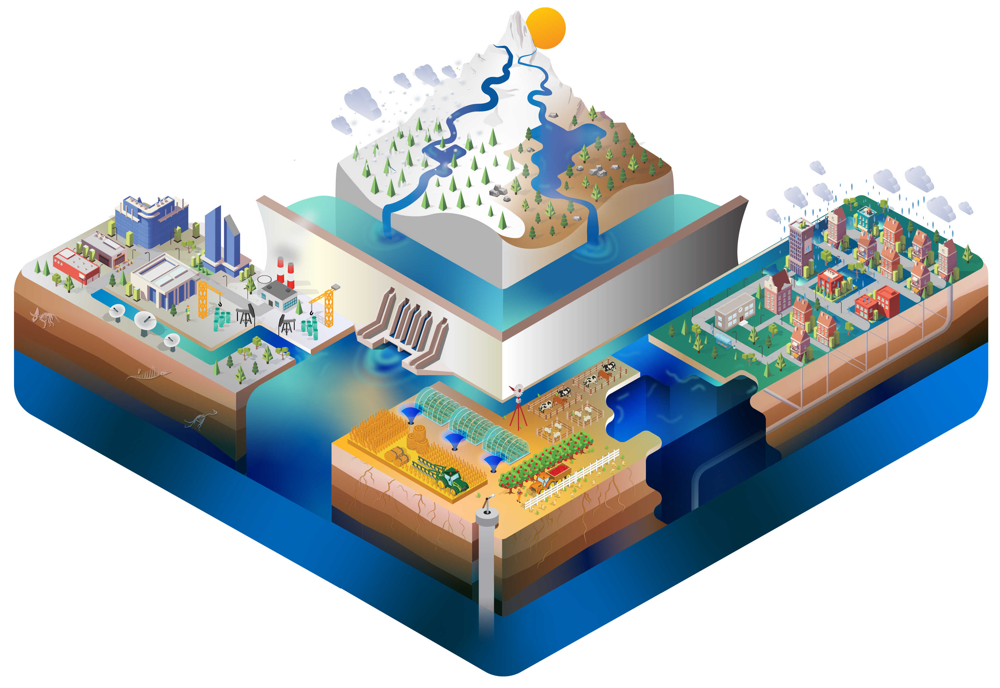

.. source documentation master file, created by
   sphinx-quickstart on Sat Sep 03 09:08:12 2016.
   You can adapt this file completely to your liking, but it should at least
   contain the root `toctree` directive.

------------

######################
Community Water Model
######################

:Copyright: IIASA WAT Program
:Authors: :ref:`rst_developer`
:Version: 1.06  
:Version Date: |today|

**Content:**
		
.. toctree::
   :maxdepth: 1
   :numbered: 1
   
   intro

   modeldesign
   publication
   setup
   tutorial
   errorHandling
   listVariables
   results

   todo
   
   data
   calibration
   calibration_tutorial
   resolution
   zambezi
   license
   sourcecode
   forum

