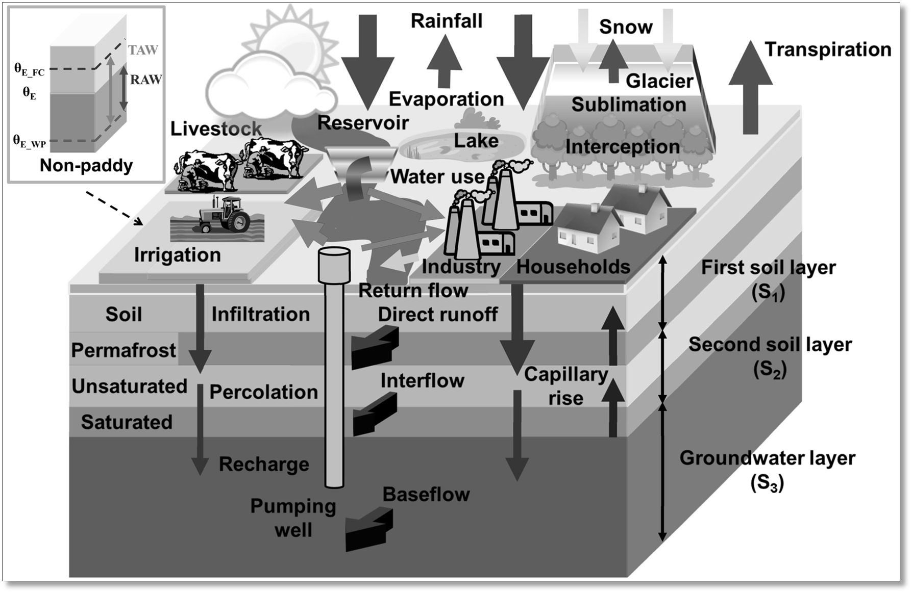

##########################
Model design and processes
##########################

The Community Water Model (CWATM) will be designed for the purpose to assess water availability, water demand and environmental needs. It includes an accounting of how future water demands will evolve in response to socioeconomic change and how water availability will change in response to climate.

Figure 3: CWATM - Water related processes included in the model design

Processes
=========

Calculation of potential Evaporation
************************************

Using Penman-Montheith equations based on FAO 56

Calculation of rain, snow, snowmelt
***********************************

Using day-degree approach with up to 7 vertical layers
Including snow- and glaciwer melt.

Land cover
**********

using fraction of 6 different land cover types

* Forest
* Grassland
* Irrigated land
* Paddy irrigated land
* Sealed areas (urban)
* Water

Water demand
************

* including water demand from industry and domestic land use via precalculated monhly spatial maps
* including agricultural water use from calculation of plant water demand
* Return flows

Vegetation
**********

Vegetation taken into account for calculating

* Albedo
* Transpiration
* Interception

Soil
****

Three soil layers for each land cover type including processes:

* Frost interupting soil processes
* Infiltration
* Preferential flow
* Capillary rise
* Surface runoff
* Interflow
* Percolation into groundwater

Groundwater
***********

Groundwater storage is simulated as linear groundwater reservoir

Lakes & Reservoirs
******************

Lakes are simulated with the weir function
Reservoirs are simulated  as outflow function between three storage limits (conservative, normal,flood) and three outflow functions (minimum, normal, non-damaging)

Routing
*******

Routing is calculated using the kinematic wave approach

