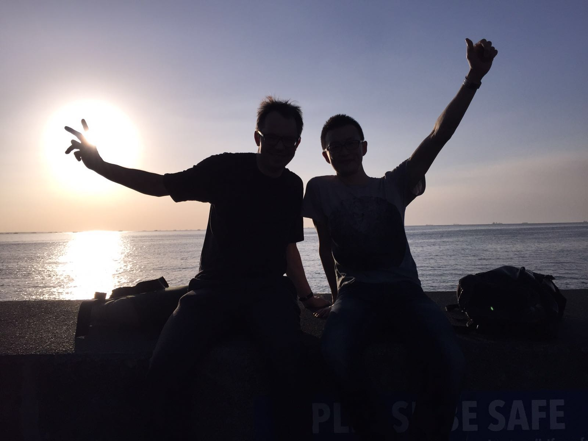

####################################
Publication 
####################################

.. contents:: 
    :depth: 3

Publication
===========

#. Burek, P., Y. Satoh, G. Fischer, M. T. Kahil, A. Scherzer, S. Tramberend, L. F. Nava, Y. Wada, S. Eisner, M. Flörke, N. Hanasaki, P. Magnuszewski, B. Cosgrove, D. Wiberg and A. P. D. W. Bill Cosgrove (2016). Water Futures and Solution - Fast Track Initiative (Final Report). IIASA, Laxenburg, Austria.
#. Burek, P., J. van der Knijff and A. de Roo (2013). LISFLOOD Distributed Water Balance and Flood Simulation Model. Luxembourg, European Commission, Joint Research Centre, Institute for Environment and Sustainability. EUR 26162 EN.
#. Wada, Y., M. Flörke, N. Hanasaki, S. Eisner, G. Fischer, S. Tramberend, Y. Satoh, M. T. H. van Vliet, P. Yillia, C. Ringler, P. Burek and D. Wiberg (2016). "Modeling global water use for the 21st century: Water Futures and Solutions (WFaS) initiative and its approaches." Geosci. Model Dev. Discuss. 8(8): 6417-6521.
#. Satoh, Y., Kahil, T., Byers, E., Burek, P., Fischer, G., Tramberend, S., Greve, P., Flörke, M., Eisner, S., Hanasaki, N., Magnuszewski, P., Nava, L. F., Cosgrove, W., Langan, S. and Wada, Y. (), Multi-model and multi-scenario assessments of Asian water futures: the Water Futures and Solutions (WFaS) initiative. Earth's Future. Accepted Author Manuscript. doi:10.1002/2016EF000503

Developer
=========

Research Scholars, Water Program, IIASA

.. _rst_developer:

Peter Burek, Yusuke Satoh, Peter Greve
^^^^^^^^^^^^^^^^^^^^^^^^^^^^^^^^^^^^^^

